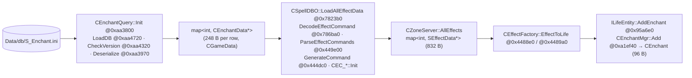

# S_Enchant.ini — complete format and runtime reference (ZoneServer101 decompile)

> Verified 2026-09-03 against the ZoneServer binary (IDA database with DWARF symbols) and the data in a
> test-server copy of `S_Enchant.ini` (`|V.10|63|`, 36,382 rows).
> Scope: ZoneServer only. Client-side files (`C_Enchant.ini`, icons, VFX, tooltips) are not covered. The full table of
> the ~300 effect commands is a separate article; this one documents the engine and the most used commands.

---

## 0. What it is and who uses it

`S_Enchant.ini` is the table of **effects** ("enchants": buffs, debuffs, passives, procs, instant item or skill
effects). A row defines what the effect does (up to 4 *command slots* `id|p1..p6`), how it coexists with others
(exclusion group `Hiword`/`Lowword`, `MaxStack`, `EnchantFlag`), whether it triggers something on attack/hit/heal
(the **transition** block, cols 42-59) and how it looks on the client (icon, VFX, texts). The server does **not**
decide the duration: whoever applies the effect (`S_Spell`, `S_Item`, another effect, a GM command) passes it, and the
row only contributes the tick period.

- The file has **no column names**: the header is `|V.10|63|` and nothing else. The names in this article are the
  DWARF fields of `GameData::CEnchantData` without the `m_n`/`m_k`/`m_e` prefix.
- Every process that links `GameData` parses it (`CGameData::LoadDatabase @0xa50290`), but **only the ZoneServer**
  builds the runtime objects and validates the commands (`CSpellDBO::LoadAllEffectData @0x7823b0`): an effect the
  MissionServer or the WorldServer accept can still kill the ZoneServer at boot.

!!! warning "No hot reload of the file"
    The GM command `reload_effect` (`TC_ReloadEffect @0x7d8f40`, help text `reload_effect : reload effect data`)
    re-decodes the commands and swaps the pointers held by spells, items and active buffs
    (`CZoneServer::CheckAndSwapReloadEffect @0x5b9e40`), but it reads the rows **already parsed in memory**
    (`CGameData::GetAllEnchants @0xa51a20`). The only reader of the file is `CEnchantQuery::Init`, called once from
    `main`. Editing `S_Enchant.ini` requires a ZoneServer restart.

Full chain (all addresses are ZS 101):



1. `main @0x521020` → `CGameData::Init @0xa50230` → `LoadDatabase @0xa50290` → `CEnchantQuery::Init(lang) @0xaa3800`.
   If `Init` returns `false`, `LoadDatabase` counts the error (`Loading DB - Error Cnt = %d, (Language %d)`) and `main`
   exits with `Load Game Data(.ini) Fail!` **before** the `Database Error!!` stage.
2. `CZoneServer::InitGame @0x5af910` → `InitWorld @0x5afc80` → `CSpellDBO::LoadAllEffectData @0x7823b0` (builds the
   `SEffectData` objects) → `LoadAllSpellData @0x7815e0` (links `S_Spell` to `AllEffects`). Errors in this stage go
   through `CLogFactory::InitErrLog`/`InitErrLogAppend` → `CLogFactory::DBError = 1` → `[FAIL] Database Error!!` at
   the end of loading.
3. Runtime: 207 call sites of `EffectToLife(id)` (skills `ISpell::OnHitLife @0x9b2760`/`OnBlast @0x9b0a60`, items
   `CItemFactory::InvokeItemEffect @0x4ded00`, equipment `CCharacter::RefreshEQEffect @0x8fc960`, class passives
   `InvokePassivity @0x900470`, titles, nodes, team/mentor buffs, GM `TC_AddEnchant @0x88b8b0`, chains
   `CEC_EffectNextID @0x9dfb20`, procs `CEC_Effect @0x9e0170`, …) plus `CEnchantMgr::Load @0xa205f0`, which restores
   the saved buffs at login.

Consumers of the raw row (`CGameData::QueryEnchant @0xa519b0`, 29 xrefs) read `m_kEnchantCommands` directly to learn
parameters without applying the effect — `CItemFactory::GetEnchantCommmandParm @0x4f67a0`, `DoStarCombo`,
`CPlayerFactory::ChangeSpellCard`/`CheckSpecialRule`, the `UseItem` checks of crops/fishing/mining/cattle,
`CRemoveRune`, `CCharacter::RemoveVIPCardBuff`, `CMonsterDBO::GetItemPos`… None of them uses any column other than
`Id` and the command slots.

---

## 1. Versions and column count (`CheckVersion @0xaa4320`)

The header `|V.x|N|` is read in `CBaseQuery<int,CEnchantData>::LoadDB @0xaa4720`:

- The first byte of the file is the delimiter (`|`) and is skipped (`m_nStartIndex = 1`); a file starting with `V`
  would use `,`. `LoadDB` first tries `S_Enchant.ini.bin` (RC4, key `easyfun`): a `.bin` next to the `.ini` wins.
- `CheckVersion`: `m_nVer = strtol(ver.substr(2))` → `V.10` = 10; it requires `m_nVer > 3`, otherwise
  `Open %s and check version(%s) is fail.` and the ZS exits with `Load Game Data(.ini) Fail!`.
- `N` is read and `(tokens − 2) % N == 0` is required over the **whole** file (`Open %s and check Columns (%d) is
  fail. DataSize(%d), Language(%d)`); then the token list is sliced blindly into chunks of `N`: one `|` too many or
  too few in a row shifts every following row and is only noticed when the total stops being a multiple of 63.

| Header | Columns | What it adds |
|---|---|---|
| V.4 | 58 | base (V.0-V.3 rejected) |
| V.5 | 59 | + `TransitionCooldownTime` (col 56) |
| V.6 – V.8 | 60 | + `MaxStack` (col 63) |
| V.9 | 61 | + `WeaponFlag` (col 57) |
| **V.10 (current)** | **63** | + `EnchantCategory` (col 9) and `TransitionEnchantCategory` (col 50) |

Columns missing in older versions are zero-filled (`Deserialize` branches on the version; there is no file
conversion). The tokenizer (`CInTextStream::ParseLines @0xa7ec70`) splits on `|`, honouring DBCS lead bytes for the
configured language, and strips a leading `\r` and/or `\n` from each token: that is why a description may contain
line breaks (10,295 rows do) while the record still has "63 pipes". Each row ends with `|` followed by a newline (the
last field, `MaxStack`, is usually empty).

Token conversion (`CInTextStream::operator>>`): integers of every size with `strtoul(tok, 0, 10)`
(`@0xa482d0`/`@0xa40ed0`/`@0xa43cb0`/`@0xa40fc0`), reals with `strtod` (`@0xa7e610`), strings verbatim (`@0xa7e6f0`).
Consequences: text in a numeric column reads as 0 (`s01041` in `EffectId` → 0), `-1` in an `int` column is −1 but in
a `ushort` it is 65535 and in a `uchar` 255, and `1.5` in an integer column is 1.

---

## 2. Columns (1-based) — DWARF field, conversion and real use in the binary

!!! note "Units"
    Every time value in the file (`Period`, `TransitionDuration`, `TransitionPeriod`, `TransitionCooldownTime`, and
    the duration parameters of `1921`, `7001`, `1079`, `6024`) is in **tenths of a second**. Integers are read with
    `strtoul`, the command parameters `p1..p6` with `strtod`. "Dead" = the parser reads it but `LoadAllEffectData`
    never copies it into `SEffectData` and no other ZoneServer code reads it (the 29 raw-row consumers only read `Id`
    and the command slots).

| # | Field (`CEnchantData`) | Type → destination in `SEffectData` | What it really does |
|---|---|---|---|
| 1 | `m_nId` | int → `ID` (child = `−ID`) | Key. 1..1000 = `FailEffect` (the ZS exits). Valid ranges **0-1000 (system), 11000-20000, 45000-200000**; `<0`, 1001-10999, 20001-44999 → `The BUFFID : [%d] is not opened` and `>200000` → `The largest BUFFID is [%d]…` (both **DBError**, the row is still loaded). `≥54990` goes through `InitSysEnchants`. |
| 2 | `m_kIconFilename` | string → not copied | **Dead** on the server (client icon). |
| 3 | `m_nAnimId` | uint → not copied | **Dead** (client animation). |
| 4 | `m_nEffectId` | uint → not copied | **Dead**; `s01041` reads as 0 anyway. |
| 5 | `m_kEffectNode` | string → not copied | **Dead** (VFX node on the client). |
| 6 | `m_kName` | string → `Name` | Only shows up in logs (`effect[%s] id [%d] can't Abandon!`). The visible name is col 60. |
| 7 | `m_eEnchantType` | uint → `Type` | 1 = buff, 2 = debuff, empty = 0. Bit 0 = the player may cancel it (`CancelPlayerEnchant`); `Type & 2` = removed by type-based dispels (`CCheckBufType`, `EnchantKillRandom`); a monster with the template protection refuses `Type = 2`. |
| 8 | `m_nEnchantFlag` | uint → `Flag` | Bit mask, table in §4.3. Bits 0x1/0x2/0x4/0x2000/0x20000 also inject a `Finish 100` command. |
| 9 | `m_eEnchantCategory` | uint (V.10) → `Category` | Copied, but **no reader was found** in the ZS (128 rows use it). |
| 10 | `m_nImmuneMonsterType` | ushort → `ImmuneMonsterType` (parent and child) | Copied; **no reader found** (8 rows). |
| 11-17 | `Cmd1` (`m_nId` + `m_dParam1..6`) | slot 1 | `Id = 0` → empty slot. See §6. |
| 18-24 / 25-31 / 32-38 | `Cmd2` / `Cmd3` / `Cmd4` | slots 2-4 | Same. The slots listed in col 42 are pulled out of here and given to the child. |
| 39 | `m_nPeriod` | int → `Period` **int16**; 0 → −1 | Tick of the `Commands` bucket (`3xxx` commands, `7001` without p6, `2931/2932`…). −1 = no tick: the buff simply expires. |
| 40 | `m_nHiword` | int → ushort → `EnchantType` | **Exclusion group** (§5.2). 0 = no group. `>65535` is truncated with a warning. |
| 41 | `m_nLowword` | uchar → `Level` | Priority inside the group: blocks lower ones, evicts `≤`. |
| 42 | `m_kTransitionCmd` | string `"1;3"` → set of slots | Slots (1-based) that form the transition **child**. A reference to an empty slot or outside 1..4 is a warning and is ignored. Empty with col 43 ≠ 0 = `BUFF [%d] 轉移指令是空的` (**DBError**). |
| 43 | `m_eEEnchantTransition` | uint → `TransitionType` | Event + receiver of the proc (§4.2): 1 AttackToSelf · 2 AttackToOpponent · 3 HurtToSelf · 4 HurtToOpponent · 5/6 CastSpell · 7 KillToSelf · 8 BeKilledToOpponent · 9 ReviveToSelf · 10/11 Heal · 12/13 BeHealed · 14/15 CastClassSpell. Any other value = `BUFF [%d] 轉移指令錯誤 %d` (**DBError**). |
| 44 | `m_nTransitionRate` | char → `TransitionRate` | Proc chance: `random() % 100 < rate`. 100 = always. Read with `strtoul`, so 200 = −56. |
| 45 | `m_nTransitionDuration` | int → `TransitionDuration` **int16** | Child duration in tenths; 0 → −1 → the child is **not** created as a buff (instant effect); multiples of 65536 also give −1. |
| 46 | `m_nTransitionPeriod` | int → child `Period` (0 → −1) | Child tick. |
| 47 | `m_kTransitionIconFilename` | string → not copied | **Dead** (child icon on the client). |
| 48 | `m_eTransitionEnchantType` | uint → child `Type` | Child buff/debuff (decides cancel and dispel). |
| 49 | `m_nTransitionEnchantFlag` | uint → child `Flag` | Same bit table as col 8, applied to the child; 0x1/0x2/0x4/0x2000/0x20000 inject `Finish 100` into the child. |
| 50 | `m_eTransitionEnchantCategory` | uint (V.10) → child `Category` | No reader found. |
| 51-55 | `m_nTransitionAnimId`, `m_nTransitionEffectId`, `m_kTransitionEffectNode`, `m_nTransitionEffectDuration`, `m_kTransitionEffectDurationNode` | not copied | **Dead** (child VFX on the client). |
| 56 | `m_nTransitionCooldownTime` | int (V.5) → **parent** `TransitionCooldownTime` | Internal proc cooldown in tenths (`EffectDownTimes`); ≤ 0 = no cooldown. |
| 57 | `m_nWeaponFlag` | uint (V.9) → `WeaponFlags` | Weapon-type mask: if ≠ 0 the buff only lands when `IsWeaponCanEffect(current weapon)` and it is removed on weapon change. |
| 58 | `m_nTransitionEnchantHiword` | int → ushort → child `EnchantType` | Child exclusion group. |
| 59 | `m_nTransitionEnchantLowword` | uchar → child `Level` | Child priority. |
| 60 | `m_kTip` | string → not copied | **Dead** on the server; on the client it is the **name** shown (35,250 rows). |
| 61 | `m_kTransitionTip` | string → not copied | **Dead**; short proc text on the client. |
| 62 | `m_kTransitionName` | string → not copied | **Dead**; on the client it is the long **description** (26,184 rows). |
| 63 | `m_nMaxStack` | ushort (V.6) → `MaxStackCnt` (parent and child); 0 → 1 | Stacking (§5.2). The loader overwrites it with `CFormula::AllFormulaParas[388]` for 312 fixed ids (11001-11040, 18915-18986, 51363-51394, 51962-52001, 551x1-558x6, 55900-55905). |

---

## 3. `Deserialize @0xaa3970` — exact read order

```
 1  Id                         int     1..1000 → "ERROR: FailEffect [%d]" + m_nErrorNum++ (fatal at the end of Init)
 2  IconFilename               string
 3  AnimId                     uint
 4  EffectId                   uint    (strtoul: "s01041" → 0)
 5  EffectNode                 string
 6  Name                       string
 7  EnchantType                uint    → m_eEnchantType
 8  EnchantFlag                uint
 9  EnchantCategory            uint    only if ver ≥ 10, else eEC_None (0)
10  ImmuneMonsterType          ushort
11-17  Cmd1: Id uint + P1..P6 double   Id == 0 → empty slot (null pointer, the gap is kept)
18-24  Cmd2, 25-31 Cmd3, 32-38 Cmd4    (always 4 slots; InitSysEnchants appends a 5th to 54999/55000)
39  Period                     int
40  Hiword                     int → ushort; > 65535 → log "(%d)的高權位數值(%d)錯誤，需在0~65535", truncated (non-fatal)
41  Lowword                    uchar
42  TransitionCmd              string  "i;j;…" (1-based) → each slot i is REMOVED from m_kEnchantCommands and moved to m_kTransitionCmd
                                       i outside 1..4 → "(%d)的轉移指令(%s)錯誤"; empty slot → "(%d)的轉移指令第(%d)指令是空的" (both non-fatal)
43  EnchantTransition          uint
44  TransitionRate             char    (strtoul → 100 fits; 200 would be negative)
45  TransitionDuration         int
46  TransitionPeriod           int
47  TransitionIconFilename     string
48  TransitionEnchantType      uint
49  TransitionEnchantFlag      uint
50  TransitionEnchantCategory  uint    only if ver ≥ 10
51  TransitionAnimId           uint
52  TransitionEffectId         uint
53  TransitionEffectNode       string
54  TransitionEffectDuration   int
55  TransitionEffectDurationNode string
56  TransitionCooldownTime     int     only if ver ≥ 5 (else 0)
57  WeaponFlag                 uint    only if ver ≥ 9 (else 0)
58  TransitionEnchantHiword    int → ushort; ≥ 65536 → "(%d)的轉移高權位數值(%d)錯誤，需在0~65535" (non-fatal)
59  TransitionEnchantLowword   uchar
60  Tip                        string
61  TransitionTip              string
62  TransitionName             string
    → if Id ≥ 54990: InitSysEnchants @0xaa43d0 (54999 appends command {1}, 55000 appends {2}; others unchanged)
63  MaxStack                   ushort  only if ver ≥ 6 (else 0)
```

Details the table does not show:

- The `(%d)…` messages go through `CQueryLogger::ErrorLog @0xa65520` → `CGameDataLogger::ErrorLog @0x520ef0` →
  `SystemLog` level 5. They **do not** touch `DBError`. The only fatal parser error is an `Id` between 1 and 1000
  (`CEnchantQuery::Init` returns `false` with `ERROR: FailEffect, ID 0~1000 有 [%d] 筆`).
- Rows are inserted into a `std::map<int, CEnchantData*>` by `Id`: a **duplicate id** silently replaces the earlier
  one (the last row in the file wins, the first one leaks).
- `Init` builds the path `..//Data//Translate//T_Enchant.ini` and discards it unused: the ZS does not translate names.
- The transition block is extracted in the parser already: the slots listed in `TransitionCmd` disappear from the
  normal command list and live in a `std::set` ordered by pointer (allocation order = slot order in practice).

---

## 4. Structures in memory

**`GameData::CEnchantData` (248 B)** — the parsed row, one per id, alive for the whole run:
`m_nId 0x0 · m_kIconFilename 0x8 · m_nAnimId 0x10 · m_nEffectId 0x14 · m_kEffectNode 0x18 · m_kName 0x20 ·
m_eEnchantType 0x28 · m_nEnchantFlag 0x2c · m_eEnchantCategory 0x30 · m_nImmuneMonsterType 0x34 ·
m_kEnchantCommands 0x38 (vector<SEnchantCommand*>) · m_nPeriod 0x50 · m_nHiword 0x54 · m_nLowword 0x56 ·
m_kTransitionCmd 0x58 (set<SEnchantCommand*>) · m_eEEnchantTransition 0x88 · m_nTransitionRate 0x8c ·
m_nTransitionDuration 0x90 · m_nTransitionPeriod 0x94 · m_kTransitionIconFilename 0x98 · m_eTransitionEnchantType 0xa0 ·
m_nTransitionEnchantFlag 0xa4 · m_eTransitionEnchantCategory 0xa8 · m_nTransitionAnimId 0xac · m_nTransitionEffectId 0xb0 ·
m_kTransitionEffectNode 0xb8 · m_nTransitionEffectDuration 0xc0 · m_kTransitionEffectDurationNode 0xc8 ·
m_nTransitionCooldownTime 0xd0 · m_nTransitionEnchantHiword 0xd4 · m_nTransitionEnchantLowword 0xd6 · m_kTip 0xd8 ·
m_kTransitionTip 0xe0 · m_kTransitionName 0xe8 · m_nMaxStack 0xf0 · m_nWeaponFlag 0xf4`.
`SEnchantCommand` (56 B): `m_nId 0x0`, `m_dParam1..6` at `0x8, 0x10, 0x18, 0x20, 0x28, 0x30` (doubles).

**`lapis::SEffectData` (832 B)** — the runtime effect, one per id in `CZoneServer::AllEffects`:
`ID 0x0 · Name 0x8 · Type 0x10 · Flag 0x14 · Category 0x18 · ImmuneMonsterType 0x1c · TransitionType 0x20 ·
command buckets (vector<CEffectCommand*>, 24 B each): CommandsStart 0x28 · Commands 0x40 · CommandsOnce 0x58 ·
CommandsEnd 0x70 · CommandsAttack 0x88 · CommandsHit 0xa0 · CommandsMiss 0xb8 · CommandsBeAttacked 0xd0 ·
CommandsHurt 0xe8 · CommandsCastSpellSelf 0x100 · CommandsCastSpellTarget 0x118 · CommandsKill 0x130 ·
CommandsBeKilled 0x148 · CommandsRevive 0x160 · CommandsHealSelf 0x178 · CommandsHealTarget 0x190 ·
CommandsBeHealedSelf 0x1a8 · CommandsBeHealedTarget 0x1c0 · CommandsCastClassSpellSelf 0x1d8 ·
CommandsCastClassSpellTarget 0x1f0 · CommandsAbsorb 0x208 · CommandsEnhance 0x220 · CommandsMove 0x238 ·
CommandsStartElf 0x250 · CommandsElf 0x268 · CommandsOnceElf 0x280 · CommandsUseItem 0x298 · CommandsMoveSelf 0x2b0 ·
DetailAttrData 0x2c8 · Period 0x2f8 (int16) · EnchantType 0x2fa (u16) · Level 0x2fc (char) · TransitionRate 0x2fd ·
InnerFlags 0x2fe (u16) · IndexFlags 0x300 (u16) · TransitionEffect 0x308 (child SEffectData*) · TransitionDuration 0x310 ·
TransitionCooldownTime 0x314 · AddHate 0x318 · HateRate 0x31a · DurationCnt 0x31c · MaxStackCnt 0x31e ·
LoopEnchantIDs 0x320 (vector<int>) · WeaponFlags 0x338`.

**`lapis::CEnchant` (96 B)** — one applied instance on one entity: `m_pEffectData 0x10 · m_CasterId 0x18 ·
m_pVictim 0x20 · m_NextTime 0x28 (CTime) · m_Duration 0x38 (tenths of a second; −2 = permanent) · m_LifePoint 0x3c ·
m_HurtType 0x40 · m_Flags 0x44 (bit 0 not saved, bit 1 survives death, bit 3 skip End commands, bit 4 duration
paused, bit 5 removed without rollback, bit 6 re-applying) · m_LifeType 0x46 · m_StackCnt 0x48 · m_BindItemTID 0x4c ·
m_BindWitchCraftID 0x50 · BossId 0x54 · RealDuration 0x58`.

**`lapis::CEnchantMgr` (1272 B, one per entity)**: `m_EnchantIdMap 0x0` (key `ID & 0xFFFFFF | (HurtType>>28)<<24`),
`m_EnchantTypeMap 0x30` (key `EnchantType | (HurtType>>28)<<16`, = exclusion group), `m_EnchantTimeMap 0x60`
(queue by `m_NextTime`), `m_State2Enchant 0x90`, `m_EnchantWeaponLimitSet 0xc0`, and 21 per-event sets
`m_OnAttack 0xf0 · m_OnHit 0x120 · m_OnMiss 0x150 · m_OnBeAttack 0x180 · m_OnHurt 0x1b0 · m_OnCastSpellSelf 0x1e0 ·
m_OnCastSpellTarget 0x210 · m_OnCastClassSpellSelf 0x240 · m_OnCastClassSpellTarget 0x270 · m_OnKillToSelf 0x2a0 ·
m_OnBeKilledTarget 0x2d0 · m_OnRevive 0x300 · m_OnHealSelf 0x330 · m_OnHealTarget 0x360 · m_OnBeHealedSelf 0x390 ·
m_OnBeHealedTarget 0x3c0 · m_OnAbsorb 0x3f0 · m_OnEnhance 0x420 · m_OnUseItem 0x450 · m_OnMove 0x480`,
`m_AbilityIndexes 0x4b0`, `m_pLife 0x4e0`, `m_pEvent 0x4e8`, `m_TriggerTransitionCnt 0x4f0`, `m_bNoRestartEvent 0x4f1`.

### 4.1 From `CEnchantData` to `SEffectData` (`CSpellDBO::LoadAllEffectData @0x7823b0`)

It walks `CGameData::GetAllEnchants` and for every row creates an `SEffectData` with defaults (`Type = 1`,
`Period = −1`, `TransitionDuration = −1`, `MaxStackCnt = 1`, everything else 0) and copies what the §2 table says.
Then:

1. Bits 0x1/0x2/0x4/0x2000/0x20000 of `Flag` → a `Finish 100` command is added to `CommandsAttack` /
   `CommandsBeAttacked` / `CommandsHurt` / `CommandsUseItem` / `CommandsMoveSelf` (the buff **ends** when the carrier
   attacks / is attacked / takes damage / uses an item / moves) and `++DurationCnt`. If the command cannot be built →
   `BUFF [%d] 攻擊失效|受擊失效|使用物品失效|移動失效 [Finish] 錯誤` (**DBError**).
2. Every non-null slot → `DecodeEffectCommand @0x786ba0` (`switch(id)`, jump table `0xDA1070` for 1001-3102 plus
   separate tables for 4001-4041, 5001-5032, 6001-6026, 7001-7114, 9009-9031): the id becomes text `"Name p1 p2 …"`
   (some ids emit several `;`-separated sub-commands, some emit fixed constants) accumulated in one of 12 streams that
   feed the buckets `Commands`, `CommandsOnce`, `CommandsStart`, `CommandsHurt`, `CommandsHit`, `CommandsAbsorb`,
   `CommandsEnhance`, `CommandsStartElf`, `CommandsElf`, `CommandsOnceElf`, `CommandsMove`, `CommandsMiss`.
   **An unknown id emits nothing and does not warn.** Every id in 2000-3999 and 5000-5999 does `++DurationCnt` even
   when it emits no text (that is why a lone `2000` still creates a buff with icon and duration). Ids 4000-5999
   (except 4021) set `InnerFlags |= 0x4` (sprite effect).
3. Each bucket is parsed by `CEffectFactory::ParseEffectCommands @0x449e00` → split on `;` →
   `CEffectCommandGenerator::GenerateCommand @0x444dc0` (lower-cased name looked up in `EffectCommandTable`, filled by
   `InitEffectCommandTable @0x4452c0` with ~300 `Book` calls). Unknown name, **argument count different from what the
   generator expects**, or a `CEC_*::Init` returning `false` → the whole bucket fails → `BUFF [%d] commands_start指令錯誤`
   (or `commands`, `commands_once`, `commands_hurt`, `commands_hit`, `commands_absorb`, `commands_enhance`,
   `elf_commands_once`, `commands_move`, `commands_miss`) → **DBError**, and the row is dropped.
4. `1121`/`1122` emit no text: their `p1` goes to `AddHate`/`HateRate`. `1007 IndexCasterAbility` is the only writer of
   `IndexFlags`. `1079 LastEnchant` chains are followed on the raw rows to fill `LoopEnchantIDs` (closed loops only);
   a missing target → `BUFF [%d] EnchantLoop指令1079資料錯誤`, more than 9 hops → `…循環超過上限(%d個)` (**DBError**).
5. After all rows, `CSpellDBO::AddSystemEffectData @0x798450` creates the system effects in code and **replaces** any
   file row with the same id: 1 MonsterLifeTime, 2 Regenerate, 7-11 ElfReturn, 12 ElfRegenerate, 13 StrengthenItem,
   14/24 CombineItem, 15 OUT_BATTLE, 16 DuelToLose, 17 ElfDecrease, **18 AntiStun (`AttrAntiStunRate 50`)**,
   **19 BossAntiStun (`AttrAntiStunRate 100`)**, 20 HealthOnlineTimer, 21 PVPRevive, 22/23 ElfNPCGames/ElfBetGames,
   25-29 Strengthen/Awake/StarCombo/Carving, 52007 PVPKiller, 52009/52010 PVP/OutPVP, 54337-54338 Captcha,
   54890 UnhonoraryKiller, 54893 ElfGamesCantJoin, 54998 BFEscapee, 77778 AutoClickPunish, 101-106 ElfWork.
   Ids 56885-56887 and 56891-56899 get `Flag |= 0x800` forced.
6. `InitErrLogFlush` → if any `InitErrLogAppend` happened, `CLogFactory::DBError = 1` and the ZS dies at the end of
   loading.

### 4.2 The transition child

If col 43 ≠ 0 a second `SEffectData` is created (id `−ID`, also stored in `AllEffects`) with: `Type` = col 48,
`Flag` = col 49, `Category` = col 50, `ImmuneMonsterType` = col 10, `Period` = col 46, `EnchantType`/`Level` =
cols 58/59, `MaxStackCnt` = col 63, `TransitionCooldownTime = 0`, no `WeaponFlags`, no name, no transition of its
own. Its commands are the col 42 slots decoded like the parent's, but the `move` and `miss` streams are **discarded**
for the child. The parent receives one parameterless command (`Effect` or `Effect2Other`) in the event bucket, and
`TransitionRate`, `TransitionDuration` and `TransitionCooldownTime` stay on the parent for that command:

| col 43 | Event (parent bucket) | Command | Who receives the child |
|---|---|---|---|
| 1 | on attack (`CommandsAttack`) | `Effect2Other` | the carrier |
| 2 | on attack (`CommandsAttack`) | `Effect` | the target hit |
| 3 | when attacked (`CommandsBeAttacked`, `InnerFlags\|=0x4000`) | `Effect` | the carrier |
| 4 | when attacked (`CommandsBeAttacked`, `InnerFlags\|=0x4000`) | `Effect2Other` | the attacker |
| 5 / 6 | on casting a skill (`CommandsCastSpellSelf` / `…Target`) | `Effect2Other` / `Effect` | carrier / target |
| 7 | on kill (`CommandsKill`) | `Effect2Other` | carrier |
| 8 | on death (`CommandsBeKilled`, `\|=0x4000`) | `Effect` | the killer |
| 9 | on revive (`CommandsRevive`) | `Effect` | carrier |
| 10 / 11 | on heal (`CommandsHealSelf` / `…Target`) | `Effect2Other` / `Effect` | carrier / healed |
| 12 / 13 | when healed (`CommandsBeHealedSelf` / `…Target`, `\|=0x4000`) | `Effect` / `Effect2Other` | carrier / healer |
| 14 / 15 | on casting a class skill (`CommandsCastClassSpellSelf` / `…Target`) | `Effect2Other` / `Effect` | carrier / target |

### 4.3 `EnchantFlag` bits (col 8 and col 49)

| Bit | Rows | Verified effect |
|---|---|---|
| 0x1 / 0x2 / 0x4 | 326 / 429 / 108 | The buff ends when the carrier attacks / is attacked / takes damage (`Finish 100` injected by the loader). |
| 0x10 | 9,316 | The player **cannot cancel it** by right-click (`CancelPlayerEnchant @0x449c40`). |
| 0x20 | 5,269 | **Survives death** (`IsDieReserve @0xa1b5f0`; `CCharacter::Die` removes everything else). |
| 0x40 / 0x80 / 0x100 / 0x1000 | 54 / 66 / 82 / 1 | Only while in **vulture / wolf / gorilla / machine** form: `CEC_AttrForm::RollBack @0x9c2a00` removes them when the form ends (`CCheckBufVultureOnly` and siblings). |
| 0x200 | 300 | Not applied to monsters of type 3, 6 or 10 (`EffectToLife @0x448bc2`). |
| 0x400 | 4,517 | Removed on **node/map change** (`CCharacter::RemoveAllNoTransNodeEnchants @0x8f97a0`, from `CPlayerFactory::CheckNoTransNode @0x5434a0`) and in `SaveAllAndQuitServer`. |
| 0x800 | 407 | Duration clamped to the end of the local day; not refreshed on re-apply; `GetRestTime` adds one tenth. |
| 0x2000 / 0x20000 | 18 / 54 | Ends on item use / on move (`Finish 100` in `CommandsUseItem` / `CommandsMoveSelf`). |
| 0x4000 | 0 | Not applied to entities of type 2059. |
| 0x8000 | 4,822 | **Hidden icon**: the client is not notified (`IsHideIcon @0xa1dfc0`). The effect still works. |
| 0x80000 | 704 | Removed on class **rebirth** (`CPlayerFactory::Rebirth @0x56a6a0`, `CCheckNoRebirth`). |
| 0x100000 | 133 | Removed when transported to a **battlefield** (`RemoveAllNoBattlefieldEnchants @0x8f97c0` from `CTransportFactory::TransportCharacterToArea @0x5955f0`). |
| 0x200000 | 435 | Suppresses message 9022 to the caster when a buff with a higher `Lowword` blocks it. |
| 0x400000 | 1,775 | **Never stacks**, even with `MaxStack ≥ 2`. |
| 0x10000 / 0x40000 / 0x800000 / 0x1000000 / 0x2000000 | 6 / 550 / 84 / 17 / 1 | No reader found in the functions inspected. |

`InnerFlags` (`+0x2fe`, derived at load time, not editable): 0x2 hidden icon of system effects · 0x4 sprite commands
(ids 4000-5999) · 0x8 mount/chair (`2134`, `2143`) · 0x10 transformation (`2132`, `2135`) · 0x20 "toggle" effect:
re-applying the same id **removes** it (mounts, transformations, `2150`) · 0x100 item commands (`DrillItem`,
`ItemReCombo`, `UnBindItem`…) · 0x200 `2055 StateNoMove` · 0x400-0x2000 EXP/prestige/collection gain commands
(`2931`, `2932`, `2944`, `5025`) · 0x4000 the proc lands on the other party (transitions 3/4/8/12/13) · 0x8400 exempt
from the buff sweep on item use.

!!! danger "What kills the ZS at boot"
    Two different gates. **Parser** (`Load Game Data(.ini) Fail!`, immediate exit): header version ≤ 3, token count
    of the file not a multiple of 63, any `Id` between 1 and 1000. **Loader** (`[FAIL] Database Error!!` at the end of
    loading): id out of range, unknown command name in the generated text, wrong argument count, a `CEC_*::Init`
    rejecting the value (`2087` with a decimal or 0, `2061` outside −1..100, `2150` with template 0,
    `7001`/`1921`/`1079` with id 0 or missing, `2242` without a skill group, `6024` with min > max, `HP` with type ≥ 9,
    `4011-4014` out of range), a transition with col 43 outside 1..15 or col 42 empty, a broken `1079` loop or one
    longer than 9 hops, and dangling references from `S_Spell`/`S_Item` to an effect that does not exist
    (`using effect [%d] not exist`). An unknown command id does **not** warn.

---

## 5. Runtime: apply, stack, exclude, expire

### 5.1 Applying an effect (`CEffectFactory::EffectToLife @0x4489a0`)

Single entry point for everything (skills, items, GM, chains, procs): `EffectToLife(life, caster, SEffectData*,
duration, hurt_type, save, damage)`. The by-id variant (`@0x4488e0`) looks the id up in `AllEffects` and calls this
one. Order of checks:

1. Null `life`/`caster` → `effect to life : victim/caster not exist!` (System log) and nothing else.
2. Entities of type 139 or 1035 accept only effect 48154.
3. If the victim is a monster (type 11): a `Type = 2` effect (debuff) is refused when the template float at `+0x2C`
   is 0 and the monster flag `+0xAEA & 0xFFFE == 4`; monsters of **type 9** (`template+0x1A`) accept no effect at all;
   neither do those with `+0x1B1 & 0x20` in their `+0x150` sub-structure.
4. Player (type 7) with `WeaponFlags != 0` (col 57): `SEffectData::IsWeaponCanEffect(CurrentWeaponFlag) @0xa1a0b0`
   or no effect. In addition `CCharacter::CheckBuffCanEffectWithChangeWeapon @0x942e80` walks
   `m_EnchantWeaponLimitSet` on every weapon change and removes (`RemoveEnchantByID`) the buffs whose `WeaponFlags`
   no longer match.
5. `Flag & 0x4000` → not applied to entities of type 2059.
6. `Flag & 0x8000` → `hurt_type |= 0x1000` (hidden icon, see 5.6). `hurt_type & 0x1000000` → `ItemMallEnchantLog`.
7. `Flag & 0x200` and the victim is a monster of type 3, 6 or 10 → not applied.
8. **`DurationCnt` (`SEffectData+0x31c`) == 0 or `duration == −1` → instant effect**: `CanExecute` and `Execute` of
   the `Commands`, `CommandsOnce` and `CommandsStart` buckets run directly on the victim and **no `CEnchant` is
   created** (no icon, no duration, no rollback). This is the path of potions, `GetItem`, `GainBonus`, teleports, etc.
9. Otherwise `ILifeEntity::AddEnchant @0x95a6e0` → `CEnchantMgr::Add @0xa1ef40`; if it returns a `CEnchant`, players
   go through `CPlayerFactory::HandleREEnchant @0x565080`.

`CEffectFactory::CheckEffectToLife @0x449320` (used by skills before spending the cast) only runs `CanExecute` over
`Commands`, `CommandsOnce` and `CommandsStart`.

### 5.2 `CEnchantMgr::Add @0xa1ef40` — same id, exclusion group, creation

Instance key: `(ID & 0xFFFFFF) | (HurtType >> 28) << 24` (the top 4 bits of `HurtType` separate "families": sprite
effects use `HurtType ≥ 0x10000000` and run the `*Elf` buckets).

**An instance with the same key already exists** (refresh):

- It stacks if `MaxStackCnt ≥ 2` (col 63) **and** not `Flag & 0x400000`; while `m_StackCnt < MaxStackCnt` it does
  `RollBackStartCommands(1)` + re-application (`Reset @0xa1fd40`, which increments `m_StackCnt`, runs
  Once/Commands/Start and re-registers the buff in the containers and in the time queue). At the cap it only refreshes.
- Duration: `HurtType & 0x400` → the remaining time is **added** (`GetRestTime`); otherwise it is **replaced**. With
  `Flag & 0x800` the duration is left untouched.
- Player and savable buff → `CleanPlayerEnchant` + `SavePlayerEnchant` again.
- If the re-application fails (`CanExecute` of some command returns `false`, typically the `6021`-`6025`/`3101`
  checks) the existing instance **is removed** (`RemoveEnchantByID`) with the log `CEnchantMgr::Add the same [%d]
  from [%s], stack [%hd] but fail !`; if it was not stackable it is also marked `m_Flags |= 0x20` (removed without
  rollback).

**New instance**:

1. Exclusion group: key `EnchantType | (HurtType >> 28) << 16` where `EnchantType` = `Hiword` (col 40) and `Level` =
   `Lowword` (col 41). With `Hiword == 0` there is no group (`AddToContainers` does not even index it). If any active
   buff of the group has a `Level` **greater** than the new one → failure, and the caster receives message **9022**
   unless `Flag & 0x200000`. Otherwise **every** group member with `Level ≤ new` is removed
   (`RemoveAllEnchantKeys @0x95b1b0`) and the new one enters: on equal `Level` the last one applied wins.
2. `Flag & 0x800` → the duration is cut to the end of the local day (`localtime`): `if (seconds_of_day + dur/10 >
   86399) dur = 10 × (86400 − seconds_of_day)`.
3. `new CEnchant(caster, life, data, dur, hurt) @0xa1a940` (`m_LifePoint = 1`, `m_StackCnt = 0`); `save == false` →
   `m_Flags |= 1` (never persisted). If the caster is a pet/summon (types 75, 267, 2059) `BossId` = the owner's id.
4. `CEnchantMgr::Add(CEnchant*) @0xa202c0`: `++m_StackCnt`; `CanExecuteStartCommands` → (`First`)
   `CanExecuteOnceCommands` + `ExecuteOnceCommands(damage)` → `Reg2Caster` (if caster ≠ victim) →
   `ExecuteStartCommands @0xa1b430` (if a Start command fails the earlier ones are rolled back and the effect does not
   enter) → if `m_LifePoint ≤ 0` afterwards (`CEnchantMgr::Add [%d] but enchant is over`) rollback and failure →
   `IndexFlags != 0` → `SetAbilityIndex` → `AddToContainers @0xa26270` (indexes by id and by group,
   `m_EnchantWeaponLimitSet` if `WeaponFlags`, and one `m_OnXxx` set per non-empty bucket; `m_OnEnhance` also when
   `m_LifePoint > 1`) → `AddNextTime @0xa22c10` (time queue).
5. Player and `m_Flags & 1 == 0` and (`RestTime == −2` or `≥ 101` tenths) → `SavePlayerEnchant @0x44a190`
   (`SEnchantSave{CasterID, EffectID, RestTime, Factor=HurtType, Counter=Damage, StackCount}`, flushed by
   `EnchantSaveToDB @0x44a1d0` → `CSpellDBO::SavePlayerEnchant @0x780db0`). Buffs shorter than 10.1 s are not saved.

Messages of this stage: `CEnchantMgr::Add : pCaster == NULL!` / `pEffectData == NULL!` (System log, EnchantMgr.cc:53/57).

### 5.3 Time: `Period`, duration, tick and expiry

- Every effect duration and period is in **tenths of a second** (`CalculerNextTime @0xa1ab00`: `t/10` s +
  `(t%10)·100 ms`). `m_Duration == −2` = permanent. `Period` (`SEffectData+0x2f8`, int16) == **−1** = no tick.
- `CalculerNextTime`: `Period == −1` → a single expiry at `now + Duration` (nothing if permanent); `Period > 0` →
  next tick at `now + Period`, `m_Duration −= Period`; when less than one period is left → last tick at `now + rest`
  and `m_Duration = 0`. A permanent effect with a period ticks forever.
- `AddNextTime @0xa22c10` puts the `CEnchant` into `m_EnchantTimeMap` (map `CTime → set<CEnchant>`). The event
  `CEventEnchant::Execute @0xadfcd0` (one per entity, re-armed by `RestarupEvent @0xa21090`) calls
  `CEnchantMgr::OnExecuteCommands @0xa22770`, which pops the oldest group and for each buff: `m_Flags & 0x10`
  (paused duration) → recompute and re-queue · `Period == −1` → **expires** (`RemoveEnchantByID`) · otherwise
  `CanExecuteCommands` + `ExecuteCommands @0xa1b610` (the `Commands` bucket = the tick) and if that fails, or
  `m_Duration ≤ 0`, or `m_LifePoint == 0` → expires; else re-queue.
- `GetRestTime @0xa1ae50`: tenths until `m_NextTime` (+ `m_Duration` if periodic; +1 if `Flag & 0x800`); −2 if
  permanent; with `m_Flags & 0x10` it returns the frozen `m_Duration`.
- `IsRealDuration @0xa1dfe0` = `HurtType & 0x300`: the duration runs in wall-clock time (offline included);
  `CalculerRealDuration @0xa1e070` stores `now + dur/10` in `RealDuration` for persistence.

### 5.4 Removal: `CEnchantMgr::Remove @0xa213c0`

`RemoveEnchantByID(id, elf_loc, not_run_end_cmds) @0x95a570` → `RemoveEnchant` → `Remove`: drops the buff from the
indexes, the queue and the containers (`RemoveFromContainers @0xa26c30`), clears `m_AbilityIndexes` when
`IndexFlags`, for players with `m_Flags & 1 == 0` runs `CleanPlayerEnchant` (DB row), and unless `m_Flags & 0x20`:
`RollBackStartCommands(m_StackCnt) @0xa1b970` (undoes the `2xxx` modifiers once per stack) and, if
`CanExecuteEndCommands` and not `m_Flags & 8`, `ExecuteEndCommands @0xa1b850` (the `CommandsEnd` bucket). Log
`CEnchantMgr::Remove [%d]` and the forensic line `<%d,%.2f,%.2f><4206><%d,%d>` (node, x, y, cid, effect). The entity
then recomputes its stats (`CCharacter::OnUpdateEnchant @0x931060`, 72 KB).

Mass-removal paths: death (`CCharacter::Die @0x90f2b0` → `RemoveAllEnchants(CCheckExceptDieReserve) @0x95add0`:
survivors are those with `IsDieReserve @0xa1b5f0` = `Flag & 0x20 || m_Flags & 2 || HurtType & 0x2000`), weapon change
(5.1), cancel by the player (`CancelPlayerEnchant @0x449c40`: needs `Type` bit 0 = buff and `!(Flag & 0x10)`, else
`CancelPlayerEnchant : effect[%s] id [%d] can't Abandon!` / `is not buff, it can not cancel!`),
`RemoveAllEquipEnchants @0xa21760`, `RemoveAllElftabletEnchants @0xa21b90`, item use (`CItemFactory::DoUseItem
@0x4e2f80`, `InnerFlags & 0x8400` exempt), the flag-driven sweeps of §4.3 and the `EnchantCancel`/`EnchantKill*`
commands (§6).

### 5.5 Persistence and re-login

At login `CEnchantMgr::Load @0xa205f0` receives `(SEffectData, CasterId, Duration, Counter, HurtType, StackCount,
RealDuration)` from the DB: if the instance already exists it only updates duration/HurtType; otherwise it applies the
same exclusion group and daily clamp as `Add`, creates the `CEnchant`, adds it (`Add(CEnchant*)`) and **repeats
`Reset` `StackCount−1` times** to rebuild the stacks (`CEnchantMgr::Load : %s reset enchant stack fail, Enchant id %d`
if one fails). The `PVPKillerEffectID` effect gets `m_Flags |= 0x10` (paused) outside PvP nodes. Children chained
with `1921` without the *Save* flag are not stored: after re-login the parent comes back but the child does not.

### 5.6 Icon and client notification

`ILifeEntity::AddEnchant @0x95a6e0`: after a successful `Add` it calls the entity's virtual hook (stat recompute),
`RestarupEvent`, `++EnchantTimes`, and **if `!IsHideIcon`** (`InnerFlags & 2 || HurtType & 0x1000`, `@0xa1dfc0`)
sends the packet `off_D15958` `{cid, effect id, RestTime, EnchantTimes, HurtType>>28, StackCnt, BindWitchCraftID}`
to the client (`NotifyClient`) and to everyone who sees the entity (`BroadCastToCanSee`). A hidden buff still works;
it is simply not drawn.

### 5.7 Transitions (procs) at runtime

- When the effect is built (§4.2) the parent keeps in `TransitionEffect` (`+0x308`) a child `SEffectData` without an
  id of its own, holding the commands extracted by `TransitionCmd`, and the parent gets an `Effect`/`Effect2Other`
  command in the bucket matching `EnchantTransition` (col 43). `CEC_Effect::Init @0x9e00d0` fails if the parent has
  no child.
- `AddToContainers` registers the carrier in `m_OnAttack`, `m_OnHit`, `m_OnMiss`, `m_OnBeAttack`, `m_OnHurt`,
  `m_OnCastSpell*`, `m_OnKill*`, `m_OnRevive`, `m_OnHeal*`, `m_OnBeHealed*`, `m_OnCastClassSpell*`, `m_OnUseItem`,
  `m_OnMove` according to the non-empty buckets. The handlers `CEnchantMgr::OnAttackEnchant @0xa22ef0`
  (`OnHitEnchant @0xa23170`, `OnMissEnchant @0xa233d0`, `OnBeAttackEnchant @0xa23650`, `OnHurtEnchant @0xa238d0`,
  `OnCastSpellSelf/Target @0xa23b60/@0xa23dc0`, `OnKillEnchant @0xa24030`, `OnReviveEnchant @0xa24510`,
  `OnHealSelf/Target @0xa24770/@0xa249e0`, `OnCastClassSpellSelf/Target @0xa25130/@0xa25390`,
  `OnUseItemEnchant @0xa25a60`, `OnMoveEnchant @0xa25c80`) copy the set, skip everything while
  `m_TriggerTransitionCnt > 0` (a proc never triggers procs), skip each buff in cooldown
  (`CheckInTransitionDownTime @0x95eda0`, virtual slot 46 of the entity) and call `CEnchant::OnAttack @0xa1c360` etc.
- `CEnchant::OnAttack`: `InnerFlags & 1` swaps attacker and defender; it runs `CanExecute` and then `Execute` of the
  whole `CommandsAttack` bucket with `(victim = defender, caster = attacker, HurtType, this, Damage)`; if the carrier
  dies and the buff is not *DieReserve* it stops.
- `CEC_Effect::Execute @0x9e0170`: `random() % 100 < TransitionRate` (col 44) → `OnTriggerEffect @0x95f020` (notes
  the parent in `TriggerEffects` when `TransitionCooldownTime > 0`) → `EffectToLife(target, source,
  TransitionEffect, TransitionDuration, hurt_type, save=1, 0)`. `InnerFlags & 0x4000` decides whether the child lands
  on the carrier or on the other party. Log `Effect [%d] Transition BuffHitTest random = %d, rate = %d -> succ/nul`.
- Cooldown: `CCharacter::PutInTransitionDownTime @0x90cb40` stores `now + TransitionCooldownTime/10 s` in
  `EffectDownTimes[ID]` (log `Effect [%d] PutInTransitionDownTime [%d]`); `CheckInTransitionDownTime` returns `true`
  until it expires and then erases the entry. `TransitionCooldownTime ≤ 0` = no cooldown.
- `CEC_Effect::CanExecute @0x9e0100`: needs a living victim (`+0x106 & 1 == 0`) and a non-null caster.

---

## 6. Commands: buckets, families and the most used ones

- **Numbering**: `1xxx` = instant (`CommandsOnce`: run once when applied; if the effect creates no buff that is all
  that happens) · `2xxx` = persistent modifiers (`CommandsStart` on entry, `RollBack` on exit; they add up across
  buffs because they do `+=`) · `3xxx` = periodic (`Commands`, every `Period`) · `4xxx`/`5xxx` = sprite · `6xxx` =
  checks and items · `7xxx` = effects on others/targets · `9xxx` = misc (shop, counters). The bucket is decided by
  the position of the `case` in `DecodeEffectCommand`, not by a flag.
- **`CanExecute` before `Execute`**: the checks (`6021 MonsterCheck`, `6022-6025`, `3101/3102 EnchantCheckType`,
  `HPCheck`, `LevelCheck`…) live in `CommandsStart`; if they fail the effect does not enter (and if it was a refresh,
  the existing buff **is removed**, §5.2).
- **Arguments**: the generated text has a fixed argument count per name; `pN` values the `case` does not use are
  ignored. Values are re-read with `strtol`/`strtod` in every `Init`, so a decimal in an integer parameter is
  truncated (and in `2087` it is fatal).

| Id | Uses | Generated text (pN → args) | Bucket | `Init` and traps | Effect |
|---|---|---|---|---|---|
| 2051 | 3,866 | `AttrMovement <p1>` (same shape: 2052 `AttrAttackSpeed`, 2053 `AttrCastTime`, 2067, 2121, 2122, 2902) | start | — | `+= p1` to the movement-speed % (`Execute @0x9c9c40`, notifies the client); 2052 negative = faster. |
| 2000 | 3,847 | *(nothing)* — same for 2004-2010, 2015-2018, 2025-2028, 2047-2048, 2058, 2070, 2076-2080, 2088-2090, 2096-2100, 2107, 2120, 2126-2130, 2138, 2152-2162, 2173-2177 | — | — | **Empty** command; it only contributes `DurationCnt` → used for icon/timer buffs with no effect. |
| 1921 | 2,871 | `EffectNextID <p1 id> <p2 chance%> <p3 dur> <p4 save> <p5 timetype>` | once | `Init @0x9df7a0`: id 0 → `Next`, chance 0 → `Probability %d` (**DBError**). | Applies `p1` to the carrier with `p2` %, duration `p3` tenths (−2 permanent); `p4 ≠ 0` persists it; `p5 = 1` → wall-clock time (`HurtType 0x100`). Without `p4` the child does not return after re-login. |
| 2083 / 2085 | 2,297 / 1,474 | `AttrPhysicoDamageRate <p1>` / `AttrMagicDamageRate <p1>` | start | — | Physical / magic damage %, additive. |
| 3001 | 1,855 | `HP <p1 min> <p2 max> <p3 min%> <p4 max%> <p5 type>` | **Commands (every `Period`)** | `Init @0x9efa20`: sorts min/max, ratios ×10, type 0-8 or `AttrResist Type is Wrong : %d` (**DBError**). | DoT/HoT: HP between `p1` and `p2` (negative = damage) plus `p3..p4` % of max per tick. **`1001` generates the same text but in `once`** (a single hit/heal on apply). |
| 7001 | 1,659 | `Effect2Target <p1 type 1-4> <p2 friend 0-3> <p3 range/10> <p4 id> <p5 dur>` | `p6` empty → **Commands (every `Period`)**; `p6 ≠ 0` → once | `Init @0x9e0530`: type/friend out of range → `Type %d`/`Friend %d`; missing id → `CEC_Effect2Target : effect id [%d] not exist!` (**DBError**). | Applies `p4` to the targets of the given kind within range; with a `Period` it becomes an aura / periodic check. |
| 2081 | 1,569 | one sub-command per `pN ≠ 0`: `AttrStr <p1>; AttrCon <p2>; AttrInt <p3>; …` | start | — | Flat base stats (several in one row). `2082` is the same, with the row `0|0|0|0|0|-300` as an empty sentinel. |
| 2055 | 1,554 | `StateNoMove …` (sub-commands depending on the sign of `p1`, `p2`…) | start | sets `InnerFlags 0x200` | Root / immobilise. |
| 1079 | 1,454 | `LastEnchant <p1 chance%> <p2 id> <p3 dur> <p4 timetype> <p5 save>` | start | `Init @0x9d22b0`: id 0 → `CEC_LastEnchant param is null.` (**DBError**); the loader follows the chain (`LoopEnchantIDs`, max 9). | `Execute` is empty: it acts in the **`RollBack`** (`@0x9d2640`): when the buff ends, `p1` % chance to apply `p2` for `p3`. |
| 2034 / 2033 | 1,449 / 852 | one sub-command per `pN ≠ 0` (N = 1..4): `AttrBeDamageRate <mask 1/2/4/8> <pN>` / `AttrDamageRate …` | start | `Init @0x9bf430`: value outside ±1000 → **DBError**; stored ×100. | Damage taken / dealt % per hit type (melee/ranged/kungfu/magic), additive across buffs. |
| 2134 | 1,367 | `Ride <p1> <p2> <p3> <p4> <p5>` (+ `Finish 100` in **hit** when `p4 == 0`) | start | `Init @0xa07fa0` sets `InnerFlags 0x8\|0x20` | Mount; re-applying the same id dismounts; with `p4 = 0` you dismount on hit. |
| 2087 | 856 | one sub-command per `pN ≠ 0`: `AttrBase <Str\|Con\|Int\|Vol\|Dex> <type> <pN>` | start | `Init @0x9bed70`: value via `strtol` → **0 or a decimal = DBError** (`增減基本屬性的數值為零沒意義`); unknown stat name = DBError. | `Execute @0x9bf080`: players only; `+=` into the base pool (type 1) or pool 2 (type 0) and `NeedUpdateAttr(60)`. Integers only. |
| 6024 | 843 | `EnchantStackCheck <p1 id> <p2 min> <p3 max> <p4 other id> <p5 dur> <p6 target>` | start | `Init @0x9e9910`: min > max → **DBError**. | Stack self-check ("stacks up to N", switch to `p4` at the cap). |
| 2003 | — | `AttrRecoverHP <p1>` (only if `p1 ≠ 0`) | start | — | `Execute @0x9cb860`: players, flat `+=` to HP regeneration (**not** an immunity). |
| 2061 | — | `AttrCastFailRate <p1 physical> <p2 magic> <p3 buff> <p4 restore> <p5 all>` | start | `Init @0x9bf740`: each value in **−1..100** or `BUFFID(%d) …` (**DBError**); `p5` excludes the others. | Cast-fail %; for "fewer interruptions" use `2067 AttrCastSuccessRate`. |
| 2150 | — | `SetCoRideAction <p1 rtpl> <p2..p5 actions>` | start | `Init @0xa0a770`: `p1 = 0` → `座騎/寶座TemplateID 0 錯誤` (**DBError**); `InnerFlags 0x20`. | Mount throne/seat mode. |
| 2242 | — | `ChangeSpellSetSpecificSpell <group> <spell>` | start | expects a skill **group**; `找不到該技能群組` (**DBError**). | Not usable on monsters. |

---

## 7. Test-server data (for calibration)

`|V.10|63|`, 36,382 rows, ids 11001-199999 with no duplicates (8,363 in 1xxxx, 4,990 in 4xxxx, 9,928 in 5xxxx, 8,744
in 6xxxx, 3,039 in 7xxxx, 641 in 9xxxx, 423 in 10xxxx, 247 in 12xxxx), 10,295 multi-line rows (line breaks inside
`Tip`/`TransitionName`), 63 `|` in 100 % of the rows.

| Column | Distribution |
|---|---|
| `IconFilename` | 90.7 % filled; `E9999` (placeholder) 10,309 times, 2,900 distinct icons |
| `AnimId` / `EffectId` / `EffectNode` | 2.0 % / 8.6 % / 8.5 %; `EffectId` is always `s#####` (text → 0 on the server); nodes `11` 1,635, `4` 869, `1` 431 |
| `Name` | 3.3 % (593 are literally `NAME`) |
| `EnchantType` | 1 = 29,956 · 2 = 5,415 · empty = 1,011 |
| `EnchantFlag` | 50.2 % filled, 143 values; most used bits: 0x10 9,316 · 0x20 5,269 · 0x8000 4,822 · 0x400 4,517 · 0x400000 1,775 · 0x80000 704 · 0x40000 550 |
| `EnchantCategory` | 128 rows (3 = 77, 6 = 24, 4 = 16, 1 = 9, 2 = 2) |
| `ImmuneMonsterType` | 8 rows (`126` ×7, `2002` ×1) |
| Slots | 0 commands: 74 · 1: 18,908 · 2: 11,223 · 3: 4,027 · 4: 2,150; 307 distinct ids |
| Top commands | 2051 ×3,866 · 2000 ×3,847 · 1921 ×2,871 · 2083 ×2,297 · 3001 ×1,855 · 7001 ×1,659 · 2081 ×1,569 · 2055 ×1,554 · 2085 ×1,474 · 1079 ×1,454 · 2034 ×1,449 · 2134 ×1,367 · 2082 ×1,352 · 2052 ×1,352 · 2064 ×1,342 |
| `Period` | 9.7 %: `10` 1,468 · `30` 514 · `20` 499 · `1` 311 · `50` 169 · `100` 148 (tenths); 1,694 rows have a `Period` and no `3xxx` command, 1,002 the other way round |
| `Hiword` / `Lowword` | 23.0 % / 21.2 %; 1,155 groups; group 81 has 346 members; typical `Lowword` 1-3, 10, 20, 51-57 |
| Transition (`TransitionCmd`) | 3,434 rows: `1` 1,533 · `1;2` 710 · `2` 466 · `3` 171 · `1;2;3` 162 · `2;3` 145 · `1;2;3;4` 50; none points at an empty slot |
| `EnchantTransition` | 2 = 1,317 · 4 = 847 · 1 = 693 · 3 = 538 · 7 = 16 · 5 = 10 · 10 = 6 · 11 = 3 · 8 = 2 · 6 = 1 · 12 = 1 |
| `TransitionRate` | `100` 942 · `3` 636 · `10` 326 · `15` 319 · `20` 185 (never > 100) |
| `TransitionDuration` | `50` 712 · `1` 355 · `100` 342 · `10` 323 · `150` 242 · `80` 227 (tenths) |
| `TransitionCooldownTime` | 2,231 rows: `300` 329 · `100` 250 · `40` 216 · `75` 212 · `20` 160 (tenths) |
| `TransitionEnchantFlag` | 1,039 rows: `512` 422 · `16` 370 · `32768` 129 · `32769` 20 · `1040` 17 |
| `TransitionEnchantHiword`/`Lowword` | 1,259 / 1,258 rows |
| `WeaponFlag` | 15 rows: `65536` ×7, `2688` ×5, `1344` ×3 |
| `Tip` / `TransitionTip` / `TransitionName` | 96.9 % / 8.0 % / 72.0 %; `Tip` = displayed name, `TransitionName` = long description |
| `MaxStack` | 1,915 rows: `5` 450 · `10` 362 · `20` 307 · `3` 191 · `1` 91 |

Sample rows:

- Class passive (INT +9 per level): `11001|E4852|||||1||||2081|||9|||…|||Sturdy Sword||Each level upgrade increases INT by 9…|`
- Aura with VFX and flag: `52124|E0124|||||1|524288|||2036||||-80|||2095|||10|||…|||9101|51|||…|||Nature's Blessing 1||Increases Nature Resistance +10 points and reduces Magic Damage Taken -80 points.|`
- VIP (flag 0x10030, 4 slots, VFX `s91341` on node 11): `48794|E5319||s91341|11||1|65584|||2952|2||||||2911|100|20|||||2902|10||||||2051|5||||…|Glory Sprite VIP ||…`
- Weapon ability with a proc (slots 1 and 4 go to the child, event 2 = on attack → enemy, 30 %, 8 s, 12 s cooldown):
  `56988|E6006|||||1||||2081||||-150|||2031|25|50|||||2032|25|50|||||1011|-3000|-6000|||||||||1;4|2|30|80||E6006|2|512|||||||120||||Otherworld - Breakthrough|$15$Reduce MP -3000-6000 and WIL -150 for 8 sec|$15$Attacking may trigger one of the following:…|`
- DoT (3001 every 1 s = `Period` 10): `11346|E4949|||||2||||3001|-100|-100|||||1807||||…||10|||…|Magnetic Pulse 1||Deal 100 Real Damage,\nand drag the target closer|`
- Saved permanent chain (`1921` p3 = −2, p4 = 1): `12357|E5086|||||1||||1921|100|16036|-2|1||||…|Block 2061|||`
- Stackable ×3 with self-check: `11389|E4905|||||2||||2034|10|10|10|10|||2044|10|10|||||6024|11389|3|3|11388|1||||…|Unholy Scar||Damage taken +10%. Stacks up to 3 times.|3`
- Icon placeholder (only `2000`): `11363|E4951|||||2|32768|||2000||||…|Time Crush - Judgement|||`
- System effects with no commands in the file: `54999|E9901|||||1|||…|85|51|…|Unbeatable|||` and `55000|E9902|||||2|||…|84|51|…|Weak|||` (the loader appends command 1 and 2).

---

## 8. Recipes and traps

- **Flat stat buff**: `2087` (integers, one per stat) or `2081` (Str/Con/Int… in one row); `Type = 1`, a `Hiword` so it
  does not coexist with its family, `MaxStack` empty. The duration comes from the `S_Spell`/`S_Item` that applies it.
- **Percentage buff**: `2083`/`2085` (damage), `2033`/`2034` (per hit type, ±1000 max), `2051` (speed), `2041-2044`
  (critical). Percentages from different buffs **add up**.
- **DoT / HoT**: `3001` with a `Period` (10 = 1 s); `1001` is a single hit. An empty `Period` with a `3xxx` = the tick
  never runs.
- **"X % on attack → debuff the enemy" proc**: same row, payload in the slots, col 42 = those slots, col 43 = 2,
  col 44 = %, col 45 = duration ×0.1 s, col 56 = cooldown ×0.1 s, cols 58/59 = the child's group. Two rows with
  `OnAttackBuff*` (2144-2149) or `7001` only when the debuff needs an id of its own.
- **Permanent chain/passive**: `1921 <id> 100 -2 1` (permanent + saved); without the trailing `1` half of the chain is
  lost on re-login. Closed `1079` loops: 9 hops max.
- **Stackable**: `MaxStack = N` without `Flag 0x400000`; every application refreshes the stack and `RollBack(stacks)`
  undoes all of them on exit. `6024` for "at N stacks switch to another effect".
- **Hide the icon**: `Flag 0x8000`. **Survive death**: `0x20`. **Not cancellable**: `0x10`. **Expire on map change**:
  `0x400`. **Daily**: `0x800`.
- **Exclusion group**: `Hiword` = family, `Lowword` = rank; equal ranks replace each other (last wins), a higher rank
  blocks a lower one with message 9022 (silenced by `0x200000`).
- **Traps**: `strtoul` on integers (a decimal is truncated, a negative in a `ushort`/`uchar` becomes 65535/255);
  `EffectId` as `s#####` is 0 (irrelevant: the server never uses it); `TransitionRate` > 127 goes negative;
  `TransitionDuration` 0 = the child is instant, not a buff; a duplicate id = the last row wins silently; a `.bin` next to
  the `.ini` wins; a command id that does not exist **raises no error** (the slot silently vanishes); editing the
  file requires a ZoneServer restart.
- **Check a change without risking the boot**: `timeout 30 ./ZoneServer101 >/dev/null 2>&1; echo $?` → 124 = alive,
  0 = aborted; `grep "\[DB\]" Test.log` names the guilty `BUFF [id]`. `/add_enchant <cid> <id> <dur>` applies any
  effect without a restart to test it.

---

## 9. Function index

| Function | Addr | Role |
|---|---|---|
| `main` | 0x521020 | `CGameData::Init` (once) → `Load Game Data(.ini) Fail!` on failure → `CZoneServer::InitGame` |
| `CGameData::Init` / `LoadDatabase` | 0xa50230 / 0xa50290 | installs `CGameDataLogger` and calls every `*Query::Init`; counts errors |
| `CEnchantQuery::Init` / `CheckVersion` / `Deserialize` / `InitSysEnchants` | 0xaa3800 / 0xaa4320 / 0xaa3970 / 0xaa43d0 | `S_Enchant.ini` parser |
| `CBaseQuery<int,CEnchantData>::LoadDB` | 0xaa4720 | `.bin` RC4, header, `(tokens−2) % N`, map by id |
| `CInTextStream::ParseLines` / `operator>>` int, uint, ushort, uchar, double, string | 0xa7ec70 / 0xa482d0, 0xa40ed0, 0xa43cb0, 0xa40fc0, 0xa7e610, 0xa7e6f0 | tokenizer and conversions (`strtoul`/`strtod`) |
| `CQueryLogger::ErrorLog` → `CGameDataLogger::ErrorLog` | 0xa65520 → 0x520ef0 | the parser's `(%d)…` messages go to the System log (non-fatal) |
| `CZoneServer::InitWorld` | 0x5afc80 | `LoadAllEffectData` → `LoadAllSpellData` |
| `CSpellDBO::LoadAllEffectData` | 0x7823b0 | `CEnchantData` → `SEffectData`, commands, transition child |
| `CSpellDBO::DecodeEffectCommand` | 0x786ba0 | 72 KB `switch(id)` → command text per bucket |
| `CEffectFactory::ParseEffectCommands` / `CEffectCommandGenerator::GenerateCommand` / `InitEffectCommandTable` | 0x449e00 / 0x444dc0 / 0x4452c0 | text → `CEC_*` |
| `CSpellDBO::AddSystemEffectData` | 0x798450 | system effects added in code |
| `TC_ReloadEffect` / `CZoneServer::CheckAndSwapReloadEffect` | 0x7d8f40 / 0x5b9e40 | GM `reload_effect`: re-decodes in memory, validates spells/items (`spell [%d] has an invalid effect [%d]`, `item [%d] has an invalid effect [%d]`), swaps pointers |
| `CEffectFactory::EffectToLife` (id) / (SEffectData) / `CheckEffectToLife` | 0x4488e0 / 0x4489a0 / 0x449320 | apply; entity, weapon and flag checks, instant effects |
| `SEffectData::IsWeaponCanEffect` / `CCharacter::CheckBuffCanEffectWithChangeWeapon` / `CEnchantMgr::FindByWrongWeaponType` | 0xa1a0b0 / 0x942e80 / 0xa22650 | col 57 |
| `ILifeEntity::AddEnchant` / `RemoveEnchantByID` / `RemoveAllEnchants` / `RemoveAllEnchantKeys` | 0x95a6e0 / 0x95a570 / 0x95add0 / 0x95b1b0 | entity API; client notification |
| `CEnchantMgr::Add` (data) / `Add` (CEnchant) / `Reset` / `Remove` / `Load` | 0xa1ef40 / 0xa202c0 / 0xa1fd40 / 0xa213c0 / 0xa205f0 | refresh, stacks, exclusion, creation, removal, restore from DB |
| `CEnchantMgr::AddToContainers` / `RemoveFromContainers` / `AddNextTime` / `RemoveNextTime` / `OnExecuteCommands` / `RestarupEvent` | 0xa26270 / 0xa26c30 / 0xa22c10 / 0xa1fb70 / 0xa22770 / 0xa21090 | indexes, per-event sets, time queue, tick |
| `CEnchantMgr::FindById` / `FindByType` / `RemoveByKey` / `RemoveAllEquipEnchants` / `RemoveAllElftabletEnchants` | 0xa22420 / 0xa20170 / 0xa211c0 / 0xa21760 / 0xa21b90 | lookups and mass removal |
| `CCharacter::RemoveAllNoTransNodeEnchants` / `RemoveAllNoBattlefieldEnchants` / `CPlayerFactory::Rebirth` / `CEC_AttrForm::RollBack` | 0x8f97a0 / 0x8f97c0 / 0x56a6a0 / 0x9c2a00 | flag-driven sweeps (0x400, 0x100000, 0x80000, form-only bits) |
| `CEnchantMgr::On{Attack,Hit,Miss,BeAttack,Hurt,CastSpellSelf,CastSpellTarget,Kill,Revive,HealSelf,HealTarget,CastClassSpellSelf,CastClassSpellTarget,UseItem,Move}Enchant` | 0xa22ef0, 0xa23170, 0xa233d0, 0xa23650, 0xa238d0, 0xa23b60, 0xa23dc0, 0xa24030, 0xa24510, 0xa24770, 0xa249e0, 0xa25130, 0xa25390, 0xa25a60, 0xa25c80 | proc triggers |
| `CEventEnchant::Execute` | 0xadfcd0 | per-entity tick/expiry event |
| `CEnchant` ctor / `CalculerNextTime` / `GetRestTime` / `CalculerRealDuration` / `IsRealDuration` / `IsDieReserve` / `IsHideIcon` / `SetData` | 0xa1a940 / 0xa1ab00 / 0xa1ae50 / 0xa1e070 / 0xa1dfe0 / 0xa1b5f0 / 0xa1dfc0 / 0xa1ae40 | instance |
| `CEnchant::ExecuteStartCommands` / `ExecuteCommands` / `ExecuteOnceCommands` / `ExecuteEndCommands` / `RollBackStartCommands` / `OnAttack` / `OnHit` | 0xa1b430 / 0xa1b610 / 0xa1b740 / 0xa1b850 / 0xa1b970 / 0xa1c360 / 0xa1c4d0 | buckets |
| `CEC_Effect::Init` / `CanExecute` / `Execute` | 0x9e00d0 / 0x9e0100 / 0x9e0170 | transition proc (roll, child) |
| `ILifeEntity::OnTriggerEffect` / `CheckInTransitionDownTime` / `CCharacter::PutInTransitionDownTime` | 0x95f020 / 0x95eda0 / 0x90cb40 | transition cooldown (`EffectDownTimes`) |
| `CEffectFactory::CancelPlayerEnchant` | 0x449c40 | cancel by the player (`Type` bit 0 and `!(Flag & 0x10)`) |
| `CCharacter::Die` / `CCheckExceptDieReserve::operator()` | 0x90f2b0 / 0x431bf0 | cleanup on death |
| `CEffectFactory::SavePlayerEnchant` / `CleanPlayerEnchant` / `EnchantSaveToDB` / `CSpellDBO::SavePlayerEnchant` | 0x44a190 / 0x44a180 / 0x44a1d0 / 0x780db0 | persistence |
| `CCharacter::OnUpdateEnchant` | 0x931060 | stat recompute (72 KB) |
| `CEC_AttrBase::Init` / `Execute` · `CEC_EffectNextID::Init` / `Execute` · `CEC_Effect2Target::Init` · `CEC_HP::Init` · `CEC_AttrBeDamageRate::Init` · `CEC_LastEnchant::Init` · `CEC_EnchantStackCheck::Init` · `CEC_AttrCastFailRate::Init` · `CEC_SetCoRideAction::Init` · `CEC_AttrMovement::Execute` · `CEC_AttrRecoverHP::Execute` | 0x9bed70 / 0x9bf080 · 0x9df7a0 / 0x9dfb20 · 0x9e0530 · 0x9efa20 · 0x9bf430 · 0x9d22b0 · 0x9e9910 · 0x9bf740 · 0xa0a770 · 0x9c9c40 · 0x9cb860 | the commands of §6 |
| `TC_AddEnchant` / `TC_AddEnchantTarget` | 0x88b8b0 / 0x88cef0 | GM `/add_enchant` |
