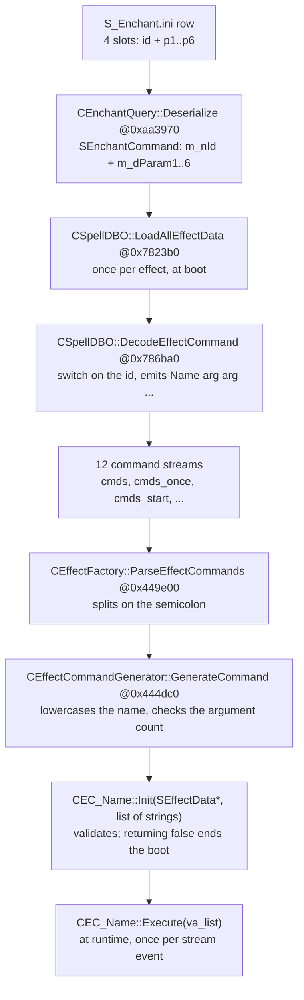

# S_Enchant.ini — effect command reference

> Verified 2026-09-04 against the ZoneServer binary (IDA database with DWARF symbols) and the data in a
> test-server copy of `S_Enchant.ini` (`|V.10|63|`, 36,382 rows).
> Companion to the `S_Enchant.ini` article, which covers the file format, the loader, the exclusion groups and the
> runtime engine. This one covers only the **command vocabulary**: the four command slots of every row.

---

## 0. The four command slots

Every effect has **four command slots**, seven columns each:

```
slot 1 → col 11 = id   col 12..17 = p1..p6
slot 2 → col 18 = id   col 19..24 = p1..p6
slot 3 → col 25 = id   col 26..31 = p1..p6
slot 4 → col 32 = id   col 33..38 = p1..p6
```

- `id` is an **unsigned integer** opcode. `0` or empty means the slot is ignored.
- `p1..p6` are **doubles**. They accept decimals and negatives, but most commands re-read them with `strtol`,
  which truncates — and in a few cases a decimal or a zero is a boot killer.
- Each command uses **only some** of the six parameters, at fixed positions decided by the decoder, not by the
  command class. A parameter the decoder does not pass is never seen by the command.

## 1. From a row to a running effect



The lookup table `EffectCommandTable` (a `map<string, IEffectCommandGenerator*>`) is filled in
`CEffectFactory::InitEffectCommandTable @0x4452c0` with about 200 `Book(name, generator)` calls. The syntax
strings that document each command's parameters live in `.rodata` from `0xCE4159`, in the form
`"Name <number> <number> …"`, where `<word>` means a string or enum argument. Those strings are not just
documentation: `Book` counts their tokens and `GenerateCommand` refuses any command whose argument count does not
match — see §9.1.

!!! warning "The text layer is the real interface"
    The numeric id is only a shorthand. What the engine runs is the **text** the decoder produces, and that text
    is what `Init` parses. Two different ids can produce the same text in different streams: `1001` and `3001`
    both emit `HP <p1> <p2> <p3> <p4> <p5>`, but `1001` lands in `CommandsOnce` (a single hit or heal) and `3001`
    in `Commands` (a tick every `Period`).

## 2. The twelve command streams

`DecodeEffectCommand` takes twelve `std::string&` outputs, one per stream, and appends to whichever the `case`
chooses. `LoadAllEffectData` then parses each string into the matching `std::vector<CEffectCommand*>` of
`SEffectData`. Offsets below are inside `SEffectData` (832 bytes).

| Decoder argument | `SEffectData` vector | Offset | When the engine runs it |
|---|---|---|---|
| `cmds` | `Commands` | `+0x40` | Every `Period` tick while the effect is active. |
| `cmds_once` | `CommandsOnce` | `+0x58` | Once, when the effect is applied. |
| `cmds_start` | `CommandsStart` | `+0x28` | When the effect enters; the matching `RollBack` runs when it leaves. |
| `cmds_hurt` | `CommandsHurt` | `+0xe8` | When the bearer takes damage. |
| `cmds_hit` | `CommandsHit` | `+0xa0` | When the bearer lands a hit. |
| `cmds_absorb` | `CommandsAbsorb` | `+0x208` | In the damage-absorption stage (shields). |
| `cmds_enhance` | `CommandsEnhance` | `+0x220` | In the damage-enhancement stage. |
| `cmds_move` | `CommandsMove` | `+0x238` | On movement. |
| `cmds_miss` | `CommandsMiss` | `+0xb8` | On a miss. |
| `cmds_start_elf` | `CommandsStartElf` | `+0x250` | Sprite equivalent of `CommandsStart`. |
| `cmds_elf` | `CommandsElf` | `+0x268` | Sprite equivalent of `Commands`. |
| `cmds_once_elf` | `CommandsOnceElf` | `+0x280` | Sprite equivalent of `CommandsOnce`. |

!!! note "How solid that pairing is"
    The decoder-argument names and the vector names both come from the binary's debug symbols, and they match one
    to one. The trigger points independently verified elsewhere are `Commands` (the `Period` tick), `CommandsOnce`
    (applied once), `CommandsStart`/`RollBack` (enter and leave), and the two streams the loader injects a
    `Finish 100` into for flag bits `0x2000` and `0x20000` (`CommandsUseItem`, `CommandsMoveSelf`). For `Hurt`,
    `Hit`, `Absorb`, `Enhance`, `Miss` and the three sprite streams the trigger is taken from the name, not from a
    separately traced call site.

`SEffectData` holds 30 command vectors in total. The other eighteen (`CommandsEnd`, `CommandsAttack`,
`CommandsBeAttacked`, `CommandsKill`, `CommandsBeKilled`, `CommandsRevive`, the heal and cast-spell pairs,
`CommandsUseItem`, `CommandsMoveSelf` and so on) are never targets of the numeric decoder: they are filled from
the `Finish 100` the loader injects for certain flag bits, or from text commands that come from other data files.

## 3. Dispatch, and what happens to an unknown id

There is not one jump table, there are **six**, plus four loose `cmp` comparisons:

| Dispatch | Id range | Jump table | Cases actually implemented |
|---|---|---|---|
| `switch(id-1001)`, 2,102 slots | `1001`–`3102` | `jpt_786E22 @0xDA1070` | **213** |
| `switch(id-4001)`, 41 slots | `4001`–`4041` | `@0xDA5220` | 9 |
| `switch(id-5001)`, 32 slots | `5001`–`5032` | `@0xDA5368` | 21 |
| `switch(id-6001)`, 26 slots | `6001`–`6026` | `@0xDA5468` | 9 |
| `switch(id-7001)`, 114 slots | `7001`–`7114` | `@0xDA5538` | 22 |
| `switch(id-9009)`, 23 slots | `9009`–`9031` | `@0xDA58C8` | 5 |
| loose `cmp` | `1`, `2`, `3901`, `9101` | — | 4 (`@0x795D55`, `@0x787266`, `@0x787299`, `@0x7872F6`) |

That is **283 ids** with a `case`. The highest id handled at all is `9101`.

!!! danger "An unknown id is swallowed in silence"
    Every `default` falls into the same shared tail (`def_7871A5 @0x7964FE`). It emits no text and writes no log,
    so a typo in a command id cannot be spotted from the boot output: the effect simply does less than you think.
    The tail still applies post-processing **by id range, whether or not there was a `case`**:

    - `2000 ≤ id ≤ 3999` → `++DurationCnt` (`SEffectData+0x31C`)
    - `4000 ≤ id ≤ 5999` and `id ≠ 4021` → `InnerFlags |= 4` (marks the effect as sprite commands)
    - `5000 ≤ id ≤ 5999` → `++DurationCnt` as well

    Then every non-empty stream gets a trailing `;` and is appended to its bucket.

That post-processing is why a row can be a buff without doing anything. `DurationCnt` is what makes the engine
create a lasting effect at all, and a `2xxx` id raises it **even when the id has no `case`**. That is why `2000`,
which has no `case`, is the standard way to write an icon-and-timer buff with no mechanical effect. Conversely, a
row whose four slots are all `1xxx` leaves `DurationCnt` at 0 and the effect is instant, with no buff at all.

## 4. How to read the tables

- **`<pN>`** is the value taken from parameter *N* of that slot. A bare number is **fixed by the id**, hardcoded
  in the decoder, and cannot be changed from the file.
- A `;` in the generated text means the id emits **several sub-commands** at once. Each one is looked up and
  initialised separately.
- **Units.** Every duration in this file is in **tenths of a second**. Percentages are not consistent: some
  commands store plain percent, some a fraction, some hundredths, some thousandths. The `Execute` column always
  says which, and §9.5 collects the pairs that look alike and are not.
- **Boot killers.** An `Init` that returns `false` ends the boot with `[FAIL] Database Error!!`. Rows marked
  **FATAL** below do exactly that. Errors that only write a log line let the server start.
- `—` in the `Init` column means the class has no `Init` of its own and validates nothing; `stub` means it has
  one that returns immediately and accepts any value.

## 5. Id → command, by family

### 5.1. Instant — `1xxx` (and the two system ids)

| Id | Generated text | Stream |
|---|---|---|
| `1` | `SetMigrationInvincible` · *bloque 0x795D55 (cmp eax,1 / jz); also ++DurationCnt (ed+31Ch)* | `cmds_start` |
| `2` | `Weak` · *branch outside the jump table (cmp eax,2 @0x787266); ++DurationCnt (ed+31C)* | `cmds_start` |
| `1001` | `HP <p1> <p2> <p3> <p4> <p5>` | `cmds_once` |
| `1002` | `Heal <p1> <p2> <p3> <p4> <p5> <p6>` | `cmds_once` |
| `1003` | `HPEX <p1> <p2> <p3> <p4> <p5> <p6>` | `cmds_once` |
| `1004` | `HPRate <p1> <p2> <p3> <p4> <p5>` | `cmds_once` |
| `1005` | `HPReal <p1> <p2> <p3> <p4>` | `cmds_once` |
| `1006` | `HPRateReal <p1> <p2> <p3> <p4>` | `cmds_once` |
| `1007` | `IndexCasterAbility 1 <p1> <p2> <p3> <p4> 1` · *the 1 after the name and the trailing 1 are literals* | `cmds_once` |
| `1008` | `IndexCasterAbility 2 <p1> <p2> <p3> <p4> 1` · *same as 1007 but with index 2* | `cmds_once` |
| `1009` | `IndexCasterAbility 4 <p1> <p2> <p3> <p4> 1` · *same as 1007 but with index 4* | `cmds_once` |
| `1011` | `MP <p1> <p2> <p3> <p4>` | `cmds_once` |
| `1012` | `MPCombo <p1> <p2> <p3> <p4> <p5> <p6>` | `cmds_once` |
| `1021` | `Damage2HP once caster 15 100 <p1> <p2> <p3> <p6>` · *15 y 100 hardcoded; skips p4 and p5* | `cmds_once` |
| `1022` | `EMP 100 <p1> <p2> MP 0 <p6>` · *two sub-commands concatenated with no ';'; 100 y 0 hardcoded* | `cmds_once` |
| `1023` | `PetDedicate <p1> <p2> <p3>` · *only if p1>0; si p1<=0 emits nothing* | `cmds_once` |
| `1031` | `MultiStroke 12 <p1> <p2> <p3> <p4>` · *12 hardcoded* | `cmds_once` |
| `1041` | `GainAAPoint <p1>` | `cmds_once` |
| `1071` | `DeSummon <p1>` | `cmds_once` |
| `1072` | `PetInstruction  100` · *uses no parameters; double space (the literal already carries one) y 100 hardcoded* | `cmds_once` |
| `1073` | `PetHP <p1> <p2> <p3> <p4>` | `cmds_once` |
| `1074` | `SummonInEventArea <p1> <p2> <p3> <p4> <p5> <p6> normal` | `cmds_once` |
| `1075` | `SummonInEventArea <p1> <p2> <p3> <p4> <p5> <p6> quest` · *identical to 1074 but ending in " quest"* | `cmds_once` |
| `1076` | `ItemTriggerEvent <p1> <p2>` | `cmds_once` |
| `1077` | `BornNPC <p1> <p2> <p3> <p4>` · *also ++DurationCnt (ed+31Ch)* | `cmds_start` |
| `1078` | `BindEnchant <p1> <p2> <p3> <p4> <p5> <p6>` · *also ++DurationCnt (ed+31Ch)* | `cmds_start` |
| `1079` | `LastEnchant <p1> <p2> <p3> <p4> 1` · *also ++DurationCnt (ed+31Ch); the trailing 1 is a literal* | `cmds_start` |
| `1080` | `AddBattlefieldScore <p1> <p2>` | `cmds_once` |
| `1081` | `BindEnchantStack <p1> <p2> <p3> <p4> <p5> <p6>` · *also ++DurationCnt (ed+31Ch)* | `cmds_start` |
| `1082` | `GetElftabletCombo <p1>` | `cmds_once` |
| `1120` | `AttrHateReset` · *no parameters* | `cmds_once` |
| `1121` | `—` · *emits NO text: it only does mov word [ed+318h] = (int)p1* | `cmds_once` |
| `1122` | `—` · *emits NO text: it only does mov word [ed+31Ah] = (int)p1* | `cmds_once` |
| `1123` | `Taunt` · *no parameters* | `cmds_once` |
| `1800` | `DistanceGotoPet <p1> <p2> <p3+100> <p4> <p5> <p6>` · *the constant 100.0 is added to p3 (qword_CE33B0)* | `cmds_move` |
| `1801` | `GotoReviveArea / Escape / Assemble <p1> / GotoLover / MarkedPointSave / MarkedPointLoad` · *internal switch on (int)p1: 1=GotoReviveArea, 2=Escape, 3-8=Assemble <p1> (p1 as an integer), 9=GotoLover, 10=MarkedPointSave, 11=MarkedPointLoad; outside 1..11 emits nothing* | `cmds_once` |
| `1802` | `DistanceGoto <p1> <p2+100>` · *the constant 100.0 is added to p2 (qword_CE33B0)* | `cmds_move` |
| `1803` | `DistanceGoto <-p1> <p2+100>` · *p1 is emitted NEGATED (xor with the sign mask); the 2nd field is the integer (int)p2+100, and if that comes out 102 it is replaced by 104* | `cmds_move` |
| `1804` | `DistanceGoto <p1> 105` · *105 (0x69) hardcoded* | `cmds_once` |
| `1805` | `ItemTransportArea <p1> <p2>` | `cmds_once` |
| `1806` | `DistanceGotoEx <p1> 105` · *105 (0x69) hardcoded* | `cmds_once` |
| `1807` | `DistanceSummon 105` · *no parameters; 105 (0x69) hardcoded* | `cmds_once` |
| `1808` | `DistancePetReturn <p1> <p2> <p3> <p4> <p5>` | `cmds_move` |
| `1811` | `Revive <p3> <p1> <p2> <p4> <p5>` · *reordered: p3 is emitted first* | `cmds_once` |
| `1821` | `EnchantKillRandom  1 <p1> <p2>;EnchantKillRandom  2 <p3> <p4>;` · *the 1st sub-command only if p1>0 and p2>0; the 2nd only if p3>0 and p4>0; double space after the name (the literal already carries one); 1 y 2 are literals* | `cmds_once` |
| `1822` | `EnchantCancel <p1> <p2> <p3>;EnchantCancel <p4> <p5> <p6>;` · *the 1st sub-command is skipped if p1==p2==p3==0; the 2nd is skipped if p4==p5==p6==0* | `cmds_once` |
| `1823` | `EnchantKills <p1> <p2> <p3> <p4> <p5> <p6>` | `cmds_once` |
| `1824` | `EnchantKill <p1> 1` · *the trailing "1" is a literal, not a parameter* | `cmds_once` |
| `1825` | `EnchantKillsRandom <p1> <p2> <p3> <p4> <p5> <p6>` | `cmds_once` |
| `1901` | `DrillItem <p1> <p2> <p3> <p4>` | `cmds_once` |
| `1911` | `Repair <p1> <p2> <p3>` | `cmds_once` |
| `1912` | `Repair <p1> 3.000000 -100.000000` · *p2 y p3 are ignored: the literal strings are emitted "3.000000" y "-100.000000"* | `cmds_once` |
| `1913` | `PlayEffect 0 <p3> 1 <p1> <p2>` · *reordered: p3 first, then the literal 1, then p1 and p2* | `cmds_once` |
| `1914` | `UnBindItem <p1> <p2> <p3> <p4> <p5> <p6>` | `cmds_once` |
| `1921` | `EffectNextID <p2> <p1> <p3> <p5> <p6>` · *si p4!=0 the text is "EffectNextID2Other <p2> <p1> <p3> <p5> <p6>" (body at 0x795F6C); p4 is never printed* | `cmds_once` |
| `1999` | `SpellAttack <p1> <p2> <p3> <p4>` | `cmds_once` |

### 5.2. Persistent modifiers — `2xxx`

| Id | Generated text | Stream |
|---|---|---|
| `2001` | `AttrMaxHP <p1>` | `cmds_start` |
| `2002` | `AttrMaxHPRate <p1>` | `cmds_start` |
| `2003` | `AttrRecoverHP <p1>` · *only if p1!=0* | `cmds_start` |
| `2011` | `AttrMaxMP <p1>` | `cmds_start` |
| `2012` | `CostMP <-p1> <p2> <p3> <p4>` · *p1 is emitted NEGATED (xorpd with the sign mask 0x8000000000000000)* | `cmds_start` |
| `2013` | `AttrMaxMPRate <p1>` | `cmds_start` |
| `2014` | `AttrRecoverMP <p1>` · *only if p1!=0* | `cmds_start` |
| `2019` | `Damage2HP hit caster 4 100 <p1> <p2> 0 <p6>;Damage2HP hit caster 8 100 <p3> <p4> 0 <p6>` · *1st sub-command only if p1!=0 or p2!=0; 2nd only if p3!=0 or p4!=0; the 4/8, the 100 and the 0 are literals* | `cmds_hit` |
| `2020` | `MPDamage2MP caster 4 <p1> <p2> <p6>;MPDamage2MP caster 8 <p3> <p4> <p6>;` · *1st sub-command only if p1!=0 or p2!=0; 2nd only if p3!=0 or p4!=0; both end with ';'* | `cmds_hit` |
| `2021` | `Damage2HP hit caster 3 100 <p1> <p2> 0 <p6>` | `cmds_hit` |
| `2022` | `Damage2MP caster 3 100 <p1> <p2> <p6>` | `cmds_hit` |
| `2023` | `AttrAttackPenetration <p1> <p2> <p3> <p4>;` | `cmds_start` |
| `2024` | `DamageReversePenetration <p1> <p2> <p3> <p4>;` | `cmds_hurt` |
| `2029` | `DamageAddRateByDistance <p1> <p2> <p3> <p4> <p5> <p6>;` | `cmds_start` |
| `2030` | `DamageImmune` · *no parameters* | `cmds_start` |
| `2031` | `MultiStroke 12 <p1> <p2> <p3> <p4>` · *the 12 is a literal* | `cmds_hit` |
| `2032` | `MultiStroke 3 <p1> <p2> <p3> <p4>` · *the 3 is a literal* | `cmds_hit` |
| `2033` | `AttrDamageRate 1 <p1>;AttrDamageRate 2 <p2>;AttrDamageRate 4 <p3>;AttrDamageRate 8 <p4>;` · *each sub-command only if its pN != 0; 1/2/4/8 are the damage-type mask* | `cmds_start` |
| `2034` | `AttrBeDamageRate 1 <p1>;AttrBeDamageRate 2 <p2>;AttrBeDamageRate 4 <p3>;AttrBeDamageRate 8 <p4>;` · *each sub-command only if its pN != 0* | `cmds_start` |
| `2035` | `DamageAdd enhance 1 100 <p1>;DamageAdd enhance 2 100 <p2>;DamageAdd enhance 4 100 <p3>;DamageAdd enhance 8 100 <p4>;` · *each sub-command only if its pN != 0; the 100 is a literal* | `cmds_enhance` |
| `2036` | `DamageAdd absorb 1 100 <p1>;DamageAdd absorb 2 100 <p2>;DamageAdd absorb 4 100 <p3>;DamageAdd absorb 8 100 <p4>;` · *each sub-command only if its pN != 0; the 100 is a literal* | `cmds_absorb` |
| `2037` | `Damage2HP hurt caster 7 <p1> <-p2> <-p2> 0 0;Damage2HP hurt caster 8 <p3> <-p4> <-p4> 0 0;` · *1st sub-command only if p1>0 AND p2>0; 2nd only if p3>0 AND p4>0; p2 y p4 are emitted NEGATED and TWICE* | `cmds_hurt` |
| `2038` | `HealRate <p1> <p2> <p3> <p4>;` | `cmds_start` |
| `2039` | `TrueDamage 12 <p1> <p2>` · *the 12 is a literal* | `cmds_hit` |
| `2040` | `TrueDamage 3 <p1> <p2>` | `cmds_hit` |
| `2041` | `AttrCriticalRate <p1*10> 0;AttrMagicCriticalRate <p2*10> 0;` · *each part only if its parameter != 0; the value is multiplied by 10 (the 10.0 constant at qword_CF9B18)* | `cmds_start` |
| `2042` | `AttrCriticalRate 0 <p1*10>;AttrMagicCriticalRate 0 <p2*10>;` · *each part only if its parameter != 0; value x10* | `cmds_start` |
| `2043` | `AttrCriticalDamage <p1> 0;AttrMagicCriticalDamage <p2> 0;` · *each part only if its parameter != 0; aqui NO hay x10* | `cmds_start` |
| `2044` | `AttrCriticalDamage 0 <p1>;AttrMagicCriticalDamage 0 <p2>;` · *each part only if its parameter != 0; no x10* | `cmds_start` |
| `2045` | `AttrEnhanceByClassType 0 <p1> <p3> <p4>;` · *p2, p5 and p6 are unused* | `cmds_start` |
| `2046` | `AttrEnhanceByClassType 1 <p1> <p3> <p4>;` · *identical to 2045 but with type 1* | `cmds_start` |
| `2049` | `ModifyCharacterMovement <p1>` | `cmds_start` |
| `2050` | `SetCharacterMovement <p1>` | `cmds_start` |
| `2051` | `AttrMovement <p1>` | `cmds_start` |
| `2052` | `AttrAttackSpeed <p1>` | `cmds_start` |
| `2053` | `AttrCastTime <p1>` | `cmds_start` |
| `2054` | `AttrWeaponAttackSpeedRate 13 <p1>;AttrWeaponAttackSpeedRate 14 <p2>;AttrWeaponAttackSpeedRate 56 <p2>;AttrWeaponAttackSpeedRate 60 <p2>;` · *the 13 block only if p1!=0; the THREE blocks 14/56/60 are emitted together and only if p2!=0* | `cmds_start` |
| `2055` | `StateNoMove <p1>;StateNoAttack <p2>;StateNoUseSkill Kungfu <p3>;StateNoUseSkill Magic <p4>;StateNoUseItem <p5>;` · *each part only if its parameter != 0. It also adds up the signs of p1..p5: if the sum == 5 it does or byte [ed+2FFh],2 and appends EffectNextID <lapis::CEffectFactory::AntiStunID> 100 120 0 0; followed by StateNoDodge 1; if the sum == -5 it appends StateNoDodge -1;* | `cmds_start` |
| `2056` | `HPHarmShieldByMP <p1> <p2> <p3> <p4> <p5> <p6>` | `cmds_start` |
| `2057` | `HealShieldEndHeal <p1> <p2> <p3> <p4> <p5> <p6>` | `cmds_start` |
| `2059` | `HealShield <p1> <p2> <p3> <p4> <p5> <p6>` | `cmds_start` |
| `2060` | `HealTimesShield <p1> <p2> <p3> <p4> <p5> <p6>` | `cmds_start` |
| `2061` | `AttrCastFailRate <p1> <p2> <p3> <p4> <p5>;` · *p6 is unused; ends with ';'* | `cmds_start` |
| `2062` | `AttrBanGainSpellType 3 <p1>;AttrBanGainSpellType 2 <p2>;` · *each part only if its parameter != 0* | `cmds_start` |
| `2063` | `AttrSpellDamage <p6> <p1> <p2> <p3> <p4> <p5>` · *p6 comes first* | `cmds_start` |
| `2064` | `AttrSpellDamageRate <p6> <p1> <p2> <p3> <p4> <p5>` · *p6 comes first* | `cmds_start` |
| `2065` | `AttrSpellDuration <p6> <p1> <p2> <p3> <p4> <p5>` · *p6 comes first* | `cmds_start` |
| `2066` | `AttrSpellChangeEffectID <p1> <p2> <p3> <p4> <p5> <p6>` | `cmds_start` |
| `2067` | `AttrCastSuccessRate <p1>` | `cmds_start` |
| `2068` | `HPHarmShield 255 <p1> <p2> <p3> <p4> <p5> <p6>` · *the 255 is a literal* | `cmds_start` |
| `2069` | `TimesShield 255 <p1> <p2> <p3> <p4> <p5> <p6>` · *the 255 is a literal* | `cmds_start` |
| `2071` | `SummonMobs <p1> <p2> <p3> <p4> <p5> <p6>` | `cmds_start` |
| `2072` | `SummonPet <p1> <p2> <p3> <p4> <p5> <p6>` | `cmds_start` |
| `2073` | `HPHarmShield <N> <p1> <p2> <p3> <p4> 0 0` · *N = 7 si p5==1.0, N = 8 si p5==2.0, N = 255 in any other case; the last two fields are literals 0 y p6 is unused* | `cmds_start` |
| `2074` | `TimesShield <N> <p1> <p2> <p3> <p4> 0 0` · *same as 2073: N = 7 si p5==1.0, 8 si p5==2.0, 255 otherwise; the last two fields are literals 0* | `cmds_start` |
| `2075` | `DeadShield <p1> <p2> <p3> <p4>` · *p5 and p6 are unused* | `cmds_start` |
| `2081` | `AttrStr <p1>;AttrCon <p2>;AttrInt <p3>;AttrVol <p4>;AttrDex <p5>;` · *each part only if its parameter != 0; p6 is unused* | `cmds_start` |
| `2082` | `AttrPhysicoDamage <p1>;AttrRangeDamage <p2>;AttrDefence <p3>;AttrHitRate <p4>;AttrRangeHitRate <p5>;AttrDodgeRate <p6>;` · *each part only if its parameter != 0; special case: if p1..p5 are 0 and p6 == -300 it emits NOTHING* | `cmds_start` |
| `2083` | `AttrPhysicoDamageRate <p1>;AttrRangeDamageRate <p2>;AttrDefenceRate <p3>;AttrHitRateRate <p4>;AttrRangeHitRateRate <p5>;AttrDodgeRateRate <p6>;` · *each part only if its parameter != 0* | `cmds_start` |
| `2084` | `AttrMagicDamage <p1>;AttrMagicDefence <p2>;` · *each part only if its parameter != 0* | `cmds_start` |
| `2085` | `AttrMagicDamageRate <p1>;AttrMagicDefenceRate <p2>;` · *each part only if its parameter != 0* | `cmds_start` |
| `2086` | `LevelCheck <p5>;AttrDefenceRate <p1>;AttrHitRateRate <p2>;AttrRangeHitRateRate <p3>;AttrDodgeRateRate <p4>;` · *LevelCheck is always emitted; the other four parts only if their parameter != 0; p6 is unused* | `cmds_start` |
| `2087` | `AttrBase Str 0 <p1>;AttrBase Dex 0 <p2>;AttrBase Int 0 <p3>;AttrBase Vol 0 <p4>;AttrBase Con 0 <p5>` · *each sub-command only if its param != 0* | `cmds_start` |
| `2091` | `ResistDamage 7 1 <p1> <p2>;ResistDamage 7 2 <p3> <p4>;ResistDamage 7 6 <p5> <p6>` · *each sub-command only if BOTH of its params > 0* | `cmds_hit` |
| `2092` | `ResistDamage 7 3 <p1> <p2>;ResistDamage 7 4 <p3> <p4>;ResistDamage 7 5 <p5> <p6>` · *each sub-command only if BOTH of its params > 0* | `cmds_hit` |
| `2093` | `ResistDamage 8 1 <p1> <p2>;ResistDamage 8 2 <p3> <p4>;ResistDamage 8 6 <p5> <p6>` · *each sub-command only if BOTH of its params > 0* | `cmds_hit` |
| `2094` | `ResistDamage 8 3 <p1> <p2>;ResistDamage 8 4 <p3> <p4>;ResistDamage 8 5 <p5> <p6>` · *each sub-command only if BOTH of its params > 0* | `cmds_hit` |
| `2095` | `AttrResist 1 <p1>;AttrResist 2 <p2>;AttrResist 6 <p3>;AttrResist 3 <p4>;AttrResist 4 <p5>;AttrResist 5 <p6>` · *each sub-command only if its param != 0; watch the element order: p3 uses 6, p4 uses 3, p5 uses 4, p6 uses 5* | `cmds_start` |
| `2101` | `SpecialDamage 7 1 <p1> <p2>;SpecialDamage 7 2 <p3> <p4>;SpecialDamage 7 4 <p5> <p6>` · *each sub-command only if BOTH of its params > 0* | `cmds_hit` |
| `2102` | `SpecialDamage 7 8 <p1> <p2>;SpecialDamage 7 16 <p3> <p4>` · *each sub-command only if BOTH of its params > 0; p5 and p6 are unused* | `cmds_hit` |
| `2103` | `SpecialDamage 7 32 <p1> <p2>;SpecialDamage 7 64 <p3> <p4>` · *each sub-command only if BOTH of its params > 0; p5 and p6 are unused* | `cmds_hit` |
| `2104` | `SpecialDamage 8 1 <p1> <p2>;SpecialDamage 8 2 <p3> <p4>;SpecialDamage 8 4 <p5> <p6>` · *each sub-command only if BOTH of its params > 0* | `cmds_hit` |
| `2105` | `SpecialDamage 8 8 <p1> <p2>;SpecialDamage 8 16 <p3> <p4>` · *each sub-command only if BOTH of its params > 0; p5 and p6 are unused* | `cmds_hit` |
| `2106` | `SpecialDamage 8 32 <p1> <p2>;SpecialDamage 8 64 <p3> <p4>` · *each sub-command only if BOTH of its params > 0; p5 and p6 are unused* | `cmds_hit` |
| `2108` | `AttrWeaponDamageRate 54 <p1>;AttrWeaponDamageRate 55 <p2>;AttrWeaponDamageRate 56 <p3>;AttrWeaponDamageRate 59 <p4>;AttrWeaponDamageRate 60 <p5>` · *each sub-command only if its param != 0; the body continues outside the range up to 0x79142E* | `cmds_start` |
| `2109` | `AttrWeaponCriticalRate 54 <p1*100>;AttrWeaponCriticalRate 55 <p2*100>;AttrWeaponCriticalRate 56 <p3*100>;AttrWeaponCriticalRate 59 <p4*100>;AttrWeaponCriticalRate 60 <p5*100>;` · *each sub-command only if its pN != 0; value x100 (qword_CE33B0=100.0); 54/55/56/59/60 are weapon-type ids* | `cmds_start` |
| `2110` | `AttrWeaponCriticalDamage 54 <p1>;AttrWeaponCriticalDamage 55 <p2>;AttrWeaponCriticalDamage 56 <p3>;AttrWeaponCriticalDamage 59 <p4>;AttrWeaponCriticalDamage 60 <p5>;` · *each sub-command only if its pN != 0; value, without multiplying* | `cmds_start` |
| `2111` | `AttrWeaponDamageRate 7 <p1>;AttrWeaponDamageRate 9 <p2>;AttrWeaponDamageRate 11 <p3>;AttrWeaponDamageRate 8 <p4>;AttrWeaponDamageRate 10 <p5>;AttrWeaponDamageRate 12 <p6>;` · *each sub-command only if its pN != 0; watch out: the id order is not sequential (7,9,11,8,10,12)* | `cmds_start` |
| `2112` | `AttrWeaponCriticalRate 7 <p1*100>;AttrWeaponCriticalRate 9 <p2*100>;AttrWeaponCriticalRate 11 <p3*100>;AttrWeaponCriticalRate 8 <p4*100>;AttrWeaponCriticalRate 10 <p5*100>;AttrWeaponCriticalRate 12 <p6*100>;` · *each sub-command only if its pN != 0; value x100; ids en orden 7,9,11,8,10,12* | `cmds_start` |
| `2113` | `AttrWeaponCriticalDamage 7 <p1>;AttrWeaponCriticalDamage 9 <p2>;AttrWeaponCriticalDamage 11 <p3>;AttrWeaponCriticalDamage 8 <p4>;AttrWeaponCriticalDamage 10 <p5>;AttrWeaponCriticalDamage 12 <p6>;` · *each sub-command only if its pN != 0; without multiplying; ids 7,9,11,8,10,12* | `cmds_start` |
| `2114` | `AttrWeaponDamageRate 13 <p1>;AttrWeaponDamageRate 14 <p2>;` · *each sub-command only if its pN != 0* | `cmds_start` |
| `2115` | `AttrWeaponCriticalRate 13 <p1*100>;AttrWeaponCriticalRate 14 <p2*100>;` · *each sub-command only if its pN != 0; value x100* | `cmds_start` |
| `2116` | `AttrWeaponCriticalDamage 13 <p1>;AttrWeaponCriticalDamage 14 <p2>;` · *each sub-command only if its pN != 0; without multiplying* | `cmds_start` |
| `2117` | `AttrShield <p1> <p2> <p3> <p4>` · *unconditional; emits NO trailing ';'* | `cmds_start` |
| `2118` | `UseTwoWeapon <p1> <p2> <p3> <p4>;` · *unconditional* | `cmds_start` |
| `2119` | `AttrWeaponMagicDamageRate 16 <p1>;AttrWeaponBeDamageRate 16 7 <p2>;` · *1st sub only if p1!=0, 2nd only if p2!=0; the 16 and the 7 are literals (the 7 comes from _M_insert<ulong>)* | `cmds_start` |
| `2121` | `AttrHate <p1>` · *unconditional; emits NO trailing ';'* | `cmds_start` |
| `2122` | `AttrHateRate <p1>` · *unconditional; emits NO trailing ';'* | `cmds_start` |
| `2123` | `AttrWeaponEQTypeModMagicDamageRate 54 <p1>;AttrWeaponEQTypeModMagicDamageRate 9 <p2>;AttrWeaponEQTypeModMagicDamageRate 10 <p3>;AttrWeaponEQTypeModMagicDamageRate 59 <p4>;AttrWeaponEQTypeModMagicDamageRate 60 <p5>;AttrWeaponEQTypeModMagicDamageRate 16 <p6>;` · *each sub-command only if its pN != 0; without multiplying; ids 54,9,10,59,60,16* | `cmds_start` |
| `2124` | `AttrWeaponMagicCriticalRate 54 <p1*100>;AttrWeaponMagicCriticalRate 9 <p2*100>;AttrWeaponMagicCriticalRate 10 <p3*100>;AttrWeaponMagicCriticalRate 59 <p4*100>;AttrWeaponMagicCriticalRate 60 <p5*100>;AttrWeaponMagicCriticalRate 16 <p6*100>;` · *each sub-command only if its pN != 0; value x100; ids 54,9,10,59,60,16* | `cmds_start` |
| `2125` | `AttrWeaponMagicCriticalDamage 54 <p1>;AttrWeaponMagicCriticalDamage 9 <p2>;AttrWeaponMagicCriticalDamage 10 <p3>;AttrWeaponMagicCriticalDamage 59 <p4>;AttrWeaponMagicCriticalDamage 60 <p5>;AttrWeaponMagicCriticalDamage 16 <p6>;` · *each sub-command only if its pN != 0; without multiplying; ids 54,9,10,59,60,16* | `cmds_start` |
| `2131` | `Transform <p1>;Disguise <p2> <p3>;FakeDie <p3>;` · *Transform only if p1>0; Disguise only if p2>0; FakeDie is enabled by p4!=0 but PRINTS p3 (probably a bug in the original)* | `cmds_start` |
| `2132` | `Transforms <p1> <p2> <p3> <p4> <p5> <p6>` · *sets or byte [ed+2FEh],10h* | `cmds_start` |
| `2133` | `ModelAlpha <p1>;Sneak <p2> <p3> <p4> 0` · *ModelAlpha only if p1<100 (const 100.0 en qword_CE33B0); the last token is the integer 0* | `cmds_start` |
| `2134` | `Ride <p1> <p2> <p3> <p4> <p5>+1` · *p5 gets +1.0 (qword_CF9658); si p4==0 also writes "Finish 100" en cmds_hit; or byte [ed+2FEh],8* | `cmds_start` |
| `2135` | `LevelCheck <p4>;Transform <p1>;MobChangeAI <p2> <p3>` · *LevelCheck only if p4>0; Transform only if p1>0; or byte [ed+2FEh],10h* | `cmds_start` |
| `2136` | `Transform <p1>;AttrForm <p2>;ReplaceShortcutPage <p2>-1` · *Transform only if p1>0; the page is p2-1.0 (qword_DA0F00 = -1.0)* | `cmds_start` |
| `2137` | `LevelCheck <p2>;Transform <p1>;Chaos` · *LevelCheck only if p2>0; Transform only if p1>0* | `cmds_start` |
| `2139` | `SpecialSpell 1 <ed[0]> <p1> <p2> <p3> <p4> <p5> <p6>` · *the 1 is a literal; ed[0] = the int at offset 0 of the effect data* | `cmds_start` |
| `2140` | `AttrForm <p2>;TransformEx <p1>` · *TransformEx only if p1>0* | `cmds_start` |
| `2141` | `ModelAlpha <p1>;Sneak <p2> <p3> <p4> 1` · *ModelAlpha only if p1<100 (const 100.0 en qword_CE33B0); the last token is the integer 1* | `cmds_start` |
| `2142` | `ChangeSpecificSpell <p1> <p2> <p3> <p4> <p5> <p6>` | `cmds_start` |
| `2143` | `SitChair <p1> <p2> <p3> <p4>+1` · *p4 gets +1.0 (qword_CF9658); or byte [ed+2FEh],8* | `cmds_start` |
| `2144` | `OnAttackBuffPhyCritical <p1> <p2> <p3>` | `cmds_hit` |
| `2145` | `OnAttackBuffMagicCritical <p1> <p2> <p3>` | `cmds_hit` |
| `2146` | `OnAttackBuffDodge <p1> <p2> <p3>` | `cmds_miss` |
| `2147` | `OnAttackBuffBlock <p1> <p2> <p3>` | `cmds_hurt` |
| `2148` | `OnAttackBuffBePhyCritical <p1> <p2> <p3>` | `cmds_hurt` |
| `2149` | `OnAttackBuffBeMagicCritical <p1> <p2> <p3>` | `cmds_hurt` |
| `2150` | `SetCoRideAction <p1> <p2> <p3> <p4> <p5>` | `cmds_start` |
| `2151` | `SpecialSpell -1 <ed[0]> <p1> <p2> <p3> <p4> <p5> <p6>` · *the -1 is a literal; ed[0] = the int at offset 0 of the effect data* | `cmds_start` |
| `2163` | `AttrSpellSetDamage <p6> <p1> <p2> <p3> <p4> <p5>` · *p6 comes first* | `cmds_start` |
| `2164` | `AttrSpellSetDamageRate <p6> <p1> <p2> <p3> <p4> <p5>` · *p6 comes first* | `cmds_start` |
| `2165` | `AttrSpellSetDuration <p6> <p1> <p2> <p3> <p4> <p5>` · *p6 comes first* | `cmds_start` |
| `2166` | `AttrSpellSetChangeEffectID <p1> <p2> <p3> <p4> <p5> <p6>` | `cmds_start` |
| `2167` | `SpellEffect <p1> <p2> <p3> 0;SpellEffect <p4> <p5> <p6> 0;` · *the 2nd block only if (int)p4!=0; the trailing 0 is a literal* | `cmds_start` |
| `2168` | `SpellEffect <p1> <p2> <p3> 1;SpellEffect <p4> <p5> <p6> 1;` · *the 2nd block only if (int)p4!=0; the trailing 1 is a literal* | `cmds_start` |
| `2169` | `SpellGroupEffect <p1> <p2> <p3> 0;SpellGroupEffect <p4> <p5> <p6> 0;` · *the 2nd block only if (int)p4!=0; the trailing 0 is a literal* | `cmds_start` |
| `2170` | `SpellGroupEffect <p1> <p2> <p3> 1;SpellGroupEffect <p4> <p5> <p6> 1;` · *the 2nd block only if (int)p4!=0; the trailing 1 is a literal* | `cmds_start` |
| `2171` | `SpellEffect <p1> <p2> <p3> 2;SpellEffect <p4> <p5> <p6> 2;` · *the 2nd block only if (int)p4!=0; the trailing 2 is a literal* | `cmds_start` |
| `2172` | `SpellGroupEffect <p1> <p2> <p3> 2;SpellGroupEffect <p4> <p5> <p6> 2;` · *the 2nd block only if (int)p4!=0; the trailing 2 is a literal* | `cmds_start` |
| `2242` | `ChangeSpellSetSpecificSpell <p1> <p2> <p3> <p4> <p5> <p6>` | `cmds_start` |
| `2811` | `ReviveBuff <p3> <p1> <p2> <p4> <p5>` · *p3 comes first, p6 is unused* | `cmds_start` |
| `2902` | `ItemDropRateUp <p1>` | `cmds_start` |
| `2911` | `ItemExpRateUp <p1> <p2>` | `cmds_start` |
| `2912` | `ItemDisableGainExp <p1> <p2> <p3> <p4>` | `cmds_start` |
| `2921` | `AttrRateBonus <p1> <p2> <p3> <p4>` | `cmds_start` |
| `2922` | `AllElfBonus <p1> <p2> <p3>` | `cmds_start` |
| `2931` | `AttrGainExp <p1> <p2> <p3> <p4> <p5>;DecDurability 2931 <p1> <p4>` · *also into cmds_start: "StateMoneyExp <p4>" si p4!=0, o "StateMoneyExp 0 " (with a trailing space) si p4==0; then or [ed+2FFh],3Ch. El 2931 del DecDurability es m_nId emitido como ulong* | `cmds` |
| `2932` | `AttrGainPrestigeExp <p1> <p2> <p3> <p4>;DecDurability 2932 <p1> 0` · *the trailing literal is " 0 " with a trailing space; also into cmds_start: "StateMoneyExp 0 " fixed; or [ed+2FFh],3Ch. The 2932 is m_nId as ulong* | `cmds` |
| `2934` | `PVPPlunderProtectAll <p1>; \| PVPPlunderProtect <p1>` · *si p1==4.0 (qword_D0DE90) the 1st goes to cmds_start; otherwise the 2nd goes to cmds_once (0x796051)* | `cmds_start \| cmds_once` |
| `2941` | `GainSTPoint <p1> <p2>` | `cmds_once` |
| `2942` | `ResetSTPoint` · *no parameters* | `cmds_once` |
| `2943` | `GainSTPointEx <p1> <p2> <p3> <p4>` | `cmds_once` |
| `2944` | `AttrGainCollectItem <p1> <p2>` · *also or [ed+2FFh],0B8h* | `cmds_start` |
| `2945` | `ItemEquipExpRateUp <p1> <p2>;` | `cmds_start` |
| `2946` | `GainItemEquipExp <p1>` | `cmds_once` |
| `2947` | `CleanItemTrainType <p1> <p2> <p3> <p4>` | `cmds_once` |
| `2948` | `RideItemExpRateUp <p1> <p2>;` | `cmds_start` |
| `2949` | `GainRideItemExp <p1>` | `cmds_once` |
| `2950` | `CleanRideItemTrainType <p1> <p2>;` | `cmds_once` |
| `2951` | `GainElfSpellPoint <p1> <p2>;` | `cmds_once` |
| `2952` | `VIPCard <p1> <p2> <p3>;` | `cmds_start` |
| `2953` | `GainFreeTicket <p1>` | `cmds_once` |
| `2954` | `GainBonus <p1> <p2> <p3> <p4> <p5> <p6>` | `cmds_once` |

### 5.3. Periodic and limits — `3xxx`

| Id | Generated text | Stream |
|---|---|---|
| `3001` | `HP <p1> <p2> <p3> <p4> <p5>` · *prefix "HP " en 0xDA82B6* | `cmds` |
| `3002` | `HPLimit <p1> <p2> <p3> <p4> <p5>` | `cmds` |
| `3003` | `HPReal <p1> <p2> <p3> <p4>` | `cmds` |
| `3004` | `HPRateReal <p1> <p2> <p3> <p4>` | `cmds` |
| `3007` | `IndexCasterAbility 1 <p1> <p2> <p3> <p4> 0` · *the 1 is a literal (ostream<<int), the trailing 0 is a literal " 0"* | `cmds` |
| `3008` | `IndexCasterAbility 2 <p1> <p2> <p3> <p4> 0` · *the 2 is a literal, the trailing 0 is a literal " 0"* | `cmds` |
| `3009` | `IndexCasterAbility 4 <p1> <p2> <p3> <p4> 0` · *the 4 is a literal, the trailing 0 is a literal " 0"* | `cmds` |
| `3011` | `MP <p1> <p2> <p3> <p4>` · *prefix "MP " en 0xDA82E7* | `cmds` |
| `3012` | `MPLimit <p1> <p2> <p3> <p4>` | `cmds` |
| `3021` | `EHP 100 <p1> <p1> HPrate <p2> 0;` · *p1 is emitted twice; 100 and the trailing " 0;" are literals* | `cmds` |
| `3022` | `EMP 100 <p1> <p1> MPrate <p2> 0;` · *p1 is emitted twice; 100 and the trailing " 0;" are literals* | `cmds` |
| `3080` | `AddBattlefieldScore <p1> <p2>` | `cmds` |
| `3101` | `EnchantCheckType <p1> 1;HPCheck <p2> 1;MPCheck <p3> 1;` · *each sub-command is emitted only if its parameter (p1/p2/p3) is != 0* | `cmds_start` |
| `3102` | `EnchantCheckType <p1> 0;HPCheck <p2> 0;MPCheck <p3> 0;` · *each sub-command is emitted only if its parameter (p1/p2/p3) is != 0* | `cmds_start` |
| `3901` | `AttrBFExp <p1> <p2>` · *branch outside the jump table (def_787038 @0x787299, cmp eax,0F3Dh)* | `cmds` |

### 5.4. Sprite — `4xxx` and `5xxx`

| Id | Generated text | Stream |
|---|---|---|
| `4001` | `ElfFamiliarEnergyMood <p1> <p2> <p3> <p4> <p5> <p6>;` · *emits nothing if p1..p6 are all 0; ends with ';'* | `cmds_once_elf` |
| `4002` | `ElfFamiliarEnergyMoodRate <p1> <p2> <p3> <p4> <p5> <p6>;` · *if p1..p6 are ALL 0 it emits nothing; ends with ';'* | `cmds_once_elf` |
| `4011` | `ElfGetSpell <p1>` · *p1 emitted as an integer; only if 1<=p1<=4, otherwise llama CLogFactory::InitErrLogAppend("Effect [%d] ") and emits nothing* | `cmds_once_elf` |
| `4012` | `ElfGetSpell <p1>` · *p1 as an integer; only if 5<=p1<=19 o p1==20 o p1==21, otherwise CLogFactory::InitErrLogAppend("Effect [%d] ") without emitting* | `cmds_once_elf` |
| `4013` | `ElfGetSpell <p1>` · *p1 as an integer; only if 13<=p1<=19 o p1==22, otherwise CLogFactory::InitErrLogAppend("Effect [%d] ") without emitting* | `cmds_once_elf` |
| `4014` | `ElfGetSpell <p1>` · *p1 as an integer; only if p1==75 exact, otherwise CLogFactory::InitErrLogAppend("Effect [%d] ") without emitting* | `cmds_once_elf` |
| `4021` | `AddElf <p1>` | `cmds_once` |
| `4031` | `ElfAction <p1> <p2> <p3> <p4> <p5>` | `cmds_once_elf` |
| `4041` | `LoverMood <p1> <p2>` | `cmds_once` |
| `5001` | `ElfCollectTime <p1>` | `cmds_elf` |
| `5002` | `ElfCollectSum <p1> 1 <p2>;ElfCollectSum <p1> 2 <p3>;ElfCollectSum <p1> 3 <p4>;ElfCollectSum <p1> 4 <p5>;` · *one sub-command per pN (N=2..5) != 0, and only if p1 != 0* | `cmds_elf` |
| `5003` | `ElfCollectRate <p1>` | `cmds_elf` |
| `5004` | `ElfSpellLevel 1 <p1> 2 <p2> 3 <p3> 4 <p4> 0 <p5> 0 <p6>;` · *nothing if p1..p4 are all 0* | `cmds_elf` |
| `5005` | `ElfCollectSum <p1> 23 <p2>;ElfCollectSum <p1> 24 <p3>;` · *each sub-command only if p1!=0 and its pN (p2 / p3) != 0* | `cmds_elf` |
| `5006` | `ElfSpellLevel 23 <p1> 24 <p2> 0 0 0 0 0 0 0 0;` · *nothing if p1..p4 are all 0; the tail " 0 0 0 0 0 0 0 0;" is a single literal* | `cmds_elf` |
| `5011` | `ElfCombineTime <p1>` | `cmds_elf` |
| `5012` | `ElfCombineRate <p1> <p2> <p3>;` | `cmds_elf` |
| `5013` | `ElfSpellLevel 5 <p1> 6 <p2> 7 <p3> 8 <p4> 9 <p5> 10 <p6>;` · *nothing if p1..p6 are all 0* | `cmds_elf` |
| `5014` | `ElfSpellLevel 11 <p1> 12 <p2> 13 <p3> 14 <p4> 15 <p5> 16 <p6>;` · *nothing if p1..p6 are all 0* | `cmds_elf` |
| `5015` | `ElfSpellLevel 17 <p1> 18 <p2> 19 <p3> 20 <p4> 21 <p5> 22 <p6>;` · *nothing if p1..p6 are all 0* | `cmds_elf` |
| `5016` | `ElfSpellLevel 26 <p1> 25 <p2> 75 <p3> 0 0 0 0 0 0;` · *if p1==0 && p2==0 && p3==0 it emits nothing; the 26/25/75 and the tail " 0 0 0 0 0 0;" are literals* | `cmds_elf` |
| `5017` | `ElfSoulCrystalCombineRate <p1> <p2>;` | `cmds_elf` |
| `5018` | `ElfTravelCombineRate <p1> <p2> <p3>;` | `cmds_elf` |
| `5021` | `ElfTrainExp <p1> <p2>` | `cmds_elf` |
| `5022` | `ElfTrainStuff <p1> <p2>` | `cmds_elf` |
| `5023` | `ElfTrainTime <p1>` | `cmds_elf` |
| `5025` | `ElfGainExp <p1> <p2> <p3>;DecDurability 5025 <p1> 0` · *writes into TWO buckets: cmds_start_elf carries this text (the id comes from ecmd+0 via _M_insert<ulong>, and the ending is the literal " 0 " WITH a trailing space) and cmds_elf receives also "StateMoneyExp 0"; ed+2FF \|= 0x3C* | `cmds_start_elf` |
| `5027` | `ElfGainGameExp <p1> <p2> <p3> <p4> <p5> <p6>` | `cmds_once_elf` |
| `5028` | `ElfGainSpellExp <p1> <p2>` | `cmds_once_elf` |
| `5032` | `ElfAttrMovement <p1>` | `cmds_start` |

### 5.5. Checks and items — `6xxx`

| Id | Generated text | Stream |
|---|---|---|
| `6001` | `ItemReCombo <p1> <p2> <p3>` | `cmds_once` |
| `6002` | `GetSpell <p1>` | `cmds_once` |
| `6003` | `GetUpanishad <p1>` | `cmds_once` |
| `6021` | `MonsterCheck <p1>;LevelCheckEx <p2> <p3>;EnchantCheck <p4>;MonsterTypeCheck <p5>;HPCheck <p6> 1` · *MonsterCheck si p1!=0; LevelCheckEx si p2>0 o p3>0; EnchantCheck si p4!=0; MonsterTypeCheck si p5!=0; HPCheck si p6>0 (the last one with no trailing ';'); ++DurationCnt (ed+31C)* | `cmds_start` |
| `6022` | `EnchantCheckEx <p1> <p2>` | `cmds_start` |
| `6023` | `EnchantClassCheck <p1> <p2> <p3> <p4> <p5> <p6>` | `cmds_once` |
| `6024` | `EnchantStackCheck <p1> <p2> <p3> <p4> <p5> <p6>` | `cmds_once` |
| `6025` | `TargetClassCheck <p1> <p2>` | `cmds_once` |
| `6026` | `EffectRebirthCheck <p1> <p2> <p3> <p4> <p5> <p6>` | `cmds_once` |

### 5.6. Target and chained effects — `7xxx`

| Id | Generated text | Stream |
|---|---|---|
| `7001` | `Effect2Target <p1> <p2> <p3> <p4> <p5>` · *si p6==0 va a cmds (var_B30); si p6!=0 rama en 0x795DEB with the SAME text but into cmds_once (var_F50); both branches do ++DurationCnt (ed+31C)* | `cmds` |
| `7002` | `EffectToCrop <p1> <p2> <p3> <p4>` · *bucket cmds si p6==0 (ecmd+28h); si !=0 va a cmds_once (loc_795EB1). Both branches: ++DurationCnt (ed+31C)* | `cmds` |
| `7004` | `BiologySay <p1> <p2> <p3> <p4>` | `cmds_once` |
| `7006` | `GetItem <p1> <p2>` | `cmds_once` |
| `7007` | `SpellCoolDown <p1> <p2> <p3> <p4> <p5> <p6>` | `cmds_once` |
| `7008` | `SpellGroupCoolDown <p1> <p2> <p3> <p4> <p5> <p6>` · *++DurationCnt (ed+31C)* | `cmds_start` |
| `7009` | `AddAchievement <p1>` | `cmds_once` |
| `7010` | `EffectNextRandID <p1> <p2> <p3> <p4> <p5> <p6>` | `cmds_once` |
| `7011` | `AddAppellation <p1> <p2>` | `cmds_once` |
| `7017` | `SpellSetCoolDown <p1> <p2> <p3> <p4> <p5> <p6>` | `cmds_once` |
| `7018` | `SpellSetGroupCoolDown <p1> <p2> <p3> <p4> <p5> <p6>` · *++DurationCnt (ed+31C)* | `cmds_start` |
| `7101` | `AttrTransfer 1 <p1> 0 0 0 0 0 0 0 0` · *index 1 fixed, uses only p1, 8 literal zeros; ++DurationCnt (ed+31C)* | `cmds_start` |
| `7102` | `AttrTransfer 2 <p1> 0 0 0 0 0 0 0 0` · *index 2 fixed, uses only p1, 8 literal zeros; ++DurationCnt (ed+31C)* | `cmds_start` |
| `7103` | `AttrTransfer 3 <p1> 4 <p2> 8 <p3*10> 9 <p4*10> 10 <p5*10>` · *p3,p4,p5 are multiplied by 10 (qword_CF9B18=10.0); p6 is unused; ++DurationCnt (ed+31C)* | `cmds_start` |
| `7104` | `AttrTransfer 5 <p1> 6 <p2> 0 0 0 0 0 0` · *6 literal zeros at the end; ++DurationCnt (ed+31C)* | `cmds_start` |
| `7105` | `AttrTransfer 7 <p1> 0 0 0 0 0 0 0 0` · *index 7 fixed, uses only p1, 8 literal zeros; ++DurationCnt (ed+31C)* | `cmds_start` |
| `7106` | `MHPMPTransfer 1 <p1> 3 <p2> 5 <p3> 7 <p4> 9 <p5> 11 <p6>` · *odd indexs 1,3,5,7,9,11; ++DurationCnt (ed+31C)* | `cmds_start` |
| `7107` | `MHPMPTransfer 2 <p1> 4 <p2> 6 <p3> 8 <p4> 10 <p5> 12 <p6>` · *even indexs 2,4,6,8,10,12; ++DurationCnt (ed+31C)* | `cmds_start` |
| `7111` | `AttrRateToPet 0 <p1> 1 <p2> 2 <p3> 3 <p4> 4 <p5> 5 <p6>` · *indexs 0-5; ++DurationCnt (ed+31C)* | `cmds_start` |
| `7112` | `AttrRateToPet 6 <p1> 7 <p2> 8 <p3> 9 <p4> 10 <p5> 11 <p6>` · *indexs 6-11; ++DurationCnt (ed+31C)* | `cmds_start` |
| `7113` | `AttrRateToPet 12 <p1> 13 <p2> 14 <p3> 15 <p4> 16 <p5> 17 <p6>` · *indexs 12-17; ++DurationCnt (ed+31C)* | `cmds_start` |
| `7114` | `AttrRateToPet 18 <p1> 19 <p2> 20 <p3> 21 <p4> 22 <p5> 23 <p6>` · *indexs 18-23; ++DurationCnt (ed+31C)* | `cmds_start` |

### 5.7. Misc — `9xxx`

| Id | Generated text | Stream |
|---|---|---|
| `9009` | `AddCharNum <p1>` | `cmds_once` |
| `9014` | `GetExpiredDailyAward` · *no parameters and no trailing space* | `cmds_once` |
| `9022` | `OpenShop <p1> <p2> <p3> <p4>` | `cmds_once` |
| `9030` | `AddRainbowCount <p1>` | `cmds_once` |
| `9031` | `AddNodeTempleChallengeTime <p1> <p2>` | `cmds_once` |
| `9101` | `UseTwoWeapon` · *branch outside the jump table (def_787231 @0x7872F6, cmp eax,238Dh)* | `cmds_start` |

## 6. Command reference

One row per command class, sorted alphabetically. The class is `lapis::CEC_<Command>` except where §9.6 says
otherwise.

| Command | Args | `Init` — validation and boot killers | `Execute` — what it does | Addresses |
|---|---|---|---|---|
| `AddAchievement` | 1 | No validation; AchievementID = strtol(p1,0,10) (base 10, truncates decimals); always return true; NOT fatal | Only type 7 objects (player), otherwise return false; queries CGameData::QueryAchievement(AchievementID) and, if the achievement exists, sends the MissionServer a CNC_DBA_AgentDBACommand with the text "Achievement id = %d point = %hd"; it does not touch any local statistic; RollBack @0x9bb480 is a 1-byte stub, it undoes nothing | `Init` 0x9bb230 · `Execute` 0x9bb3a0 |
| `AddAppellation` | 2 | No validation; AddOrRemove = strtol(p1,0,10) and AppellationID = strtol(p2,0,10); always return true; NOT fatal | Only type 7 (player); p1==1 calls CPlayerFactory::AddAppellation(char, AppellationID), p1==0 calls RemoveAppellation; any other value of p1 does NOTHING and still returns true; RollBack @0x9bb700 is a stub, it does not remove the title | `Init` 0x9bb490 · `Execute` 0x9bb660 |
| `AddBattlefieldScore` | 2 | The real class is lapis::CEC_BFAddScore (registered in CEffectFactory::InitEffectCommandTable @0x447c9f with the string "AddBattlefieldScore <number> <number> "); it requires the list to have EXACTLY 2 elements or return false; Side = strtol(p1) in 1..3 ((ushort)(Side-1) <= 2); Score = strtol(p2) in -9999..+9999 ((ushort)(Score+9999) < 0x4E1F); FATAL in all three cases but WITHOUT a message: it does not call InitErrLogAppend, it just returns false | Only type 7 (player); it takes the character's active battlefield (dword +0x1518) via CBattlefieldFactory::GetBattlefield and calls SetTeamScore(bf, Side, Score, charId); Score is flat points on the Side team's scoreboard, not a percentage; if the player is not in a battlefield return false; RollBack @0x9d1930 is a stub, it does not subtract the points | `Init` 0x9d16f0 · `Execute` 0x9d18a0 |
| `AddCharNum` | 1 | m_nNum = strtol(p1,0,10); it requires (ushort)(m_nNum-1) < 6, that is 1..6 (0 and negatives fail because of the cast to unsigned short); on failure it calls InitErrLogAppend(0xdcd668) with the Chinese literal "增加角色上限變數 %hd 錯誤 正確範圍[1 ~ 6] " and returns false = FATAL | Only type 7 (player); new = (short)[char+0x17F0] + m_nNum and it aborts with return false if new < 4 or (float)new > CFormula::AllFormulaParas[169]; if it passes it sends the WorldServer the text command "set_max_char_num %d %hd -1" (account character slots, flat units); RollBack @0x9bba60 is a stub | `Init` 0x9bb710 · `Execute` 0x9bb850 |
| `AddElf` | 1 | ElfId = strtol(p1,0,10); the only validation: return (ElfId != 0), so p1 = 0 is FATAL but WITHOUT a message (it does not touch InitErrLogAppend); any other id is accepted without checking that it exists in the elf table | It calls CElfManager::AddElf(Ins, character, ElfId, false) and returns its result; if the object is not type 7 it passes nullptr as the character instead of aborting (the manager decides); it grants the elf to the bearer; RollBack @0x9bbbf0 is a 1-byte stub | `Init` 0x9bba70 · `Execute` 0x9bbb70 |
| `AddNodeTempleChallengeTime` | 2 | NodeID = strtol(p1) must satisfy (ulong)(NodeID-1) < 0xFFFFFFFF (only 0 is rejected), otherwise InitErrLogAppend("Node [%ld] invalid!") + false = FATAL; Time = strtol(p2) must satisfy (uint)(Time-1) < 0x3E7, that is 1..999, otherwise InitErrLogAppend("Time [%d] invalid!") + false = FATAL | Only type 7 (player); CZoneRainbowRoadFactory::AddNodeChallengeEnterCount(Ins, char, NodeID, (ushort)Time) adds Time challenge entries to node NodeID (flat entry counter); if the factory fails it returns false and sends the client system message 18726 with code -105; RollBack @0x9bbe70 is a stub | `Init` 0x9bbc00 · `Execute` 0x9bbdd0 |
| `AddRainbowCount` | 1 | m_nCount = strtol(p1,0,10); it requires m_nCount > 0; on failure it returns false = FATAL, but the message does NOT go to the boot error log: it uses CLogFactory::ElfTempleLog("AddRainbowCountItem ERROR! Count == %hd") | Only type 7 (player); CZoneRainbowRoadFactory::GMAddCount(Ins, char, m_nCount) adds m_nCount Rainbow Road entries (flat counter, short); it notifies the client with message 16549 code -105 format "%d" and leaves a trace in ElfTempleLog "Player[%u][%s] Gain Rainbow Count By Item, Count[%hd]"; RollBack @0x9bc070 is a 1-byte stub | `Init` 0x9bbe80 · `Execute` 0x9bbfb0 |
| `AllElfBonus` | 3 | No validation; CollectTime = strtol(p1), CombineTime = strtol(p2), TrainTime = strtol(p3), all base 10; always return true; NOT fatal; it accepts negatives and zero | Only type 7 (player); it raw-adds three int counters of the character: +0xB4C += CollectTime, +0xB50 += CombineTime, +0xB54 += TrainTime (elf collecting / combining / training bonus, flat units); RollBack @0x9bc2b0 is NOT the exact inverse: it reads a SECOND vararg n (stacked amount) and subtracts n*CollectTime / n*CombineTime / n*TrainTime only if n > 0, while Execute adds a single time and ignores that argument | `Init` 0x9bc080 · `Execute` 0x9bc240 |
| `AttrAttackPenetration` | 4 | PhysicalPenetration=strtol(p1), MagicPenetration=strtol(p2), PhyPenetrationDefence=strtol(p3), MagPenetrationDefence=strtol(p4), base 10 (decimals truncated); all four must fall in -9999..+9999 ((uint)(v+9999) <= 0x4E1E); if p1/p2 fall outside: InitErrLogAppend(0xdcdd0e) "穿透值 %d or %d 超出範圍+-9999" + false = FATAL; if p3/p4 fall outside: InitErrLogAppend(0xdcdd34) "穿透減免值 %d or %d 超出範圍+-9999" + false = FATAL | NO type filter: it is applied to any entity, players and monsters; mPhysicalPenetration += (short)p1, mMagicPenetration += (short)p2, mPhysicalPenetrationDefence += (short)p3, mMagicPenetrationDefence += (short)p4, flat points of the field (game scale: 50 = 5.0%); only if it is type 7 does it mark NeedUpdateDetailAttr(1) for p1/p2 and NeedUpdateDetailAttr(15) for p3/p4; RollBack @0x9bd9d0 subtracts each value n times with n = second vararg (amount), asymmetric with Execute which adds a single time | `Init` 0x9bd650 · `Execute` 0x9bd900 |
| `AttrAttackSpeed` | 1 | Percent = strtod(p1,0) (does NOT truncate decimals) and immediately afterwards Percent /= 100.0 in float; if the result is exactly 0.0 it calls InitErrLogAppend(0xdcdce8) "增減攻擊速度的％ %f 沒意義" and returns false = FATAL (p1=0 kills the boot); there is no upper or lower cap | NO type filter: it is valid for players and monsters; EFBonusAttr->AttackSpeedRate (float at [entity+0x160]+0x100) += Percent, that is p1 as a percentage converted to a per-unit fraction (p1=10 adds 0.10 = +10% attack speed), and afterwards it calls Notify @0x9bce80 to recalculate and propagate; RollBack @0x9bd590 subtracts Percent in a loop of n iterations (n = second vararg, stacked amount) and calls Notify again, asymmetric with Execute which adds a single time | `Init` 0x9bcd40 · `Execute` 0x9bce30 |
| `AttrBFExp` | 2 | No validation; ExpRate = strtol(p1,0,10) and AAExpRate = strtol(p2,0,10); always return true; NOT fatal; it accepts negatives, zero and enormous values | Only type 7 (player); base = CGameData::QueryLevel(level+1)->m_nMonsterExp; it requires the player to be inside a battlefield (GetBattlefield with the dword +0x1510 and CBattlefield::IsCharExits with the charId +0x100), otherwise return false; r = (short)[char+0x1528]/100.0; SCharInfo.Exp += (1-r)*(base*ExpRate/100) and SCharInfo.AAExp += r*(base*AAExpRate/100), that is ExpRate and AAExpRate are integer PERCENTAGES of the next level's monster exp, not exp points; it notifies the client with TextIndex 11258 and both totals; RollBack @0x9bea60 is a 1-byte stub, the granted exp is not undone | `Init` 0x9be640 · `Execute` 0x9be790 |
| `AttrBanGainSpellType` | 2 | SpellType = strtol(p1,0,10) must satisfy (ushort)(SpellType-1) < 6, that is 1..6; on failure InitErrLogAppend(0xdce078) "無法被施展Buff的類型 %hd 錯誤" and it returns false = FATAL; Probability = strtol(p2,0,10) is NOT validated (any value goes, negatives or greater than 100 included) | Only type 7 (player); SpellType==2 adds Probability to the word at [char+0x160]+0x4AC and SpellType==3 to the word at [char+0x160]+0x4AA (probability of not receiving buffs of that type, in % points); WATCH OUT: types 1, 4, 5 and 6 pass the Init validation but Execute IGNORES them silently; the S_Enchant decoder (id 2062) only emits types 3 and 2; RollBack @0x9bec60 subtracts Probability n times (n = second vararg), asymmetric with Execute which adds once | `Init` 0x9bea70 · `Execute` 0x9bebd0 |
| `AttrBase` | 3 | p1 is a WORD, not a number: it is compared against "Str"/"Dex"/"Int"/"Vol"/"Con" and yields AttrType 2/3/4/5/6; Type = strtol(p2,0,10) and Value = strtol(p3,0,10); Value == 0 -> InitErrLogAppend(0xdce2a8) "增減基本屬性的數值為零沒意義" + false = FATAL; unknown word -> InitErrLogAppend(0xdce2df) "基本屬性的種類 %s 錯誤" + false = FATAL; Type is NOT validated in Init: any value other than 0 and 1 passes the boot and then Execute does nothing | Only type 7 (player) and it also requires the FOURTH vararg to be != 0, otherwise return false; Type==1 adds Value to the Str/Dex/Int/Vol/Con dword inside the EFBonusAttr[1] block and Type==0 inside the EFBonusAttr[2] block (two different bonus sets; flat attribute points, += operator); then CCharacter::NeedUpdateAttr(60); RollBack @0x9bf250 subtracts Value in a loop of n iterations (n = SECOND vararg) and calls NeedUpdateAttr(60) even with n <= 0, asymmetric with Execute which adds a single time and which additionally looks at the fourth vararg | `Init` 0x9bed70 · `Execute` 0x9bf080 |
| `AttrBeDamageRate` | 2 | p1=HurtType via strtol (bit mask 1/2/4/8, UNVALIDATED: a 0 or a 16 passes and then does nothing); p2 via strtod (accepts decimals); FATAL if p2 < -1000.0 or p2 > 1000.0 -> InitErrLogAppend(0xdce304 "進行攻擊時增減被敵人傷害％數的傷害％數 %f 錯誤") and return false; it is stored as (int)(p2*100) = hundredths of a percent | SEffectAttribute(CCharacter+352).DamageEnhance.BeDamageRates[0..3] (off 68/72/76/80, int) += Rate for each set bit of HurtType, in hundredths of a percent; the addition is applied to the bearer whether player or monster and only the NeedUpdateDetailAttr(14) recalculation is limited to type 7 (player); RollBack (0x9bf640) subtracts Rate N times (N = 2nd vararg = buff stacks) = exact inverse | `Init` 0x9bf430 · `Execute` 0x9bf5c0 |
| `AttrCastFailRate` | 5 | 5 strtol to int16 (Physico, Magic, Buff, Restore, All); each one must satisfy (uint16)(v+1) < 102, that is range [-1, 100]; out of range = FATAL with InitErrLogAppend("BUFFID(%d) 施展技能的失敗機率的<X>技能失敗機率 %hd 錯誤") at 0xdce420 (物理/physical) / 0xdce46d (魔法/magical) / 0xdce4ba (增益/buff) / 0xdce507 (恢復/restore) / 0xdce554 (全部/all); additionally if All != 0 and any of the other 4 != 0 -> FATAL 0xdce5a1 "BUFFID(%d) 施展技能的全部失敗機率有值(%hd)時，其他不可填值"; WATCH OUT: the -1 is NOT a -1%, it is a SENTINEL | SEffectAttribute+284/288/292/296 (physical / magical / buff / restore skill failure prob., int) += the value, unless it equals -1, in which case it adds the constant xmmword_DCE400 = -30000 (= -300%, that is it never fails); afterwards All is added to all 4 with the same -1 trick; it does NOT call NeedUpdateDetailAttr and does NOT check the character's null pointer; RollBack (0x9bfbc0) subtracts the same N times using +30000 (xmmword_DCE410) for the -1 = exact inverse | `Init` 0x9bf740 · `Execute` 0x9bfaf0 |
| `AttrCastSuccessRate` | 1 | 1 strtol to int16; FATAL if (unsigned)val >= 101, that is only 0..100 passes (any negative becomes a huge unsigned and falls) -> InitErrLogAppend(0xdce6a8 "施展技能不被中斷機率 %hd 錯誤,正確範圍(1~100)"); the message says 1~100 but the code DOES accept 0 (and then Execute adds nothing) | EFBonusAttr->CastSuccessRate (int16, resistance to having your cast interrupted) += val in flat % points, only if val != 0; the addition is applied to anyone and only the NeedUpdateDetailAttr(26) requires type 7 (player); RollBack (0x9bfe40) subtracts val N times (N = stacks) = exact inverse | `Init` 0x9bfcf0 · `Execute` 0x9bfdd0 |
| `AttrCastTime` | 1 | 1 strtod (accepts decimals); it is stored in float and DIVIDED BY 100 before validating; FATAL if the result is exactly 0.0f -> InitErrLogAppend(0xdce7a8 "增減施法速度的％ %f 沒意義"); there is no range, a -100000 passes | EFBonusAttr->CastTimeRate (float, off +268) += p1/100 as a fraction of % of cast speed (p1=-15 -> -0.15 = -15%); the addition is applied to anyone, NeedUpdateDetailAttr(3) only if type 7; RollBack (0x9c01a0) subtracts p1/100 N times = exact inverse; watch out: Execute dereferences the character BEFORE checking whether it is NULL (crash with a null pointer; the RollBack does check it) | `Init` 0x9c0040 · `Execute` 0x9c0130 |
| `AttrCon` | 1 | 1 strtol (truncates decimals); it does NOT validate range or sign; SILENT FATAL if the value is 0: it does `return this->Con != 0` without calling InitErrLogAppend, so the boot dies with [FAIL] Database Error!! and NOT A SINGLE line saying which effect is to blame | EFBonusAttr[1].ResistAttr.Damages[1] (CON/Stamina bonus, int) += Con in flat points; the WHOLE effect is inside the if (character && type==7): on a monster it does absolutely nothing; NeedUpdateAttr(60); RollBack (0x9c03c0) subtracts Con N times (N = stacks) = exact inverse | `Init` 0x9c0290 · `Execute` 0x9c0350 |
| `AttrCriticalDamage` | 2 | 2 strtod (Value = own, BeValue = received); NO validation: it always returns true, it accepts 0, negatives and any magnitude, and there is no error literal in the function | SEffectAttribute+240 (float) += Value = own critical damage and +244 (float) += BeValue = critical damage received, the value enters as-is without scaling (the 2043/2044 decoder does not multiply by 10 either); it is applied to anyone and only the NeedUpdateDetailAttr(2)/(16) require type 7, and each one only if its field != 0; RollBack 0x9c07b0 not verified | `Init` 0x9c05b0 · `Execute` 0x9c06f0 |
| `AttrCriticalRate` | 2 | 2 strtol (Value = own, BeValue = received); NO validation: it always returns true; strtol truncates, so a 0.5 stays at 0 | EFBonusAttr->CriticalRate (int, +224) += Value and ->BeCriticalRate (int, +232) += BeValue; the internal unit is the one the decoder emits, which for 2041/2042 multiplies by 10 (10 = 1%, that is tenths of a percent) — I have not looked at the final consumer, the x10 scale comes from DecodeEffectCommand not from this class; it is applied to anyone, NeedUpdateAttr(26) and the DetailAttr 2/16 only if type 7; RollBack (0x9c0ad0) subtracts Value and BeValue N times = exact inverse | `Init` 0x9c08f0 · `Execute` 0x9c0a30 |
| `AttrDamageRate` | 2 | p1=HurtType via strtol (mask 1/2/4/8, UNVALIDATED); p2 via strtod; FATAL if p2 < -1000.0 or p2 > 1000.0 -> InitErrLogAppend(0xdcea98 "進行攻擊時增減傷害敵人％數的傷害％數 %f 錯誤"); it is stored as (int)(p2*100) = hundredths of a percent | SEffectAttribute.DamageEnhance.DamageRates[0..3] (off 52/56/60/64, int) += Rate for each set bit of HurtType, in hundredths of a percent; it is applied to anyone, NeedUpdateDetailAttr(0) only if type 7; RollBack 0x9c0f20 not verified (not decompiled; it is the twin of AttrBeDamageRate::RollBack) | `Init` 0x9c0d10 · `Execute` 0x9c0ea0 |
| `AttrDefence` | 1 | 1 strtod; no range; SILENT FATAL if the value is exactly 0.0f (it compares with _mm_cmpneq_ss and returns that bit): it kills the boot WITHOUT InitErrLogAppend and without leaving any trace of which effect it was | EFBonusAttr->PhysicoDefence (DOUBLE, off +176; the class value is float and gets promoted) += p1 in flat points of physical defence; it is applied to anyone, NeedUpdateAttr(22) only if type 7; RollBack (0x9c1160) subtracts p1 N times on the same double = exact inverse | `Init` 0x9c1020 · `Execute` 0x9c10f0 |
| `AttrDefenceRate` | 1 | 1 strtod; FATAL if the value is exactly 0.0 -> InitErrLogAppend(0xdcec38 "增加物防％數的％數為零沒意義"); the literal does NOT carry a %f, so the log does not say which value it was; if it passes, p1/100 is stored; there is no range | SEffectAttribute+196 (float) += p1/100 = fraction of % of physical defence (p1=20 -> 0.20 = +20%); it is applied to anyone, NeedUpdateAttr(22) only if type 7; RollBack 0x9c13b0 not verified (not decompiled; same 0xd4-byte template as AttrDefence/AttrCastTime, which do subtract N times) | `Init` 0x9c1250 · `Execute` 0x9c1340 |
| `AttrDex` | 1 | 1 strtol (truncates decimals); it does NOT validate range or sign; SILENT FATAL if the value is 0: `return this->Dex != 0` without InitErrLogAppend, the same as AttrCon | EFBonusAttr[1].ResistAttr.Resists[4] (int) += Dex in flat DEX points; the WHOLE effect is inside the if (character && type==7): on a monster it does nothing; NeedUpdateAttr(60); RollBack 0x9c15d0 not verified (not decompiled; exact size twin of AttrCon::RollBack, which subtracts N times) | `Init` 0x9c14a0 · `Execute` 0x9c1560 |
| `AttrDodgeRate` | 1 | 1 strtod; FATAL if the value is exactly 0.0 -> InitErrLogAppend(0xdcedc8 "增加閃避的數值為零沒意義"); literal WITHOUT %f (it does not say the value); it does NOT divide by 100 and there is no range | SEffectAttribute+212 (float) += p1 in flat dodge points (it is not a %, it is the flat value; the 2082 decoder does not scale it either); it is applied to anyone, NeedUpdateAttr(25) only if type 7; RollBack 0x9c1910 not verified (not decompiled; same 0xd4-byte template as AttrDefence/AttrCastTime) | `Init` 0x9c17c0 · `Execute` 0x9c18a0 |
| `AttrDodgeRateRate` | 1 | 1 strtod; FATAL if the value is exactly 0.0 -> InitErrLogAppend(0xdcee98 "增加閃避率的％數為零沒意義"); literal WITHOUT %f; if it passes, p1/100 is stored; there is no range | SEffectAttribute+220 (float) += p1/100 = fraction of % of dodge (p1=30 -> 0.30 = +30%); it is applied to anyone, NeedUpdateAttr(25) only if type 7; RollBack 0x9c1b60 not verified (not decompiled; same 0xd4-byte template) | `Init` 0x9c1a00 · `Execute` 0x9c1af0 |
| `AttrEnhanceByClassType` | 4 | 4 strtol to int16 and all 4 FATAL with an ASCII message: HitFlag must satisfy (uint16)v < 2, that is 0 or 1, otherwise 0xdcef68 "2045or2046 HitFlag invalid."; ClassType must satisfy (uint16)v < 7, that is 0..6, otherwise 0xdcef84 "2045or2046 ClassType invalid."; AttrType must satisfy (uint16)(v-1) < 8, that is 1..8, otherwise 0xdcefa2 "2045or2046 AttrType invalid."; Value is taken to absolute value and (abs<<16) != 0 and < 65536001 is required, that is abs(Value) in 1..1000, otherwise 0xdcefbf "2045or2046 Value out of range +-1~1000 ~."; the sign of the original Value IS preserved in the field, the abs is only for the check | It ONLY takes effect on type 7 (player), on a monster it does nothing; it calls SClassAttrEnhance::AddAttrEnhance (0x9c21e0) on EFBonusAttr[3].DamageEnhanceByDistance if HitFlag=1 or on EFBonusAttr[3].DamageEnhance.DamageRates[1] if HitFlag=0; that is a map<ClassType, map<AttrType, short>> and it ADDS Value if the (ClassType,AttrType) pair already exists, or creates it with =Value if not; ClassType=0 = a loop that applies it to the 6 classes 1..6; NeedUpdateDetailAttr(ClassType + (HitFlag==1 ? 5 : 19) - 1); RollBack (0x9c2040) calls AddAttrEnhance with -N*Value, but that product is passed as __int16: with Value=1000 and N>=33 stacks it OVERFLOWS the short and the rollback ends up ADDING instead of subtracting | `Init` 0x9c1c50 · `Execute` 0x9c1f10 |
| `AttrForm` | 1 | strtol base 10 (truncates decimals); FATAL if Form==0: InitErrLogAppend @0x51c7f0 with the literal 0xdcf0a9 "改變形態的設定為0" (without %d) and return false; there is NO upper cap: the value is used as 1<<Form on a WORD, Form>15 overflows (effect not verified) | only type 7 (player) targets: OR of the form word at obj+0xD50 with 1<<Form (Form==5 -> 0x0E, the three forms at once); if SEffectData.Flag&0x800000 it stores the effect ID at obj+0xD54; it notifies the client with command 50; RollBack 0x9c2a00 does the opposite and additionally purges: it clears the high DWORD of +0xD50, calls RemoveAllEnchants for each active form and clears the bit (AND ~(1<<Form), or &~0x0E if Form==5) re-notifying the 50 | `Init` 0x9c2790 · `Execute` 0x9c2890 |
| `AttrGainCollectItem` | 2 | p1 -> mAutoDropId, p2 -> mDropId, both strtol base 10; it validates NOTHING and always returns true (never fatal); FishGroundIndex is set to -1; both fields enter StartFishing as short: an id > 32767 is truncated silently | it starts the fishing/collecting via CFishFactory::StartFishing(char, mDropId, mAutoDropId, -1) only on players (type 7) and with the field obj+262 >= 0; it puts the character in state 19 (eaidFishing) with LifeEntityDo + ResetOperation + AddStateEnchant(19, enchant); it returns false if it cannot start (log "but can not start fishing") or if the state does not allow it (message 9308); RollBack 0x9c3660 = not verified | `Init` 0x9c30a0 · `Execute` 0x9c33f0 |
| `AttrGainExp` | 5 | the 5 with strtol base 10 (Type, Probability, Rate, ItemState, PlayEffect); FATAL Type outside 1..4, comparison (unsigned short)(Type-1)>=4, literal 0xdcf648 "掛網增加經驗值的種類 %d 有問題"; FATAL Probability outside 0..100 (unsigned >= 0x65), literal 0xdcf674 "掛網增加經驗值的機率 %d 有問題"; Rate<=0 is corrected to 1 SILENTLY (it is not an error); FATAL ItemState >= 2, literal 0xdcf6a0 "掛網狀態 %d 有問題", SIGNED comparison (a negative would pass the filter, effect not verified); FATAL PlayEffect outside 0..1 (unsigned >= 2), literal 0xdcf6ba "是否播放特效 %d 有問題"; the four fatals call InitErrLogAppend and return false | offline training tick (掛網/chair) only for players (type 7): it fires if random()%100 < Probability and depending on Type it grants character EXP (1: GainExp), AA EXP (2: GainAAExp), equipment EXP (3: GainEquipExp of the equipped trainable item, it requires container type 1 or it warns 12401 and returns false) or consumes rebirth (4: GainExp with m_nRebirthCharExp*Rate/10000, minimum 1, capped at the mRebirthStoreEXP balance, it subtracts it and does SavePlayerCharacter "rebirth_store_exp"); the base is m_nMoneyExp of level+1 of the level table MULTIPLIED by Rate (flat points, not %); ItemState!=0 requires finding in the inventory the enchant's item (offset +76) with durability > 0, if it is at 0 it warns 16026 and cuts the tick; PlayEffect==0 (inverted) launches the visual effect 80016 and sets bChairTrainEffect; RollBack 0x9c4a40 is an empty ret: it undoes NOTHING | `Init` 0x9c38d0 · `Execute` 0x9c3e50 |
| `AttrGainPrestigeExp` | 4 | strtol base 10 (Type, Exp, Probability, MaxExp); FATAL Exp==0, literal 0xdcf6da "掛網增加聲望經驗值的獲得經驗值 %d 有問題"; FATAL Probability outside 0..100 (unsigned >= 0x65), literal 0xdcf715 "掛網增加聲望經驗值的機率 %d 有問題"; FATAL MaxExp<=0, literal 0xdcf747 "掛網增加聲望經驗值的上限 %d 有問題"; the three call InitErrLogAppend and return false | if random()%100 < Probability it adds Exp flat points of prestige experience of type Type via CPlayerFactory::AddPrestigeExp(char, Type, Exp, true), only to players (type 7), and it notifies the client and those who see him; MaxExp is NOT used here but in CanExecute 0x9c4cc0, which rejects with message 10505 if GetPrestigeExp(Type) >= MaxExp and with 11342 if vtbl[81] returns true; RollBack 0x9c4f70 is an empty ret: it undoes NOTHING | `Init` 0x9c4a60 · `Execute` 0x9c4d70 |
| `AttrHate` | 1 | strtol base 10 (it TRUNCATES decimals: 0.5 -> 0); FATAL if Value==0: InitErrLogAppend with the literal 0xdcf838 "每次造成傷害所額外增減的仇恨數值 %d 沒意義" and return false; there is no range: it accepts negatives and any magnitude | only players (type 7): it adds Value in FLAT POINTS to the hate/aggro bonus in EFBonusAttr[2] (high part of PhysicoDefence) and marks NeedUpdateDetailAttr(27); RollBack 0x9c50d0 subtracts Value exactly N times (N = 2nd vararg = number of enchant stacks) and marks the 27 again: it undoes the opposite | `Init` 0x9c4f90 · `Execute` 0x9c5060 |
| `AttrHateRate` | 1 | strtod (it does NOT truncate, it accepts decimals); FATAL if Value==0.0: InitErrLogAppend with the literal 0xdcf9c8 "針對每次造成傷害的原仇恨值增減的％ %f 沒意義" and return false; if it passes, the value is DIVIDED BY 100 and stored as a fraction (the ini is written in %: 20 -> 0.20); no upper or lower cap | only players (type 7): it adds Value (already a fraction, that is % of the base hate) to the float of EFBonusAttr[2] (PhysicoDamage+4) and marks NeedUpdateDetailAttr(27); RollBack 0x9c5580 present, not verified (same size and shape as AttrHitRate's: it subtracts N times) | `Init` 0x9c5410 · `Execute` 0x9c5500 |
| `AttrHateReset` | 0 | 7-byte stub (mov [this+8], effect_data / mov al,1 / retn): it reads NO parameter, it validates nothing and it always returns true; it is never fatal | it only acts if the target is type 11 (monster/AI): it walks the mob's hate tree and sets the hate value of ALL entries to 1 (field +48 of each node), and if the 2nd vararg (the caster) is a player (type 7) it fixes him as the current target (field v4[56]); on players it does nothing; RollBack 0x9c5400 is an empty ret: it undoes NOTHING | `Init` 0x9c52b0 · `Execute` 0x9c5320 |
| `AttrHitRate` | 1 | strtod (it does NOT truncate, it accepts decimals); FATAL if HitRate==0.0: InitErrLogAppend with the literal 0xdcfb98 "增加近攻命中的數值為零沒意義" (without a format) and return false; it accepts negatives and it has no cap | it adds HitRate in FLAT POINTS (float) to EFBonusAttr->MeleeHitRate (melee hit), and only AFTERWARDS does it check the type to call NeedUpdateDetailAttr(4) if it is a player -> the attribute is applied ALSO to monsters and to any entity; 🔴 BUG: it dereferences the target BEFORE the null check, a null target = SEGV; RollBack 0x9c5a20 subtracts HitRate exactly N times (N = 2nd vararg = stacks) and refreshes the 4: it undoes the opposite | `Init` 0x9c58d0 · `Execute` 0x9c59b0 |
| `AttrHitRateRate` | 1 | strtod (it does NOT truncate, it accepts decimals); FATAL if HitRateRate==0.0: InitErrLogAppend with the literal 0xdcfc78 "增加近攻命中率的％數為零沒意義" and return false; if it passes, the value is DIVIDED BY 100 (the ini is written in %: 20 -> 0.20); no cap | it adds HitRateRate (fraction, that is % of the base hit) to the float of the attribute at obj+352 offset +216 (MeleeHitRateRate), and only AFTERWARDS does it check the type for NeedUpdateDetailAttr(4) if it is a player -> it is applied ALSO to monsters; 🔴 the same BUG as AttrHitRate: it dereferences the target before the null check; RollBack 0x9c5c70 present, not verified (0xd4 bytes, same shape as AttrHitRate's) | `Init` 0x9c5b10 · `Execute` 0x9c5c00 |
| `AttrInt` | 1 | strtol base 10 (it TRUNCATES decimals); FATAL if Int==0 -> it returns false, but 🔴 WITHOUT calling InitErrLogAppend: the ZoneServer dies with [FAIL] Database Error!! and it leaves NOT A SINGLE line in the init error log; there is no range: it accepts negatives and any magnitude | only players (type 7): it adds Int in FLAT POINTS (integer) to the Intelligence bonus in EFBonusAttr[1] (ResistAttr.Resists[2] read as a DWORD) and marks NeedUpdateAttr(60); RollBack 0x9c5e90 subtracts Int exactly N times (N = 2nd vararg = enchant stacks), the same shape as AttrHate's: it undoes the opposite | `Init` 0x9c5d60 · `Execute` 0x9c5e20 |
| `AttrMagicCriticalDamage` | 2 | p1 -> Value, p2 -> BeValue, both with strtod (they do NOT truncate, they accept decimals); it validates NOTHING, neither zeros nor ranges, and it ALWAYS returns true: it is never fatal; it does NOT divide by 100 nor multiply by 10, the value enters raw | it adds Value to the float of the attribute at obj+352 offset +248 (magic critical damage dealt) and BeValue to +252 (magic critical damage received), in the binary's raw units; it refreshes NeedUpdateDetailAttr(2) if Value!=0 and (16) if BeValue!=0, but ONLY if the target is a player -> the attribute is written ALSO on monsters; 🔴 it dereferences the target before the null check (null target = SEGV); RollBack 0x9c6280 present, not verified | `Init` 0x9c6080 · `Execute` 0x9c61c0 |
| `AttrMagicCriticalRate` | 2 | p1 -> Value, p2 -> BeValue, both with strtol base 10 (they TRUNCATE decimals); it validates NOTHING, neither zeros nor ranges, and it ALWAYS returns true: it is never fatal | it adds Value (integer) to the DWORD of the attribute at obj+352 offset +228 (magic critical probability) and BeValue to +236 (probability of receiving a magic critical); ⚠️ the S_Enchant decoder (ids 2041/2042) already multiplies the ini parameter BY 10 before emitting it, so the internal unit is a TENTH of the ini's; it refreshes NeedUpdateAttr(27) and, if BeValue!=0, NeedUpdateDetailAttr(16), only if the target is a player -> it is written ALSO on monsters; 🔴 it dereferences the target before the null check; RollBack 0x9c6590 present, not verified | `Init` 0x9c63c0 · `Execute` 0x9c6500 |
| `AttrMagicDamage` | 1 | strtol base 10 (it TRUNCATES decimals); FATAL if MagicDamage==0 -> it returns false, but 🔴 WITHOUT calling InitErrLogAppend: boot dead with [FAIL] Database Error!! and ZERO lines in the init log (the same mute pattern as AttrInt); there is no range, it accepts negatives | it adds MagicDamage in FLAT POINTS (integer) to the DWORD of the attribute at obj+352 offset +160 (magic attack); it refreshes NeedUpdateAttr(21) and, if EFBonusAttr->Attr2Attr[8] is not zero, also the 19 and the 20, but ONLY if the target is a player -> the attribute is written ALSO on monsters; 🔴 it dereferences the target before the null check (null target = SEGV); RollBack 0x9c6910 present, not verified | `Init` 0x9c67c0 · `Execute` 0x9c6880 |
| `AttrMagicDamageRate` | 1 | strtod (it does NOT truncate, it accepts decimals); FATAL if Value==0.0: InitErrLogAppend with the literal 0xdd0038 "增加魔攻％數的％數為零沒意義" and return false; if it passes, the value is DIVIDED BY 100 (the ini is written in %: 20 -> 0.20); no cap | it adds Value (fraction, % of the base magic attack) to the float of the attribute at obj+352 offset +200; it refreshes NeedUpdateAttr(21) and, if EFBonusAttr->Attr2Attr[8] is not zero, also the 19 and the 20, but ONLY if the target is a player -> it is written ALSO on monsters; 🔴 it dereferences the target before the null check; RollBack 0x9c6ca0 present, not verified | `Init` 0x9c6b10 · `Execute` 0x9c6c00 |
| `AttrMagicDefence` | 1 | strtol base 10 (truncates decimals, "3.9"->3); the ONLY prohibition: p1 == 0; if 0 -> InitErrLogAppend(0xdd0128 "增加魔防數值的數值為零沒意義") + return false = FATAL; no cap, negatives allowed | EFBonusAttr+0xA4 (int) += p1 in flat points of magic defence; bearer, player or monster; if it is a player (type 7) NeedUpdateAttr(23); RollBack 0x9c6ee0 subtracts p1 once per layer (2nd va_arg = n) = exact inverse | `Init` 0x9c6db0 · `Execute` 0x9c6e80 |
| `AttrMagicDefenceRate` | 1 | strtod (it accepts decimals); the ONLY prohibition: p1 == 0.0; if 0 -> InitErrLogAppend(0xdd0208 "增加魔防％數的％數為零沒意義") + return false = FATAL; afterwards it divides by 100; no cap | EFBonusAttr+0xCC (float) += p1/100 as a fraction (50 = +50% magic defence); bearer, player or monster; if player NeedUpdateAttr(23); RollBack 0x9c7220 subtracts the same fraction n times = exact inverse | `Init` 0x9c70c0 · `Execute` 0x9c71b0 |
| `AttrMaxHP` | 1 | strtol base 10 (truncates decimals); the ONLY prohibition: p1 == 0; if 0 -> InitErrLogAppend(0xdd0458 "生命上限數值加 %d 沒意義", 0) + return false = FATAL; BUG: the %d is filled with the constant 0, not with the value read; negatives allowed | EFBonusAttr+0x9C (int) += p1 in flat points of maximum health; ILifeEntity bearer, player or monster; Notify 0x9c7600 recalculates the real MaxHP (vfunc 57), clamps the current HP if it exceeds it and notifies (NeedUpdateAttr 0 and 17 to the player, or a broadcast packet to those who see him if it is a monster); RollBack 0x9c7c60 reads the layer counter and a subtraction loop, but the loop body is not verified (only the va_arg prologue checked) | `Init` 0x9c74f0 · `Execute` 0x9c75c0 |
| `AttrMaxHPRate` | 1 | strtol base 10 TRUNCATED TO __int16: it is stored in 16 signed bits, 40000 becomes -25536 and 65536 becomes 0; the ONLY prohibition: that 16-bit value == 0; if 0 it returns false = FATAL BUT WITHOUT CALLING InitErrLogAppend, that is the boot dies WITHOUT a log line; afterwards it multiplies by 0.01 | EFBonusAttr+0xB8 (float) += p1/100 as a fraction (20 = +20% maximum health); bearer, player or monster; Notify 0x9c7f50 recalculates MaxHP and clamps the current HP if there is excess; RollBack 0x9c85b0 subtracts the same fraction n times and calls Notify again = exact inverse | `Init` 0x9c7e20 · `Execute` 0x9c7f00 |
| `AttrMaxMP` | 1 | strtol base 10 (truncates decimals); the ONLY prohibition: p1 == 0; if 0 -> InitErrLogAppend(0xdd05d8 "能量上限數值加 %d 沒意義", 0) + return false = FATAL; the same BUG of the %d fixed to 0; negatives allowed | EFBonusAttr+0xA0 (int) += p1 in flat points of maximum mana; bearer, player or monster; Notify 0x9c8790 recalculates MaxMP and clamps the current MP if there is excess; RollBack 0x9c8e00 reads the layer counter and a subtraction loop, loop body not verified (only the va_arg prologue checked) | `Init` 0x9c8680 · `Execute` 0x9c8750 |
| `AttrMaxMPRate` | 1 | strtol base 10 TRUNCATED TO __int16 (the same overflow as AttrMaxHPRate); the ONLY prohibition: the 16-bit value == 0; if 0 it returns false = FATAL WITHOUT a log (it fails silently); afterwards it multiplies by 0.01 | EFBonusAttr+0xBC (float) += p1/100 as a fraction (20 = +20% maximum mana); bearer, player or monster; Notify 0x9c90f0 recalculates MaxMP and clamps the current MP; RollBack 0x9c9760 reads the layer counter and a subtraction loop, loop body not verified (same size 0xbb as AttrMaxHPRate::RollBack, already verified as an exact inverse) | `Init` 0x9c8fc0 · `Execute` 0x9c90a0 |
| `AttrMovement` | 1 | strtod (it accepts decimals, "12.5" is valid); it divides by 100 BEFORE validating; the ONLY prohibition: p1/100 == 0.0; if 0 -> InitErrLogAppend(0xdd0808 "增減移動速度的％ %f 沒意義") + return false = FATAL; no upper or lower cap, negatives allowed (they slow down) | EFBonusAttr+0x108 (float) += p1/100 as a fraction over the base speed (30 = +30%); bearer, player or monster; Notify 0x9c9c90; RollBack 0x9c9dd0 subtracts the same fraction n times and calls Notify = exact inverse | `Init` 0x9c9b50 · `Execute` 0x9c9c40 |
| `AttrPhysicoDamage` | 1 | strtod (it accepts decimals); it VALIDATES NOTHING: it always returns true, even with p1 = 0 or non-numeric text (strtod gives 0.0); there is no error literal nor call to InitErrLogAppend; it is NEVER fatal | EFBonusAttr+0xA8 (double) += p1 in flat points of melee physical attack; bearer, player or monster (the addition is always done); only if it is a player NeedUpdateAttr(19) and additionally NeedUpdateAttr(21) if Attr2Attr[9] != 0; RollBack 0x9ca710 subtracts p1 n times = exact inverse on the value, but it only fires NeedUpdateAttr(19) and NEVER the 21 even if Execute had fired it | `Init` 0x9ca5c0 · `Execute` 0x9ca680 |
| `AttrPhysicoDamageRate` | 1 | strtod (it accepts decimals); the ONLY prohibition: p1 == 0.0; if 0 -> InitErrLogAppend(0xdd0b98 "增加近攻的數值為零沒意義") + return false = FATAL; afterwards it divides by 100; no cap | EFBonusAttr+0xC0 (float) += p1/100 as a fraction of physical attack (50 = +50%); bearer, player or monster; only if player NeedUpdateAttr(19) and NeedUpdateAttr(21) if Attr2Attr[9] != 0; RollBack 0x9ca980 subtracts the same fraction n times on +0xC0 = exact inverse (without the 21 notification) | `Init` 0x9ca800 · `Execute` 0x9ca8f0 |
| `AttrRangeDamage` | 1 | strtod (it accepts decimals); the ONLY prohibition: p1 == 0.0 (_mm_cmpneq_ss comparison); if 0 it returns false = FATAL BUT WITHOUT CALLING InitErrLogAppend, it dies without a log line; no cap | EFBonusAttr+0x450 (double) += p1 in flat points of ranged attack; PLAYERS ONLY: if the bearer is not a CCharacter of type 7 it touches nothing and returns true all the same (monsters ignore the effect completely); NeedUpdateAttr(20) and additionally 21 if Attr2Attr[10] != 0; RollBack 0x9cabe0 subtracts p1 n times on +0x450 = exact inverse | `Init` 0x9caa70 · `Execute` 0x9cab40 |
| `AttrRangeDamageRate` | 1 | strtod (it accepts decimals); the ONLY prohibition: p1 == 0.0; if 0 -> InitErrLogAppend(0xdd0d28 "增加遠攻的數值為零沒意義") + return false = FATAL; afterwards it divides by 100; no cap | EFBonusAttr+0x460 (float) += p1/100 as a fraction of ranged attack (50 = +50%); PLAYERS ONLY (type 7), monsters ignore it; NeedUpdateAttr(20) and 21 if Attr2Attr[10] != 0; RollBack 0x9cae70 subtracts the same fraction n times on +0x460 = exact inverse | `Init` 0x9cace0 · `Execute` 0x9cadd0 |
| `AttrRangeHitRate` | 1 | strtod (it accepts decimals); the ONLY prohibition: p1 == 0.0; if 0 -> InitErrLogAppend(0xdd0e08 "增加遠攻命中的數值為零沒意義") + return false = FATAL; it does NOT divide by 100 (flat value); no cap | EFBonusAttr+0x480 (float) += p1 in flat points of ranged hit (unscaled, 50 = 50 points); PLAYERS ONLY (type 7), monsters ignore it; it notifies with NeedUpdateDetailAttr(4), not with NeedUpdateAttr; RollBack 0x9cb0c0 subtracts p1 n times on +0x480 = exact inverse | `Init` 0x9caf60 · `Execute` 0x9cb040 |
| `AttrRangeHitRateRate` | 1 | strtod (it accepts decimals); the ONLY prohibition: p1 == 0.0; if 0 -> InitErrLogAppend(0xdd0ee8 "增加遠攻命中率的％數為零沒意義") + return false = FATAL; afterwards it divides by 100; no cap | EFBonusAttr+0x464 (float) += p1/100 as a fraction of ranged hit (50 = +50%); PLAYERS ONLY (type 7), monsters ignore it; NeedUpdateDetailAttr(4); RollBack 0x9cb320 subtracts the same fraction n times on +0x464 = exact inverse | `Init` 0x9cb1b0 · `Execute` 0x9cb2a0 |
| `AttrRateBonus` | 4 | 4 consecutive strtol base 10 (p1 CombineRate, p2 WStrengthenRate, p3 EStrengthenRate, p4 ElfCombineRate); they truncate decimals; it VALIDATES NOTHING: no ranges, no ban on 0, no error literal, no InitErrLogAppend; it always returns true, it is NEVER fatal; it consumes 4 elements of the list, if the text brings fewer the list pop is done all the same (not verified what happens with a short list) | 4 __int16 fields of the CCharacter itself (+0x1A8C CombineRate, +0x1A8E WStrengthenRate, +0x1A90 EStrengthenRate, +0x1A92 ElfCombineRate), NOT of EFBonusAttr; each one += its parameter in whole % points (int16, it overflows past 32767); PLAYERS ONLY (type 7) and it is also the only Execute of the batch that returns FALSE if the bearer is not a player; RollBack 0x9c2f10 adds (-n)*value to the 4 fields at once = exact inverse | `Init` 0x9c2c40 · `Execute` 0x9c2e90 |
| `AttrRateToPet` | 12 (6 idx+value pairs) | strtol base 10 on the 12 tokens (truncates decimals); the 1st of each pair is the INDEX and it is NOT validated: Execute uses it raw as (attr+1004+4*idx), an idx outside 0..23 would write out of place; the 2nd of each pair is the value and it is silently CLAMPED to [0,100]; Init always returns true and does NOT call InitErrLogAppend; it is NEVER fatal | only if the target is a player (GetType()==7): (obj+352)+1004+4*idx += value, rate in % (0-100) of the attribute the pet inherits; afterwards CPet::RefreshAttrFromBoss if the flag obj+7856 is at 0; RollBack 0x9cb6b0 subtracts exactly the same 6 values (the only one of the batch WITHOUT a stack multiplier) | `Init` 0x9cb410 · `Execute` 0x9cb5c0 |
| `AttrRecoverHP` | 1 | 1 token, strtol base 10 (truncates decimals); no range, no cap, no message; return (p1 != 0), that is p1=0 is FATAL AND MUTE: it does NOT call InitErrLogAppend, the boot dies with [FAIL] Database Error without a single line of a clue; DecodeEffectCommand (id 2003) already omits the command when p1==0 | only players (type 7): (obj+352)+1128 += RecoverHP, flat points of the bearer's HP regeneration; RollBack 0x9cb8c0 subtracts RecoverHP N times, N = 2nd vararg (number of stacks), exact inverse only if N==1 | `Init` 0x9cb7a0 · `Execute` 0x9cb860 |
| `AttrRecoverMP` | 1 | identical to AttrRecoverHP except for the field: 1 token, strtol base 10, no range validation, return (p1 != 0); p1=0 = FATAL AND MUTE (without InitErrLogAppend) | only players (type 7): (obj+352)+1132 += RecoverMP, flat points of the bearer's MP regeneration; RollBack 0x9cbbc0 not verified (same size 0x1c8 as the HP one) | `Init` 0x9cbaa0 · `Execute` 0x9cbb60 |
| `AttrResist` | 2 (type, value) | 2 tokens with strtol base 10; the TYPE is validated ONLY by its low byte: (type<<24)-0x1000000 < 0x5000001 is equivalent to (type & 0xFF) in 1..6, so 257 or 513 PASS the filter; on failure: InitErrLogAppend(屬性抗性的屬性 %hhd 錯誤) + return false = FATAL; the VALUE is not validated at all (neither sign nor cap) | to ANY character, monsters too: EFBonusAttr->ResistAttr.Resists[type-1] += value (short field, flat points of elemental resistance 1..6); only if it is a player (type 7) additionally NeedUpdateAttr(type+10); RED: if the type slipped through by the low byte but is >255, Execute triggers __assert_fail(resist_type >= GameData::eAR_Begin ...) and ABORTS the ZoneServer; RollBack 0x9cc060 subtracts value x N (N = 2nd vararg) | `Init` 0x9cbda0 · `Execute` 0x9cbfc0 |
| `AttrShield` | 4 | p1 BlockRate strtol: (uint16)(p1+100) < 0xC9, that is p1 in [-100,100], otherwise InitErrLogAppend(增減盾能力的格擋率 %hd 錯誤); p2 BlockDamageRate strtol: (unsigned)p2 < 101, that is 0..100 and a negative BOUNCES for being unsigned, otherwise 增減盾能力的盾牌格擋衰減傷害 %hd 錯誤; p3 and p4 with strtod (they DO accept decimals), both have to be in [0,100] and are stored divided by 100, otherwise 增減盾能力的物理防禦率 %f 錯誤 and 增減盾能力的魔法防禦率 %f 錯誤; the four failures return false = FATAL | only players (type 7), on the bearer's EFBonusAttr[2]: HIWORD(MaxHPRate) += BlockRate (% of block), LOWORD(MaxMPRate) += BlockDamageRate (% of reduction of the blocked damage), PhysicoDamageRate += p3/100 and PhysicoDefenceRate += p4/100 (fractions 0.0-1.0, NOT points nor tenths); NeedUpdateAttr 22 and 23 + NeedUpdateDetailAttr 17; RollBack 0x9cc540 subtracts the 4 fields N times (N = 2nd vararg) | `Init` 0x9cc180 · `Execute` 0x9cc480 |
| `AttrSpellChangeEffectID` | 6 = 3 pairs (consumes ALL remaining tokens) | loop: it consumes the whole list two by two, <spellID short> <newEffectID int>, both strtol base 10; the pair is DISCARDED SILENTLY if either of the two is 0; if no pair is left: InitErrLogAppend(改變特定技能的原BUFF變為新的BUFF沒有指定技能) + return false = FATAL; RED: with an ODD number of tokens the second strtol reads the list's sentinel node = garbage pointer (UB) | only players (type 7): for each pair CCharacter::ChangeSpellEffectID(spellID, newEffectID, 1, 0), it replaces the effect/BUFF that that skill triggers; RollBack 0x9cc900 calls the same thing with the flag at 0 (it undoes the replacement, without a stack multiplier) | `Init` 0x9cc6b0 · `Execute` 0x9cc880 |
| `AttrSpellDamage` | 1 + N (p6 = damage, then up to 5 spellIDs) | 1st token = Damage (strtol base 10, int); Damage==0: InitErrLogAppend(增加特定某些技能的傷害固定數的數值為零沒意義) + false = FATAL; afterwards it consumes ALL the remaining tokens as spellIDs (short, strtol) skipping the 0s; if the skill list ends up empty: InitErrLogAppend(增加特定某些技能的傷害固定數值沒有指定技能) + false = FATAL; there is no value cap nor any check that the spellID exists | only players (type 7): for each spellID CCharacter::AddSpellDamage(spellID, Damage) = FLAT addition (points) to that skill's damage for the bearer; RollBack 0x9ccf40 calls AddSpellDamage(-Damage) N times (N = 2nd vararg), exact inverse only if N==1 | `Init` 0x9cccf0 · `Execute` 0x9ccec0 |
| `AttrSpellDamageRate` | 1 + N (p6 = percent, then up to 5 spellIDs) | same shape as AttrSpellDamage: 1st token = Rate (strtol base 10, stored in a short); Rate==0: InitErrLogAppend(增加特定某些技能的傷害固定％數的數值為零沒意義) + false = FATAL; the remaining tokens = short spellIDs, the 0s are skipped; empty list: InitErrLogAppend(增加特定某些技能的傷害固定％數沒有指定技能) + false = FATAL; there is NO upper or lower cap on the percentage | players only (type 7): for each spellID CCharacter::AddSpellDamageRate(spellID, Rate) with Rate as a PERCENTAGE according to the error literal itself (傷害固定％數); RollBack 0x9cd670 not verified | `Init` 0x9cd420 · `Execute` 0x9cd5f0 |
| `AttrSpellDuration` | 1 + N (p6 = duration, then up to 5 spellIDs) | same shape: 1st token = Duration (strtol base 10, int); Duration==0: InitErrLogAppend(增加特定某些技能的持續時間的數值為零沒意義) + false = FATAL; the rest = short spellIDs, the 0s are skipped; empty list: InitErrLogAppend(增加特定某些技能的持續時間沒有指定技能) + false = FATAL; no cap | players only (type 7): for each spellID CCharacter::AddSpellDuration(spellID, Duration, false) lengthens/shortens the duration of that skill of the bearer; UNIT not verified (AddSpellDuration 0x91ae30 has not been entered); RollBack 0x9cddb0 not verified | `Init` 0x9cdb60 · `Execute` 0x9cdd30 |
| `AttrSpellSetChangeEffectID` | 6 = 3 pairs (consumes ALL remaining tokens) | clone of AttrSpellChangeEffectID but the pairs are <spellSetID int> <nuevoEffectID int> (vector of pair<int,int>); a pair with any 0 is discarded; with no pair at all: InitErrLogAppend(改變特定技能的原BUFF變為新的BUFF沒有指定技能), the SAME literal as AttrSpellChangeEffectID so they cannot be told apart in the log, + false = FATAL; same failure with an odd number of tokens | players only (type 7): for each pair CCharacter::ChangeSpellSetEffectID(spellSetID, nuevoEffectID, 1, 0), replaces the effect of a whole group of skills; RollBack 0x9ccbd0 not verified (0x72 bytes, same size as the one of SpellChangeEffectID) | `Init` 0x9cc980 · `Execute` 0x9ccb50 |
| `AttrSpellSetDamage` | 1 + N (p6 = damage, then up to 5 spellSetIDs) | clone of AttrSpellDamage with group IDs (vector<int> instead of vector<short>): Damage==0: InitErrLogAppend(增加特定技能群組的傷害數值為零沒意義) + false = FATAL; with no valid group: InitErrLogAppend(增加特定技能群組的傷害數值沒有指定技能群組) + false = FATAL; the 0s of the list are skipped; no caps | players only (type 7): for each group CCharacter::AddSpellSetDamage(spellSetID, Damage) = FLAT addition to the damage of every skill of the group; RollBack 0x9cd280 not verified | `Init` 0x9cd040 · `Execute` 0x9cd210 |
| `AttrSpellSetDamageRate` | 1 + N (p6 = percent, then up to 5 spellSetIDs) | clone of AttrSpellDamageRate with group IDs: Rate (short) ==0: InitErrLogAppend(增加特定技能群組的傷害％數的數值為零沒意義) + false = FATAL; with no valid group: InitErrLogAppend(增加特定技能群組的傷害％數沒有指定技能群組) + false = FATAL; no caps | players only (type 7): for each group CCharacter::AddSpellSetDamageRate(spellSetID, Rate) with Rate as a PERCENTAGE according to the error literal; RollBack 0x9cd9c0 not verified | `Init` 0x9cd770 · `Execute` 0x9cd940 |
| `AttrSpellSetDuration` | 1 + N (p6 = duration, then up to 5 spellSetIDs) | clone of AttrSpellDuration with group IDs: Duration==0: InitErrLogAppend(增加特定技能群組的BUFF持續時間的數值為零沒意義) + false = FATAL; with no valid group: InitErrLogAppend(增加特定技能群組的BUFF持續時間沒有指定技能群組) + false = FATAL; no caps | players only (type 7): for each group CCharacter::AddSpellSetDuration(spellSetID, Duration, false) on the duration of the BUFF of the group; UNIT not verified; RollBack 0x9ce100 not verified | `Init` 0x9cdeb0 · `Execute` 0x9ce080 |
| `AttrStr` | 1 | 1 token, strtol base 10 (truncates decimals); no range and no cap, accepts negatives; if p1==0: InitErrLogAppend(增減力量的數值為零沒意義) + return false = FATAL (here there IS a log, unlike AttrRecoverHP/MP); id 2081 of DecodeEffectCommand already omits the section when the parameter is 0 | players only (type 7): the DWORD at EFBonusAttr[1].ResistAttr.Resists[0] (base attribute block of the bonus) += Str, flat Strength POINTS of the bearer, and NeedUpdateAttr(60); RollBack 0x9ce3e0 subtracts Str N times (N = 2nd vararg, SSE vectorized loop) and repeats NeedUpdateAttr(60): exact inverse only if N==1 | `Init` 0x9ce2a0 · `Execute` 0x9ce370 |
| `AttrTransfer` | 10 | it validates NOTHING and always returns true (never fatal); it reads 5 pairs (index, value) with strtol base 10 (truncates decimals) into Type[0..4] / Rate[0..4]; the index is NOT checked -> an out-of-range index writes outside the Attr2Attr array | Players only (vtbl+2==7) and only if (Flags&1)==0, otherwise it returns false: EFBonusAttr->Attr2Attr[Type[i]] += Rate[i] for i=0..4 (flat points, attribute->attribute conversion) and NeedUpdateAttr(60); RollBack 0x9ce830 subtracts the same N times (N = 2nd vararg = stacks), exact inverse | `Init` 0x9ce5d0 · `Execute` 0x9ce760 |
| `AttrVol` | 1 | 1 argument, strtol base 10 (truncates decimals); SILENT FATAL: if Vol==0 it returns false WITHOUT calling InitErrLogAppend -> the ZoneServer dies with Database Error!! and no line of this command appears in the log; there is no other range or cap | Players only (vtbl+2==7): EFBonusAttr[1].ResistAttr.Damages[0] += Vol (flat Volition points in the bonus block of the bearer) and NeedUpdateAttr(60); RollBack 0x9ceb10 subtracts Vol N times (SSE vectorized loop), exact inverse | `Init` 0x9ce9e0 · `Execute` 0x9ceaa0 |
| `AttrWeaponAttackSpeedRate` | 2 | p1=Type strtol, p2=Value strtod (accepts decimals); valid Type = 7..16 and 54, 55, 56, 60 -- CAREFUL: 59 is NOT valid here, it is the only one of the family that excludes it; otherwise: InitErrLogAppend(增減武器普攻速度的種類 %hd 錯誤) + return false = FATAL; if Value==0.0: InitErrLogAppend(增減武器普攻速度的數值為零沒意義) + return false = FATAL; it also sets AttackType=28 and Range=0, or AttackType=29 and Range=1 for Type 13, 14, 56, 60 (ranged weapons) | Players only (vtbl+2==7): array of 15 floats from EFBonusAttr[1].MeleeHitRateRate, index = Type-7 (7..16 -> 0..9; 54/55/56/59/60 -> 10..14), += Value (% of attack speed per weapon type, value straight from the ini, without x100); then NeedUpdateAttr(AttackType) and NeedUpdateDetailAttr(3); RollBack 0x9cefa0 subtracts Value N times, exact inverse | `Init` 0x9ced00 · `Execute` 0x9ceef0 |
| `AttrWeaponBeDamageRate` | 3 | p1=Type strtol, p2=HurtType strtol (bit mask 1/2/4/8), p3=Value strtod; valid Type = 7..16 and 54, 55, 56, 59, 60; otherwise: InitErrLogAppend(武器傷害％的種類 %hd 錯誤) + return false = FATAL; if Value==0.0: InitErrLogAppend(進行攻擊時增減被敵人傷害％數的傷害％數為零沒意義) + return false = FATAL (the only literal of the family that IS passed the value as a vararg); (int)(Value*100.0) is stored -> in the ini it goes in %, internally they are hundredths; HurtType is NOT validated: 0 boots fine and touches no channel | It is applied to the bearer EVEN IF IT IS NOT A PLAYER (it uses v5->EFBonusAttr without filtering; only the NeedUpdateDetailAttr(14) is skipped if it is not a player): for each bit of HurtType, DamageEnhance.WeaponBeDamageRates[0..3] += Value (x100); WeaponBeDamageRates[4] is set to Type if some channel ended up !=0 (mark of which weapon applies it); RollBack 0x9cf400 subtracts Value N times with the same mask and recomputes [4], exact inverse | `Init` 0x9cf0c0 · `Execute` 0x9cf300 |
| `AttrWeaponCriticalDamage` | 2 | p1=Type strtol, p2=Value strtol -- TRUNCATES decimals (there is no strtod here); valid Type = 7..16 and 54, 55, 56, 59, 60; otherwise: InitErrLogAppend(增減武器普攻爆擊傷害的種類 %hd 錯誤) + return false = FATAL; if Value==0: InitErrLogAppend(增減武器普攻爆擊傷害的數值為零沒意義) + return false = FATAL | Players only (vtbl+2==7): array of 15 DWORD in EFBonusAttr[1] (inside the DamageEnhanceByDistance block), remapped Type-7 index, += Value (critical damage of the normal attack per weapon type, flat integer, without x100); NeedUpdateDetailAttr(2); RollBack 0x9cf7c0 subtracts Value N times, exact inverse | `Init` 0x9cf580 · `Execute` 0x9cf720 |
| `AttrWeaponCriticalRate` | 2 | p1=Type strtol, p2=Value strtol -- TRUNCATES decimals; valid Type = 7..16 and 54, 55, 56, 59, 60; otherwise: InitErrLogAppend(增減武器普攻爆擊率的種類 %hd 錯誤) + return false = FATAL; if Value==0: InitErrLogAppend(增減武器普攻爆擊率的數值為零沒意義) + return false = FATAL | Players only (vtbl+2==7): array of 15 WORD from EFBonusAttr[1].MaxHPRate, remapped Type-7 index, += Value; DecodeEffectCommand already multiplies the ini param by 100, that is, the WORD goes in hundredths of a percent (100 = 1%) and saturates at 65535; NeedUpdateDetailAttr(2); RollBack 0x9cfb00 subtracts Value N times, exact inverse | `Init` 0x9cf8c0 · `Execute` 0x9cfa60 |
| `AttrWeaponDamageRate` | 2 | p1=Type strtol, p2=Value strtod (accepts decimals); valid Type = 7..16 and 54, 55, 56, 59, 60; otherwise: InitErrLogAppend(增減武器普攻傷害％的種類 %hd 錯誤) + return false = FATAL; if Value==0.0: InitErrLogAppend(增減武器普攻傷害％的％數為零沒意義) + return false = FATAL; it also sets AttrType=19 (melee) or 20 for Type 13, 14, 56, 59, 60 (ranged) | Players only (vtbl+2==7): array of 15 floats from EFBonusAttr[1].Heal, remapped Type-7 index, += Value (% of normal attack damage per weapon type, straight from the ini, without x100); NeedUpdateDetailAttr(0); RollBack 0x9d0210 subtracts Value N times, exact inverse | `Init` 0x9cff90 · `Execute` 0x9d0170 |
| `AttrWeaponEQTypeModMagicDamageRate` | 2 | p1=Type strtol, p2=Value strtod; valid Type = 7..16 and 54, 55, 56, 59, 60; it reuses THE SAME literals as AttrWeaponDamageRate: 增減武器普攻傷害％的種類 %hd 錯誤 and 增減武器普攻傷害％的％數為零沒意義 (they speak of 普攻 / physical attack even though the command is magic -> in the log it cannot be told which of the two commands failed); both cases return false = FATAL | Players only (vtbl+2==7): array of 15 floats from EFBonusAttr[1].HealShield (a block different from the one of AttrWeaponDamageRate), remapped Type-7 index, += Value (% of magic damage according to the equipped weapon type, without x100); NeedUpdateDetailAttr(0); RollBack 0x9d0570 subtracts Value N times, exact inverse | `Init` 0x9d0320 · `Execute` 0x9d04d0 |
| `AttrWeaponMagicCriticalDamage` | 2 | p1=Type strtol, p2=Value strtol -- TRUNCATES decimals; valid Type = 7..16 and 54, 55, 56, 59, 60; it sharis a literals with AttrWeaponCriticalDamage: 增減武器普攻爆擊傷害的種類 %hd 錯誤 (bad Type) and 增減武器普攻爆擊傷害的數值為零沒意義 (Value 0); both return false = FATAL | Players only (vtbl+2==7): EFBonusAttr[1].MHPMP2Attr[index+8] += (WORD)Value -- array of WORD, the Value is truncated to 16 bits; remapped Type-7 index; magic critical damage per weapon type, flat integer without x100; NeedUpdateDetailAttr(2); RollBack 0x9d08c0 adds -Value N times, exact inverse | `Init` 0x9d0680 · `Execute` 0x9d0820 |
| `AttrWeaponMagicCriticalRate` | 2 | p1=Type strtol, p2=Value strtol -- TRUNCATES decimals; valid Type = 7..16 and 54, 55, 56, 59, 60; it sharis a literals with AttrWeaponCriticalRate: 增減武器普攻爆擊率的種類 %hd 錯誤 and 增減武器普攻爆擊率的數值為零沒意義; both return false = FATAL | Players only (vtbl+2==7): array of 15 WORD in EFBonusAttr[1] right behind DeadShield.DeadProtectShieldID, remapped Type-7 index, += Value; the generator already multiplies the ini param by 100 -> hundredths of a percent (100 = 1%); NeedUpdateAttr(27); RollBack 0x9d0c10 subtracts Value N times, exact inverse | `Init` 0x9d09d0 · `Execute` 0x9d0b70 |
| `AttrWeaponMagicDamageRate` | 2 | p1=Type strtol, p2=Value strtod; valid Type = 7..16 and 54, 55, 56, 59, 60; otherwise: InitErrLogAppend(武器傷害％的種類 %hd 錯誤) (the same string as AttrWeaponBeDamageRate) + return false = FATAL; if Value==0.0: InitErrLogAppend(增減武器魔攻傷害％的％數為零沒意義) + return false = FATAL | Players only (vtbl+2==7): array of 15 floats from EFBonusAttr[1].HealHP, remapped Type-7 index, += Value (% of magic damage per weapon type, without x100); then NeedUpdateAttr(21) and, if EFBonusAttr->Attr2Attr[8]!=0, also NeedUpdateAttr(19) and (20); RollBack 0x9d0fc0 subtracts Value N times and repeats the same NeedUpdate, exact inverse | `Init` 0x9d0d30 · `Execute` 0x9d0ee0 |
| `BindEnchant` | 6 | 6 arguments, all strtol base 10 -> EnchandID[0..5]; it only checks the FIRST one: if EnchandID[0]==0 -> InitErrLogAppend(CEC_BindEnchant param is null.) + return false = FATAL; the other 5 may be 0 (they are ignored) and it is NOT checked that the id exists in S_Enchant; this literal is ASCII, not Chinese | Execute 0x9d1f20 is a 3-byte stub (b0 01 c3 = mov al,1; ret) that does nothing: applying the enchants does not go through this object; the real work is in RollBack 0x9d1f30, which on expiry/removal calls ILifeEntity::RemoveEnchantByID(target, EnchandID[i], 0, 0) for each id !=0 -> it serves any ILifeEntity (player or monster), not only players; it is not a symmetric inverse because the Execute adds nothing | `Init` 0x9d1bb0 · `Execute` 0x9d1f20 |
| `BindEnchantStack` | 6 | 6 strtol arguments; the first 5 are enchant ids and only the !=0 ones enter the vector; the 6th is RemoveStackCount; FATAL if the 5 ids are 0: InitErrLogAppend(CEC_BindEnchantStack param is null.) + return false; if RemoveStackCount==0 it corrects itself to 1 (it does not fail); it does not validate that the ids exist | Execute 0x9d2190 is a 3-byte stub (b0 01 c3) that does nothing. RollBack 0x9d21a0 calls ILifeEntity::RemoveAllEnchantIDs(target, EnchandIDs, true) RemoveStackCount times -- that is, it removes RemoveStackCount stacks of EACH id of the list -- and afterwards recomputes with CEnchantMgr::GetEnchantsForCondition + ILifeEntity::UpdateEnchant(set, RemoveStackCount); it is the inverse of nothing, the Execute adds nothing | `Init` 0x9d1ff0 · `Execute` 0x9d2190 |
| `BiologySay` | 4 | p1=BeginID, p2=EndID, p3=ExecRate, p4=TargetType, the 4 with strtol; IT IS NEVER FATAL: it always returns true; the only thing it does is, if TargetType>=3, write InitErrLogAppend(CEC_BiologySay 目標類型 %d 錯誤) -- and a BUG of the binary: it calls with the format but WITHOUT passing the value, so the %d prints garbage; ExecRate, BeginID and EndID are not validated (ExecRate=0 = it never fires; EndID<BeginID gives a negative modulo and can ask for an id below BeginID) | It takes 2 varargs (bearer and target). TargetType==1 acts on the 1st arg, TargetType==0 on the 2nd; in both cases the entity must be of type 11 or 27 (monster/NPC) and have CAI (field [55]); TargetType==2 passes the Init but in Execute it falls into the return false = IT DOES NOTHING silently. It rolls random()%100 < ExecRate and if it comes up it calls CAI::MonsterSay(CAI, BeginID + random()%(EndID-BeginID+1)) -> random line from the id range; it does not touch any stat; RollBack 0x9d2bf0 is an empty ret (1 byte, c3), it undoes nothing | `Init` 0x9d27f0 · `Execute` 0x9d2a90 |
| `BornNPC` | 4 | strtol base 10 x4 -> NPCID(p1), Only(p2), TargerPos(p3), AddTime(p4); strtol truncates decimals; no ranges and no forbidden values; FATAL only if NPCID==0 -> InitErrLogAppend "CEC_BornNPC can't born npc_id[%d]." and it returns false; p2/p3/p4 accept any value without checking | Execute is a STUB (mov al,1; retn) and does nothing: the spawn is in RollBack 0x9d3220, that is, on EXPIRY/removal of the effect; there CNode::BornNPC(p1) in the node of the bearer, or a deferred CEventBornNPC p4 if p4!=0 (unit of p4 not verified); p2=Only!=0 aborts if that monster already exists in the node (CNode::IsMonsterExist); p3=TargerPos==0 uses the fixed position of GetFBEliaNpsPosDB(nodoID,npcID) instead of the one of the bearer; NPCID 64785..64787 additionally broadcasts to the FamilyBattle and clears HasFamilyBattleFlag; there is NO inverse (the NPC is never deleted) | `Init` 0x9d2fc0 · `Execute` 0x9d3210 |
| `ChangeSpecificSpell` | variable, in PAIRS until the list is exhausted (6 params from S_Enchant = 3 source/target pairs) | strtol base 10, stored as pair<u16,u16>; a (0,0) pair is silently ignored; if only one of the two is 0 -> FATAL "ERROR BUFF %d 原技能 %hu 與替換技能 %hu 其中一個未填!!!" and return false; if CGameData::QuerySpell does not find the source and/or the destination -> FATAL "ERROR BUFF %d 找不到技能 %hu !!!" (one line per failing id) and return false; with >=4 stored pairs it ONLY warns "Too much change spell! count:%zu" and returns true (NOT fatal), but Execute indexes a bitset<3> -> the 4th pair throws std::__throw_out_of_range_fmt at runtime | Players only (vtbl+2 returns 7) and only if they have EFBonusAttr; for each pair whose source spell is in the SpellMaster of the bearer it replaces source->destination with CCharacter::UpdateChangeSpecificSpell(vec,true), stores the bitset<3> mask in EFBonusAttr[EffectID][InstanceID] and notifies the client (CZoneServer::NotifyClient); it is applied to the bearer of the enchant, not to the target; no units (they are spell ids, not numeric values); RollBack 0x9d49a0 exists (it undoes the replacement; exact equivalence not verified) | `Init` 0x9d40d0 · `Execute` 0x9d4370 |
| `ChangeSpellSetSpecificSpell` | variable, in PAIRS until the list is exhausted (odd p = spell GROUP id, even p = target spell; 6 params = 3 groups) | strtol base 10; a (0,0) pair is silently skipped; only one of the two at 0 -> FATAL "ERROR BUFF %d 技能群組 %d 與替換技能 %hu 其中一個未填!!!"; GetAllSetSpells(grupo) empty -> FATAL "ERROR BUFF %d 找不到該技能群組 %d !!!"; nonexistent source spell of the group -> "ERROR BUFF %d 找不到原技能 %hu !!!"; nonexistent destination -> "ERROR BUFF %d 找不到替換技能 %hu !!!"; all of them return false and kill the boot; there is NO cap on pairs (it uses vector<vector<>> instead of the bitset<3> of ChangeSpecificSpell) | Players only (type 7) with EFBonusAttr; it expands each group to all its spells, filters the ones the bearer has in SpellMaster and replaces them all with the destination spell with CCharacter::UpdateChangeSpecificSpell(vec,true) (one call and one NotifyClient per group), registering the applied lists in EFBonusAttr[EffectID][InstanceID]; it is applied to the bearer; RollBack 0x9d6370 exists (inverse not verified in detail) | `Init` 0x9d4f10 · `Execute` 0x9d5560 |
| `Chaos` | 0 | Init is a 2-instruction stub (mov al,1; retn) at 0x9d38e0: it consumes NO parameter, validates NOTHING and is NEVER fatal; it accepts any value | Execute = CEC_Chaos::SetState(args,true) 0x9d39d0: it puts the eaidChaos state on the bearer via CPlayerFactory::LifeEntityDo and hooks the enchant with ILifeEntity::AddStateEnchant(state 4); if the bearer is a player with bit 0x2 of +0x107 and !+0x1379 it additionally does RemoveEnchantByState(9); it notifies its Operation; no units (it is a binary state, not a value); it is valid for any ILifeEntity (players and monsters); RollBack 0x9d3bc0 = xor edx,edx + jmp SetState -> SetState(args,false) = LifeEntityRemoveDo(eaidChaos): EXACT inverse; CanExecute 0x9d38f0 rejects if bit 0x1 of +262 is set, accepts without asking if bit 0x10 of +262 is set, and otherwise requires LifeEntityCanDo(eaidChaos) (if it fails it sends msg 9308/-105 to the client) | `Init` stub · `Execute` 0x9d39c0 |
| `CleanItemTrainType` | 4 | FATAL if pEffectData==NULL -> InitErrLogAppend "pEffectData %p "; strtol base10 p1=mRate and FATAL if mRate==0 -> "增加的經驗值 %d 錯誤" (recycled message, the %d is always passed as 0); ONLY if mRate!=0 does it read p2=mDurabilityRate, p3=mSubDurabilityRate and p4=mLevelLimit, and NONE of the three is validated (any value passes); on a clean exit it sets InnerFlags \|= 0x0100 | Players only (type 7); it calls CCharacter::CleanEquipTrainType(container, slot, mRate, mDurabilityRate, mSubDurabilityRate) on the item that arrives in varargs 3 and 4 (container + slot index); the three rates are passed as they are, the internal unit of CleanEquipTrainType 0x926160 is not verified; p4=mLevelLimit is not used by Execute but by CanExecute 0x9f8780, which requires the item to have TrainType and (low byte + high byte of TrainLevel) < mLevelLimit, otherwise it rejects and sends msg 12563/-105 to the player; no RollBack (0x9f9c00 = bare retn) | `Init` 0x9f8510 · `Execute` 0x9f88d0 |
| `CleanRideItemTrainType` | 2 | Same pattern as CleanItemTrainType: FATAL if pEffectData==NULL -> "pEffectData %p "; p1=mRate via strtol and FATAL if mRate==0 -> "增加的經驗值 %d 錯誤" (%d fixed at 0); p2=mLevelLimit is read only if mRate!=0 and is NOT validated; it sets InnerFlags \|= 0x0100 | Players only (type 7); it calls CCharacter::CleanRideTrainType(container, slot, mRate) on the mount item that arrives in the varargs; it only uses mRate (internal unit of 0x9274b0 not verified); p2=mLevelLimit only acts in CanExecute 0x9f8fc0, byte for byte identical to the one of CleanItemTrainType (TrainLevel low+high < mLevelLimit or rejection with msg 12563/-105); no RollBack (0x9f9c50 = bare retn) | `Init` 0x9f8e60 · `Execute` 0x9f9110 |
| `CostMP` | 4 | strtol base 10 x4 with a hard range and FATAL in all four: p1=Mp must be in [-99999,99999] or "施展技能消耗能量加 %d 沒意義或超出範圍"; p2=MpRate in [-1000,1000] or "施展技能消耗能量%%加 %d 沒意義或超出範圍"; p3=Hp in [-99999,99999] or "施展技能消耗血量加 %d 沒意義或超出範圍"; p4=HpRate in [-1000,1000] or "施展技能消耗血量%%加 %d 沒意義或超出範圍"; the four InitErrLogAppend are called WITHOUT an argument for the %d, so the number that comes out in the log is garbage (bug of the binary); careful: DecodeEffectCommand emits p1 already NEGATED, the range is symmetric so it changes nothing | It adds in one go (a single SSE paddd instruction, 4 int32) Mp, MpRate, Hp, HpRate to the four consecutive integers of [bearer+0x160]+300 = skill cost block (flat MP, MP in %, flat HP, HP in %); += operator, it is applied only to the bearer; CanExecute 0x9d76d0 only requires the target to exist and bit 0x1 of +262 to be 0; RollBack 0x9d7760 SUBTRACTS those same 4 values count times (count = 2nd vararg) and does nothing if count<=0, so it is the exact inverse only if Execute was applied count times | `Init` 0x9d7420 · `Execute` 0x9d7710 |
| `Damage2HP` | 8 | p1 string: =="hit" -> IsHit=1; also if p1 != "once" it registers AddDetailAttrData in the effect; p2 string: =="caster" -> ToCaster=1; p3=Type via strtol (bit mask of the hit type, unvalidated); p4=Probability via strtol, FATAL if (unsigned)Probability > 100 -> "攻擊的傷害轉換成HP的機率 %hd 錯誤" (a negative becomes a huge unsigned and is also FATAL); p5 and p6 = Min and Max via strtod (they DO accept decimals, they do not truncate) and they order themselves (Min=smaller, Rand=larger-smaller); p7=Target via strtol, if it is >=2 it is forced to 0 WITHOUT error or warning; p8=Limit via strtol, FATAL if Limit!=0 and (u16)(Limit-1)>=1000 -> "攻擊的傷害轉換成HP的上限 %hd 錯誤(1~1000)", that is, Limit must be 0 or 1..1000; the two InitErrLogAppend go without an argument for the %hd (garbage number in the log) | Only if (hit_flags & Type)!=0 and random()%100 < Probability; amount = damage_received * (Min*10 + rand[0..Rand*10]) / 1000 -> Min/Max are PERCENTAGES of the damage with one decimal; the receiver is the 2nd vararg if p2=="caster" and the 1st otherwise; the stack counter of the enchant (word at +72) multiplies Probability, Min*10 and Rand*10 in 16 bits (overflow possible); if the effect carries flag 0x40000 it applies the received-healing bonus of the target (BeHealHP and BeHealHPRate); Limit caps the amount to Limit/1000 of the MAXIMUM HP of the receiver (per mille); amount<0 = real damage (vfunc36, and vfunc39 if it kills), amount>0 = healing (vfunc37) and with Target==1 it is spread to ALL the team members that are in the same node (CZoneTeamInfo::GetLocalMembers); if the other end is type 11 with bit 0x4 the amount is forced to 1; no RollBack (0x9d9360 = bare retn) | `Init` 0x9d82e0 · `Execute` 0x9d89e0 |
| `Damage2MP` | 6 | p1 string: =="caster" -> ToCaster=1, anything else leaves 0 WITHOUT error; p2=Type via strtol (bit mask, unvalidated); p3=Probability via strtol, FATAL if (unsigned)>100 -> "攻擊的吸吸MP的機率 %hd 錯誤" (the 吸吸 is a typo of the binary itself); p4 and p5 = Min and Max via strtol -> here the decimals ARE truncated, unlike Damage2HP which uses strtod; they order themselves (Min=smaller, Rand=larger-smaller); p6=Limit via strtol, FATAL if Limit!=0 and (u16)(Limit-1)>=1000 -> "傷害轉換成MP的上限 %hd 錯誤(1~1000)"; the two InitErrLogAppend go without an argument for the %hd (garbage number); if pEffectData exists it registers AddDetailAttrData | Only if (flags & Type)!=0 and random()%100 < Probability; amount = Min + uniform[0,Rand+1) in FLAT MP POINTS: Execute does NOT multiply by the damage of the hit (the name is misleading); it is a transfer: it applies +amount to one end (vfunc38) and -amount to the other; with p1=="caster" the one that receives +amount is the 1st vararg and the -amount the 2nd, and without "caster" they swap (which of the two varargs is attacker and which victim: not verified, it depends on the caller); the stacks of the enchant (word +72) multiply Probability, Min and Rand; Limit caps the negative side to Limit/1000 of the MAXIMUM MP (vfunc58) of that target, that is, per mille; it notifies and broadcasts both sides; no RollBack (0x9d8290 = bare retn) | `Init` 0x9d7a20 · `Execute` 0x9d7f20 |
| `DamageAdd` | 4 | mandatory p1 string: "enhance" -> IsEnhance=1, "absorb" -> IsEnhance=0, anything else is FATAL "機率增減傷害數值的命令錯誤"; p2=Type via strtol (bit mask, unvalidated); p3=Probability via strtol, FATAL if (unsigned)>100 -> "機率增減傷害數值的機率 %hd 錯誤"; p4=Damage via strtol, FATAL if Damage==0 -> "機率增減傷害數值的數值 %d 沒意義" (this one does pass an argument, but it is the constant 0, not the value read); if everything fits it publishes AddDetailAttrData in the effect | Execute is a STUB (mov al,1; retn): it touches absolutely nothing at runtime; the command is purely declarative, Init publishes it with SEffectData::AddDetailAttrData and the damage engine consumes it afterwards (Damage = flat points that are added in "enhance" or absorbed in "absorb" with probability Probability% on the hits whose type matches the Type mask); the exact formula lives outside the class: not verified; CanExecute 0x9d9790 requires the first two varargs to exist and bits 0x1, 0x80 and 0x100 of +262 to be 0; no RollBack (0x9d9920 = bare retn) | `Init` 0x9d9420 · `Execute` 0x9d9910 |
| `DamageAddRateByDistance` | 6 | p1..p4 via strtod (they accept decimals); each one requires -1000 < v < 1000 with EXCLUSIVE limits and is FATAL if it goes out; they are stored as (int)(v*100), that is, hundredths of a percent: p1=MeleeAttackDamageAddRate "近戰攻擊時增減傷害的%%數 %f 錯誤", p2=RangeAttackDamageAddRate "遠程攻擊時增減傷害的%%數 %f 錯誤", p3=PhysicalSkillDamageAddRate "物理技能攻擊時增減傷害的%%數 %f 錯誤", p4=MagicSkillDamageAddRate "魔法技能攻擊時增減傷害的%%數 %f 錯誤"; p5=MinDistance and p6=MaxDistance via strtol, each one must satisfy (unsigned) < 201 or FATAL "最小距離 %hd 錯誤" / "最大距離 %hd 錯誤" (a negative turns into a huge unsigned and also blows up), and BOTH are stored DIVIDED BY 2; final FATAL if MaxDistance < MinDistance -> "最大距離 %hd 小於最小距離 %hd" | It inserts into the CDamageEnhanceByDistance map of the bearer ([bearer+0x160]+104) an entry with key (MinDistance,MaxDistance) and the 4 ratios; if that key ALREADY exists it ADDS the four in one go with a paddd (+=), it does not replace them; units: ratios in hundredths of a percent (1.5 is stored as 150) and distances in game units ALREADY divided by 2; it is applied to the bearer; RollBack 0x9d9f30 calls CDamageEnhanceByDistance::RollBack 0x9da010 count times (count = 3rd vararg) with the same 6 values, that is, an exact inverse if count matches the times it was executed, and it does nothing if count==0 | `Init` 0x9d9970 · `Execute` 0x9d9e60 |
| `DamageImmune` | 0 | Init 0x9da430 is a 3-instruction stub (it stores pEffectData, mov al,1, retn): it reads NO parameter, validates NOTHING and is NEVER fatal; DecodeEffectCommand does not pass it any either (the generated text is only "DamageImmune") | It sets to 1 the byte [bearer+0x160]+316, the boolean damage-immunity flag of the effect attribute block; = operator (assignment, not accumulator) and no units; it is applied to the bearer, it serves any ILifeEntity (players and monsters); RollBack 0x9da4c0 writes 0 in that same byte -> exact inverse, BUT being a boolean without a reference counter, if there are two overlapping DamageImmune the RollBack of the first one to expire turns off the immunity of both (bug) | `Init` stub · `Execute` 0x9da480 |
| `DamageReversePenetration` | 4 | strtol base 10 x4: p1=PhysicalProbability, p2=PhysicalRate, p3=MagicProbability, p4=MagicRate; ALL FOUR must be in [0,100] (endpoints included) and it is enough for one to go out of it for it to be FATAL "穿透反傷 數值超過0~100 %d or %d or %d or %d" (it prints the four values, this one does pass arguments); there is no other check whatsoever, the four at 0 boot without complaint and leave the effect inert | Reflection of the penetration against the attacker: according to the mask of the hit it uses the physical pair (flags&3 = normal attack, flags&4 = physical skill) or the magic one (flags&8), and with any other mask it does nothing; it requires the attacker's penetration >0 (vfunc77 physical / vfunc78 magic) and random()%100 < stacks*Probability; base = stacks * Rate% * damage / 100, multiplied by the fraction of damage that the penetration really gained against the defender (mitigation without penetrating minus mitigation penetrating, with DEF vfunc536/vfunc568, CFormula::AllFormulaParas[32] and level+9) and, only in physical skill, additionally by min(6th vararg,100)/100; the result is rounded with +0.5 and is applied as DAMAGE TO THE ATTACKER (vfunc36 with the extra flag 0x2000000), it is notified and broadcast in negative and if it kills him it calls vfunc39; Probability and Rate are integer percentages; no RollBack (0x9be630 = bare retn) | `Init` 0x9bdaf0 · `Execute` 0x9bddc0 |
| `DeSummon` | 1 | strtol base 10 p1=Probability and NOTHING ELSE: no range, no forbidden values, not a single InitErrLogAppend; Init ALWAYS returns true, so this command CANNOT take down the boot of the ZoneServer; a p1<=0 leaves the effect inert and a p1>=100 makes it certain, in both cases without warning | If random()%100 >= Probability it does nothing (Probability = integer %, no odd units); if the target is type 11 (summon) and has bit 0x1 at +2792 it calls its vfunc+312 with 0, which unsummons it; if it is type 75 it looks for the owner at +2912 and removes from him the enchant whose id is at +2924 with ILifeEntity::RemoveEnchantByID, with which the creature disappears when the buff drops; any other type returns true without touching anything; CanExecute 0x9daac0 requires both varargs to be alive and the target to be type 11 with bit 0x1 of +2792, or type 75; no RollBack (0x9dac60 = bare retn) | `Init` 0x9daa30 · `Execute` 0x9dab70 |
| `DeadShield` | 4 | all strtol (truncates decimals); p1 DeadTimes >=0 otherwise FATAL "死亡護盾值 %d 錯誤" @0xdd46b8; p2 DeadHPHealRate in 1..100 (test (uint)(v-1)>=0x64, so 0 and >100 fail) otherwise FATAL "死亡護盾抵擋後血量 %d 錯誤" @0xdd46d2; p3 DeadEffectID >=0 otherwise FATAL "死亡護盾抵擋後的BUFFID %d 錯誤" @0xdd46f8; p4 DeadEffectDuration >=0 otherwise FATAL "死亡護盾抵擋後的BUFF時間 %u 錯誤" @0xdd4721; the 4 failures call InitErrLogAppend @0x51c7f0 and return false = FATAL | It copies with `=` the 16-byte block {Times, HPHealRate, EffectID, Duration} + the ID of the enchant into arg0->EFBonusAttr->DeadShield (+468..+487): Times = number of deaths avoided (flat integer), HPHealRate = % of health you revive with, EffectID/Duration = buff that is cast on resurrecting; if there already was ANOTHER active DeadProtectShieldID it removes it first with RemoveEnchantByID. It is applied to the bearer (arg0), players and monsters. RollBack @0x9dafa0 does NOT restore the previous shield: it sets the 20 bytes of the block to ZERO, and only if arg0 is not null and (its type != 7 or it is 7 with bit0 of [+265]) | `Init` 0x9dac70 · `Execute` 0x9daf20 |
| `DecDurability` | 3 | all strtol; p1 DurabilityItemType ONLY accepts 2931, 2932 or 5025 otherwise FATAL "掛網道具的指令 %d 有問題" @0xdd48c8; p2 DurabilityPointType depends on p1: with 2931 -> 1..4 FATAL "掛網增加經驗值的種類 %d 有問題" @0xdcf648, with 2932 -> 1..99 FATAL "掛網增加聲望經驗值的種類 %d 有問題" @0xdd48eb, with 5025 -> 1..26 or exactly 75 FATAL "掛網增加精靈經驗值的種類 %d 有問題" @0xdd491d; p3 StateType < 2 (only 0 or 1; the negatives PASS, it is a signed comparison) otherwise FATAL "掛網狀態 %d 有問題" @0xdcf6a0; every failure returns false = FATAL | It spends the "hang/AFK" object (掛網) of the player (arg1, must be CCharacter type 7) and only when random%100 <= 4, that is a FIXED HARDCODED 5% that is not configurable; it looks for the item whose id is at [arg2+76] (StateType 1 = FindItemFromInventoryDurabilityCheck, StateType 0 = FindFirstItemFromInventory); if the object is a chair (eAT_Chair with MaxDurability>0) it does Durability -= 1 (ONE flat point) and notifies the client, warning with message 16026 on reaching 0; in any other case it CONSUMES 1 unit of the whole object (ItemConsume) and warns with 10503. Exceptions: item 15703 is never touched, and with p1=2931 neither if IsCharEXPFull @0x9db6c0. Players only. RollBack @0x9db890 is a `ret` stub: it undoes nothing | `Init` 0x9db070 · `Execute` 0x9db310 |
| `Disguise` | 2 | strtol; p1 MonsterType >=0 otherwise FATAL "友好系別 %hd 錯誤" @0xdd4ab8 (InitErrLogAppend + false); p2 EffectiveMonsterLevel is read and is NOT VALIDATED at all (it accepts any value, negatives included); it is the only one of the 14 with a single failure point | Monster disguise: it writes with `=` entity+1914 (word) = MonsterType and entity+1916 (word) = EffectiveMonsterLevel, flat values (not %); it returns false, that is, it does not apply the effect, if arg0 is NULL or if arg0 has bit0 of [+262] set. RollBack @0x9dc040 undoes exactly the opposite: it sets the dword [+1914] to 0, clearing both fields in one go | `Init` 0x9dbe70 · `Execute` 0x9dbfe0 |
| `DistanceGoto` | 2 | p1 Distance with strtod (it does NOT truncate decimals) and it is stored MULTIPLIED BY 0.5, that is, HALF of what the .ini says, without any validation; p2 PerformanceMode with strtol, forced to 101..105 (test (uint8)(v-101)>=5) otherwise FATAL "衝刺的表演方式 %d 錯誤" @0xdd4b7c | Displacement in world units (never %). With Distance==0 it moves the CASTER (arg1) towards the bearer (arg0), up to dist-1.6 if the separation is >2 or up to half otherwise: it is a gap-closer. With Distance!=0 it moves the BEARER (arg0) that distance in the direction of its own facing (angle 4.712389-yaw), except with PerformanceMode==105, which uses the bearer->caster vector. In both cases CheckLineOfMoveUntilBlock aborts the jump and warns with message 11925 if there is a wall. Blocked for types 139 and 1035 and for type 11 with certain mounts. RollBack @0x9ddaa0 `ret` stub | `Init` 0x9dc090 · `Execute` 0x9dc2c0 |
| `DistanceGotoEx` | 2 | IDENTICAL byte for byte to DistanceGoto::Init: p1 Distance strtod and *0.5; p2 PerformanceMode strtol forced to 101..105 otherwise FATAL "衝刺的表演方式 %d 錯誤" @0xdd4b7c (it shares the same string) | Blink variant: it ALWAYS displaces the BEARER (arg0) Distance world units. With PerformanceMode != 105 it uses its own facing; with 105 and a different caster it tries up to 16 directions drawn at random from the tables cos_table @0xdd4c30 / sin_table @0xdd4c50 (7 entries) until it hits one without a wall, and if the 16 collide it warns with message 11925 and does not move. Blocked if the bearer is a CCharacter in eFT_Machine form, if it is of type 139, or if it rides certain mounts. RollBack @0x9ddac0 `ret` stub | `Init` 0x9dc870 · `Execute` 0x9dca60 |
| `DistanceGotoPet` | 6 | all strtol except p2; p1 TargetType forced to 1 or 2 otherwise FATAL "傳送目標 %d 錯誤" @0xdd4bec; p2 Distance with strtod and WITHOUT the *0.5 of DistanceGoto (here the number of the .ini is used whole); p3 PerformanceMode forced to 101..102, narrower than DistanceGoto, otherwise FATAL "衝刺的表演方式 %d 錯誤" @0xdd4b7c; p4 BuffTarget < 3 (0/1/2) otherwise FATAL "BUFF施展指定目標 %d 錯誤" @0xdd4c03; if BuffTarget != 0 it additionally requires p5 BuffID != 0 otherwise FATAL with the truncated literal "BUFFID %d " @0xdd4710; p6 BuffTime is not validated | It teleports the PLAYER (arg1, must be CCharacter type 7) next to his pet: TargetType 1 and 2 choose two different pet slots; if the pet is within Distance (comparison of squares, world units) it moves the player to the position of the pet with PerformanceMode, and if there is a wall it warns with message 13970 and does not move. Afterwards it casts EffectToLife(BuffID, BuffTime): with BuffTarget==1 on the PET, with ==2 on the PLAYER, with 0 on neither. Players only. RollBack @0x9ddb00 `ret` stub | `Init` 0x9dd420 · `Execute` 0x9dd880 |
| `DistancePetReturn` | 5 | p1 Distance strtod WITHOUT *0.5; p2 PerformanceMode strtol forced to 1 or 2 (test (uint8)(v-1)>=2) and afterwards REMAPPED inside Init itself: 1 -> 101 and 2 -> 102, that is, the .ini carries 1/2 and NOT 101/102 like its siblings; otherwise FATAL "衝刺的表演方式 %d 錯誤" @0xdd4b7c; p3 BuffTarget < 3 otherwise FATAL "BUFF施展指定目標 %d 錯誤" @0xdd4c03; if BuffTarget != 0 it requires p4 BuffID != 0 otherwise FATAL "BUFFID %d " @0xdd4710; p5 BuffTime is not validated | Pet recall: if the player (arg1, type 7) has a pet and it is closer than Distance, it TELEPORTS THE PET to the position of the player with the already remapped PerformanceMode, empties its whole FightingCandidates and InterestLifeInMe list (it removes the accumulated aggro) and does SetPetInstruction(1) on it; if there is a wall it warns with message 15535. Then EffectToLife(BuffID, BuffTime): BuffTarget==1 on the PET, ==2 on the PLAYER. Players only. RollBack @0x9de250 `ret` stub | `Init` 0x9ddb10 · `Execute` 0x9dded0 |
| `DistanceSummon` | 1 | a single strtol; p1 PerformanceMode forced to 101..105 (test (uint8)(v-101)>=5) otherwise FATAL "衝刺的表演方式 %d 錯誤" @0xdd4b7c; it validates nothing else. Careful: the decoder always emits "DistanceSummon 105" with the 105 fixed, so this check can never fail from S_Enchant | It pulls the BEARER (arg0) until it sticks to the CASTER (arg1): it computes the sum of the collision radii of both (vtbl+448) and places arg0 at the point of the line arg1->arg0 at exactly that distance from arg1; if CheckLineOfMoveUntilBlock runs into a wall it stays where it is (it does not fail, it just does not move). BUG OF THE BINARY: it calls the move with the literal 101 HARDCODED, the PerformanceMode validated in Init is NEVER used. It broadcasts and notifies the visual effect 33052 with duration 11.0. Blocked if arg0 is a CCharacter in eFT_Machine form, if it is of type 139, or type 11 with mount 11 / flag 0x10. RollBack @0x9ddae0 `ret` stub | `Init` 0x9dcdd0 · `Execute` 0x9dcf30 |
| `DrillItem` | 4 | It REQUIRES the list to bring EXACTLY 4 elements: it walks 4 nodes and if it does not come back to the head it returns false WITHOUT WRITING ANYTHING in the log = SILENT FATAL; all strtol; p1 Rand 0..100 otherwise FATAL "打洞機率 %hd 錯誤" @0xdd9c58; p2 Dec 0..100 and it is stored NEGATED (this->Dec = -Dec) otherwise FATAL "修理耐久值扣減％數 %hd 錯誤" @0xdd9c70; p3 Lv in 1..100 otherwise FATAL "限制有效等級 %hd 錯誤" @0xdda7bf; p4 Kuso 0 or 1 otherwise FATAL "kuso裝備使用 %hd 錯誤" @0xdd9c97; on a clean exit it does HIBYTE(effect_data->InnerFlags) \|= 1 | It opens a slot (socket) in the equipment: if random%100 < Rand it calls CItemFactory::DrillItem on this->citem (which CanExecute @0x9f73a0 sets, Init leaves it at nullptr), persists with CItemDBO::ModifyItemEmbedded, does ItemLog 26 + CCharacterDBO::FlushAll, sends the complete packet of the item and warns with message 9776. If the roll fails, it punishes: it adds Dec (which is NEGATIVE) to CurMaxDurability of the item of container arg2 / slot arg3, with a floor at 0, and it trims Durability if it stays above the new maximum; it calls RefreshEQsAttr if the durability reaches 0 and warns with message 9777. CAREFUL: even though the Init error says ％數 (percentage), Dec is applied as FLAT POINTS of maximum durability, not as %. p4 Kuso is not used in Execute (not verified whether CanExecute uses it). Players only (arg0 type 7). RollBack @0x9f7d60 `ret` stub | `Init` 0x9f70b0 · `Execute` 0x9f7620 |
| `EHP` | 6 | It has no Init of its own: the vtable slot @0xdd5148 points to lapis::CEC_EXP::Init. p1 Probability 0..100 (unsigned >=0x65 fails) otherwise FATAL "吸收指令的機率 %hd 錯誤" @0xdd51c8; p2 and p3 are the minimum and the maximum of what is stolen and they SELF-ORDER (if p2>p3 it swaps them), leaving ConvertFromMin and ConvertFromRand = max-min; p4 IS NOT A NUMBER but a STRING and only "HPrate", "MPrate", "HP" or "MP" are valid, anything else FATAL "吸收指令的目的種類 %s 錯誤" @0xdd51f7; p5 ConvertRate is read and is not validated; p6 Limit accepts 0 (no cap) or 1..1000, outside that FATAL "吸取指令的上限 %hd 錯誤(1~1000)" @0xdd521d | Life drain: with random%100 < Probability it takes from the VICTIM (arg0) a random FLAT amount in [ConvertFromMin, ConvertFromMin+ConvertFromRand], clipped to what he is missing of HP; if it comes out negative it goes in through the damage path (vtbl+36, it counts as a real hit and triggers CPlayerFactory::HitTrigger), if it comes out positive it heals (vtbl+37); it notifies and broadcasts the damage packet and then delivers what was drained to the CASTER (arg1) with CEC_EXP::ConvertToHPRate/ConvertToMPRate/ConvertToHP/ConvertToMP according to p4 (the *rate variants are %, HP/MP are flat points). It is valid for players and monsters. RollBack @0x9df450 `ret` stub | `Init` 0x9de460 (heredado de CEC_EXP::Init) · `Execute` 0x9df110 |
| `EMP` | 6 | IDENTICAL to EHP: the vtable @0xdd5290 also points to lapis::CEC_EXP::Init, with the same 6 arguments and the same validations (Probability 0..100, min/max self-ordered, p4 string HPrate/MPrate/HP/MP, p6 Limit 0 or 1..1000). There is no check of EMP's own | MANA drain: with random%100 < Probability, and only if CPlayerFactory::LifeEntityCanDo(eaidUnconscious) allows it, it subtracts from the VICTIM (arg0) a random FLAT amount in [ConvertFromMin, +ConvertFromRand] calling vtbl+38 (MP modifier, without clipping against the current MP); it is NOT applied if the victim is a CCharacter in eFT_Machine form, that is, mechanics are immune to MP drain; it notifies and broadcasts the packet (flag 1 = MP) and converts what was drained to the CASTER (arg1) with ConvertToHPRate/MPRate/HP/MP according to p4. Players and monsters. RollBack @0x9df790 `ret` stub | `Init` 0x9de460 (heredado de CEC_EXP::Init) · `Execute` 0x9df4f0 |
| `Effect2Target` | 5 | all strtol; p1 Type forced to 1..4 otherwise FATAL "Type %d " @0xdd584a; p2 Friend forced to 0..3 otherwise FATAL "Friend %d " @0xdd5859; p3 Range is stored DIVIDED BY 10 with integer division, so the .ini goes in tenths and any value < 10 becomes 0; p4 EffectID must already exist in CZoneServer::Ins->AllEffects (tree lookup) and if it does not exist it returns false = FATAL, but the warning "CEC_Effect2Target : effect id [%d] not exist!" @0xdd586a is only printed if CheckSystemLogLevel(5,0) allows it: the boot can die WITHOUT a message; p5 Duration is not validated | It propagates another effect to a set of targets chosen by Type: 1 = the bearer itself (arg0), 2 = its current target/enemy (or its master if it is type 11), 3 = the local members of the party, 4 = circular sweep (CircularRangeSearch) of radius Range over the two grids of the node. Friend filters: 0 requires a valid enemy, 1..3 require an ally (with extra rules for battlefield 524 and for duel with Friend==3, and Friend==2 only accepts players); it always discards types 27, 523 and 267. To each survivor it casts CEffectFactory::EffectToLife(NextEffectData, Duration) propagating the hurt_type received in arg2. It always returns true. It has NO RollBack of its own: it inherits lapis::CEC_Effect::RollBack @0x9e1590, which is a `ret` stub | `Init` 0x9e0530 · `Execute` 0x9e0950 |
| `EffectNextID` | 5 | all strtol; first it requires pEffectData != NULL otherwise FATAL "pEffectData = NULL " @0xdd59db; p1 NextEffectID != 0 otherwise FATAL "NextEffectID %d 錯誤" @0xdd5318; p2 Probability != 0 otherwise FATAL "Probability %d " @0xdd532f, and CAREFUL: it only checks that it is not zero, there is NO ceiling, a 500 or a negative pass the Init; p3 Duration is not validated; p4 is normalized to bool (Save = v!=0); p5 SaveTimeType is stored as int16 without validating. Init does NOT check that the chained effect exists, that is resolved in Execute | It chains another effect: it resolves NextEffectID against CZoneServer::Ins->AllEffects LAZILY the first time it is executed, not in Init, and if it does not exist it returns false leaving a trace only through SystemLog level 5 "CEC_EffectNextID : effect id [%d] not exist!" @0xdd5358; afterwards it rolls random%100 and if the result (compared as a SIGNED int8, hence a Probability > 127 breaks) is smaller than Probability it calls CEffectFactory::EffectToLife(bearer, caster, NextEffectData, Duration, flags, Save) forcing bit 0x100 when SaveTimeType==1 and propagating bit 3 of the Flag of the child effect. Probability in integer %. Players and monsters. RollBack @0x9e00b0 `ret` stub | `Init` 0x9df7a0 · `Execute` 0x9dfb20 |
| `EffectNextRandID` | 6 | all strtol; it requires pEffectData != NULL otherwise FATAL "pEffectData %p " @0xdd58c5; p1..p5 are five effect ids that are stacked into a vector ONLY if they are different from zero (the zeros are silently discarded and leave no gap); if the vector ends up empty FATAL "CEC_EffectRandID size = 0" @0xdd58db; p6 DurationTime != 0 otherwise FATAL "CEC_EffectRandID DurationTime = 0" @0xdd58f5. It does NOT validate that the ids exist and there is no probability parameter | It picks ONE at random out of the up to 5 loaded ids (random % size of the vector: uniform distribution, without weights or priorities) and calls CEffectFactory::EffectToLife(bearer, caster, chosen id, DurationTime, flags of arg2); it ALWAYS fires, it has no probability roll of its own and it always returns true. Players and monsters. RollBack @0x9e1c00 `ret` stub | `Init` 0x9e15d0 · `Execute` 0x9e1ab0 |
| `EffectRebirthCheck` | 6 | strtol base 10 in all 6 (truncates decimals); pEffectData NULL = FATAL "EffectRebirthCheck pEffectData = NULL 錯誤"; p1 RebirthCount must be >=0 and (float)p1 <= CFormula::AllFormulaParas[456] or FATAL "EffectRebirthCheck 轉生次數: %d 不在範圍內"; p2 ClassID: (uint16)(p2+1) < 0x3F, that is -1..61 (-1 = wildcard, any class) or FATAL "EffectRebirthCheck 職業編號: %d 不在範圍內"; p3 MatchEffectID, p4 MatchDuration, p5 NotMatchEffectID, p6 NotMatchDuration are NOT validated in Init; the 3 failures call InitErrLogAppend@0x51c7f0 and return false = FATAL | It compares the rebirth counter of the target (int16) with p1 and, if p2 != -1, its ClassID too; if it matches it casts CEffectFactory::EffectToLife(effect p3, duration p4), if it does not match (effect p5, duration p6), on the target; players only (GetType()==7); if the chosen effect id is !=0 but does not exist in CZoneServer::AllEffects it logs "CEC_EffectRebirthCheck : effect id [%d] not exist!" (EC_EffectRebirthCheck.cc:73) and returns false, NOT fatal (it is runtime); RollBack@0x9e2210 is a 1-byte stub (ret), it undoes nothing; BUG: if the entity is not type 7 the pointer stays NULL and it is dereferenced all the same = SIGSEGV | `Init` 0x9e1c10 · `Execute` 0x9e2030 |
| `EffectToCrop` | 4 | strtol base 10 in all 4; p1 mType must be 1 or 2 ((uint16)(p1-1)<2u) or FATAL "Type %d 錯誤" via InitErrLogAppend@0x51c7f0; p2 Range is stored divided by 10 with INTEGER division (p2 goes in tenths of a distance unit, p2<10 = radius 0); p3 EffectID must exist in CZoneServer::Ins->AllEffects or Init returns false = FATAL (it only writes SystemLog level 5 "CEC_EffectToCrop : effect id [%d] not exist!" EC_Effect.cc:322, it does NOT call InitErrLogAppend, but the false kills the boot all the same); p4 Duration unvalidated; the pointer to the child SEffectData is cached in Init | Only if the bearer is in a node whose Template->ID == 518 (island/orchard); it searches within radius Range (=p2/10) in GameObjs and NonInteracts and to each object of type 27 (crop) with flags&3==3 and CloseEnough it applies CIsleFactory::EffectToCrop(node, mType, cropID, EffectID, Duration); it does not touch the bearer or monsters; no RollBack of its own (it inherits the one of the base: it undoes nothing) | `Init` 0x9e1010 · `Execute` 0x9e13a0 |
| `ElfAction` | 5 | strtol base 10 in all 5; ZERO validation: p1 ActionID, p2 EffectID, p3 NodeID, p4 TalkStartID and p5 TalkEndID are accepted as they are; it only computes TalkRand = \|p5 - p4\|; Init ALWAYS returns true, it is NEVER fatal | It sends the client of the player a network packet (vtable off_D32678, 0x18 bytes) with {elfID = word at +0x4C of the 1st vararg, ActionID, EffectID, NodeID, TalkID = p4 + random()%TalkRand}; players only (type 7), only the bearer, it does not modify any stat; RollBack@0x9e2670 is a 1-byte stub (ret); BUG: if the entity is not type 7 it reads the IInterface* from address 0x8 = SIGSEGV; the modulo uses (int16)TalkRand, with \|p5-p4\| a multiple of 65536 it makes a division by zero | `Init` 0x9e2220 · `Execute` 0x9e2560 |
| `ElfAttrMovement` | 1 | strtod (it does NOT truncate decimals: 12.5 is valid); p1 = percentage of movement speed; p1 == 0.0 exactly = FATAL "增減移動速度的％ %f 沒意義"; p1 outside [-100.0, 300.0] (both inclusive) = FATAL "增減移動速度的％ %f 超過範圍，應為 -100 ~ 300 %% 之間"; if it passes it stores Percent = p1/100.0 (fraction); both failures go through InitErrLogAppend@0x51c7f0 + return false | It adds Percent (= p1/100, fraction) to the movement speed float at [player+0xB58] with "+=" ONE single time, and if [player+0x1338] (CElfPet) is not NULL it calls Notify to refresh the client; players only (type 7), only the bearer; RollBack@0x9e2a90 SUBTRACTS Percent as many times as the 2nd vararg says (stack counter), asymmetric with Execute, which adds a single time | `Init` 0x9e2680 · `Execute` 0x9e27a0 |
| `ElfCollectRate` | 1 | strtol base 10 (truncates decimals); p1 Rate is stored as it is as an int16; ZERO validation (no range, no sign, no zero); Init ALWAYS returns true, it is NEVER fatal | It adds Rate to the word at [elf+0x274] (1st vararg = the CElf; the 2nd vararg must be a type 7 player, otherwise it returns false without touching anything); unit not verified (the field is typed Rate, presumably % of collection); RollBack@0x9e2d10 subtracts exactly the same (symmetric) | `Init` 0x9e2b80 · `Execute` 0x9e2c80 |
| `ElfCollectSum` | 3 | strtol base 10 in all 3 (p1 Rate, p2 Type, p3 Amount); ZERO validation: no Type range, no sign, no zero; Init ALWAYS returns true, it is NEVER fatal | On the elf (1st vararg) it does [elf + 2*Type + 0x3C2] += Rate and [elf + 2*Type + 0x32A] += Amount, both word; it requires the 2nd vararg to be a type 7 player or it returns false; RollBack@0x9e32f0 subtracts exactly both (symmetric); SERIOUS BUG: Type is used as an array index WITHOUT bounds checking, a large or negative p2 writes outside the structure of the elf (the values seen in S_Enchant are 1..4 and 23..24) | `Init` 0x9e3030 · `Execute` 0x9e3240 |
| `ElfCollectTime` | 1 | strtol base 10; p1 Seconds is stored as it is as an int32; ZERO validation; Init ALWAYS returns true, it is NEVER fatal | It adds Seconds to the dword at [elf+0x270] (1st vararg = CElf), with "+="; it requires the 2nd vararg to be a type 7 player or it returns false; the real unit (seconds vs tenths) not verified, the field is typed Seconds in the IDB; RollBack@0x9e3540 subtracts exactly the same (symmetric) | `Init` 0x9e33b0 · `Execute` 0x9e34b0 |
| `ElfCombineRate` | 3 | strtol base 10 in all 3 (p1 Rate, p2 ItemLevel, p3 BindMode); ONLY validation: p2 ItemLevel <= 0 = FATAL "精靈製造物品等級限制 %hd 錯誤" via InitErrLogAppend@0x51c7f0 + return false (ItemLevel is int16, %hd); p1 and p3 unvalidated | It ASSIGNS (it does not add) on the elf (1st vararg): [elf+0x27C] = Rate (word), [elf+0x27E] = ItemLevel (word), [elf+0x280] = (templateID of the item of the 3rd vararg & 0xFFFFFF) \| ((flags>>28)<<24) (dword), [elf+0x45A] = BindMode (word); it requires the 2nd vararg to be a type 7 player; RollBack@0x9e3900 does NOT restore the previous values, it sets to ZERO [elf+0x45A] and the qword at [elf+0x27C] (Rate, ItemLevel and the packed id in one go) | `Init` 0x9e35e0 · `Execute` 0x9e3810 |
| `ElfCombineTime` | 1 | strtol base 10; p1 Seconds is stored as it is as an int32; ZERO validation; Init ALWAYS returns true, it is NEVER fatal; code identical byte for byte to the one of ElfCollectTime except for the offset | It adds Seconds to the dword at [elf+0x278] (1st vararg = CElf), with "+="; it requires the 2nd vararg to be a type 7 player or it returns false; real unit not verified (field typed Seconds); RollBack@0x9e4230 subtracts exactly the same (symmetric) | `Init` 0x9e40a0 · `Execute` 0x9e41a0 |
| `ElfFamiliarEnergyMood` | 6 | strtol base 10 in all 6; the pairs (p1,p2)=Familiar, (p3,p4)=Energy, (p5,p6)=Mood self-order (if min>max it swaps them) and it stores Rand = \|max-min\|; ZERO validation of range, sign or zero; Init ALWAYS returns true, it is NEVER fatal | On the elf (1st vararg) it rolls 3 independent randoms in [min, min+Rand] and calls CElf::GainFamiliar, CElf::GainEnergy and CElf::GainMood with flat points (they can be negative); it does NOT check the type of the 2nd vararg nor that the elf is non-NULL (unlike the other ElfCollect*); RollBack@0x9e5390 is a 1-byte stub (ret), it undoes nothing | `Init` 0x9e4d40 · `Execute` 0x9e5270 |
| `ElfFamiliarEnergyMoodRate` | 6 | strtol base 10 in all 6; (p1,p2)=Familiar, (p3,p4)=Energy, (p5,p6)=Mood, each pair self-orders and stores Rand=\|max-min\|; ZERO validation of range, Init ALWAYS returns true, it is NEVER fatal; 🔴 COPY-PASTE BUG in the 3rd block: when p5 > p6 the code does NOT swap MoodMin with p6, but instead does EnergyMin = p6 and computes MoodRand = \|old EnergyMin - p5\| (compare with 0x9e4d40, which does do it right) - that is, putting the Mood pair the wrong way round DESTROYS the minimum of Energy and leaves the Mood range starting at the maximum | On the elf (1st vararg) it rolls 3 randoms in [min, min+Rand] and applies PERCENTAGES, not points: GainFamiliar(pct/100*999), GainEnergy(pct/100 * CElfData->m_nMaxCon looked up in GameData::CGameData::QueryElf(TemplateID)) and GainMood(pct/100*999); if QueryElf does not find the elf it logs to DebugLog "ERROR!! can't find CElfData %d in CEC_ElfFamiliarEnergyMoodRate::Execute()" (EC_ElfFamiliarEnergyMoodRate.cc:78) and returns false; the type 7 player check of the 2nd vararg is used ONLY for the log, it blocks nothing; RollBack@0x9e5ae0 1-byte stub (ret) | `Init` 0x9e53a0 · `Execute` 0x9e58d0 |
| `ElfGainExp` | 3 | strtol base 10 (truncates decimals); p1 Type must be 75 or be in 1..26 ((uint16)(p1-1) < 0x1A) or FATAL "掛網增加精靈經驗值的種類 %d 有問題"; p2 Exp == 0 = FATAL "掛網增加精靈經驗值的獲得經驗值 %d 有問題" (0 forbidden, negative allowed); p3 Probability >= 101 unsigned = FATAL "掛網增加精靈經驗值的機率 %d 有問題" (a negative p3 also fails, the comparison is unsigned); the 3 go through InitErrLogAppend@0x51c7f0 + return false | It rolls random()%100 and if it comes out < Probability (0 = never, 100 = always) it calls CElf::GainSkillExp(elf, Type, Exp) AND ALSO CElf::GainExp(elf, Exp), both with the same Exp in flat points; if the elf is summoned (CallElf) it broadcasts with CZoneServer::BroadCastToCanSee a floating text packet with Exp to everyone who can see it; it only requires the 1st vararg (CElf) not to be NULL, it does NOT check that the 2nd is a player; RollBack@0x9e6320 1-byte stub (ret) | `Init` 0x9e5dd0 · `Execute` 0x9e6130 |
| `ElfGainGameExp` | 6 | strtol base 10 in all 6; the 6 values are put with push_back into a member std::vector<int> (elfexp) in the order p1..p6; ZERO validation of anything; Init ALWAYS returns true, it is NEVER fatal | If the 2nd vararg is a player (type 7) it calls CElfManager::UpdateRecGames(Ins, player, 0, elfexp, 0) passing it the vector of the 6 values as they are (exp of the mini-games of the elf); it does not touch the elf directly nor monsters; RollBack@0x9e6ba0 1-byte stub (ret); CanExecute@0x9e6b90 is 3 bytes (constant) | `Init` 0x9e6340 · `Execute` 0x9e6750 |
| `ElfGainSpellExp` | 2 | strtol base 10 on both (p1 mType = skill type, p2 mGainExp); ZERO validation: neither the range of p1 (unlike ElfGainExp, which requires 1..26 or 75), nor that p2 be != 0; Init returns true ALWAYS, NEVER fatal | Calls CElf::GainSkillExp(elf, mType, mGainExp) on the elf (1st vararg) with flat points; requires elf non-NULL and the 2nd vararg to be a type 7 player, otherwise returns false; RollBack@0x9e6bc0 1-byte stub (ret) | `Init` 0x9e67d0 · `Execute` 0x9e6ab0 |
| `ElfGetSpell` | 1 | 1x strtol base 10 (truncates decimals) -> this->Spell; validates NOTHING, does NOT call InitErrLogAppend, return true always; NOT FATAL. The real validation is in CanExecute 0x9e72f0 (runtime, not boot): arg1 CElf != NULL; arg2 type 7 entity (player); QueryElf(TemplateID) must exist (otherwise: DebugLog level 5 "ERROR!! can't find CElfData %d in CEC_ElfGetSpell::CanExecute()" and false); elf type != eET_Return (msg 9476); NOT already having that skill (msg 9339); CElf::CanAddSkill(elf) true (msg 9340) | CElf::AddSkill(elf, Spell): adds the skill id to the skill list of the bearer's ELF (not the player's), only once, with no duration. RollBack 0x9e7490 is a 1-byte stub (ret) = does NOT undo anything, the elf's skill stays forever | `Init` 0x9e7260 · `Execute` 0x9e7440 |
| `ElfSoulCrystalCombineRate` | 2 | 2x strtol base 10: p1 -> Rate, p2 -> BindMode; NO ranges, NO forbidden values, NO error message; return true always; NOT FATAL. Careful: Execute writes them as 16-bit WORD, a value greater than 65535 is silently truncated | elf[+0x45C] (word) = Rate (ASSIGNMENT, not +=, overwrites whatever was there); elf[+0x460] (dword) = packed source item id (tpl & 0xFFFFFF \| (flags>>28)<<24); elf[+0x464] (word) = BindMode; requires target entity type 7 (player) or returns false. Unit of Rate (integer percent vs tenths) not verified. RollBack 0x9e3c00 sets the THREE fields to 0: it does NOT restore the previous value, it wipes it | `Init` 0x9e39a0 · `Execute` 0x9e3b20 |
| `ElfSpellLevel` | 12 | 12x consecutive strtol base 10 -> Type1,Level1,Type2,Level2,Type3,Level3,Type4,Level4,Type5,Level5,Type6,Level6; ZERO validation, no range, no InitErrLogAppend, return true always; NOT FATAL. WARNING: Execute indexes SpellLevel[TypeN] WITHOUT bounds checking, a Type outside the array = out-of-range write inside CElf (the decoder emits literals 1..26 and 75, so the array reaches at least 76 entries) | For each N with TypeN != 0: elf->EFBonusAttr.SpellLevel[TypeN] += LevelN (flat points of elf skill level), and at the end CElf::UpdateClientSkill(elf); only on the bearer's elf. RollBack 0x9e8150 subtracts exactly the same (-= LevelN) and calls UpdateClientSkill again: exact undo | `Init` 0x9e79a0 · `Execute` 0x9e8080 |
| `ElfTrainExp` | 2 | 2x strtol base 10: p1 -> Rate, p2 -> Exp; NO validation, NO error message; return true always; NOT FATAL. Rate is written as a 16-bit WORD, Exp as a 32-bit DWORD | elf[+0x28C] (word) += Rate and elf[+0x288] (dword) += Exp (elf training rate and experience); CUMULATIVE (+=), not assignment; unit of Rate (integer percent vs tenths) not verified. RollBack 0x9e8460 subtracts the same (-= Rate, -= Exp): exact undo | `Init` 0x9e8280 · `Execute` 0x9e8400 |
| `ElfTrainStuff` | 2 | 2x strtol base 10: p1 -> Rate, p2 -> Amount; NO validation, NO error message; return true always; NOT FATAL. Both are written as a 16-bit WORD | elf[+0x290] (word) += Rate and elf[+0x28E] (word) += Amount (rate and amount of elf training materials); CUMULATIVE (+=); unit of Rate not verified. RollBack 0x9e86f0 subtracts the same: exact undo | `Init` 0x9e8510 · `Execute` 0x9e8690 |
| `ElfTrainTime` | 1 | 1x strtol base 10: p1 -> Seconds; NO validation, NO range, NO error message; return true always; NOT FATAL. Accepts negatives without complaining | elf[+0x284] (dword) += Seconds (adjustment of the elf's training time; the concrete unit -seconds or ticks- not verified); CUMULATIVE (+=); requires target entity type 7 or returns false. RollBack 0x9e8930 subtracts the same: exact undo | `Init` 0x9e87a0 · `Execute` 0x9e88a0 |
| `ElfTravelCombineRate` | 3 | 3x strtol base 10: p1 -> Rate, p2 -> ItemLevel, p3 -> BindMode. FATAL: if ItemLevel <= 0 it calls CLogFactory::InitErrLogAppend("精靈製造物品等級限制 %hd 錯誤") (literal at 0xdd6028) and returns FALSE -> kills the boot with [FAIL] Database Error!!. Rate and BindMode are NOT validated. Binary bug: the InitErrLogAppend call passes no vararg, the %hd of the message prints stack garbage | elf[+0x466] (word) = Rate; elf[+0x468] (word) = ItemLevel; elf[+0x46C] (dword) = packed source item id (tpl & 0xFFFFFF \| (flags>>28)<<24); elf[+0x470] (word) = BindMode; all ASSIGNMENT, not +=; requires target entity type 7. RollBack 0x9e3fc0 sets the FOUR fields to 0: it wipes, it does not restore | `Init` 0x9e3ca0 · `Execute` 0x9e3ed0 |
| `EnchantCancel` | 3 | 3x strtol base 10: p1 -> TypeStart, p2 -> TypeEnd, p3 -> Level. If TypeStart > TypeEnd it SWAPS them silently (not an error). FATAL: if Level < 0 it calls CLogFactory::InitErrLogAppend("解除BUF的低權位 %hhd 錯誤") (literal at 0xdd75b8) and returns FALSE -> [FAIL] Database Error!!. TypeStart/TypeEnd are UShort and have no upper cap. Binary bug: InitErrLogAppend is called without varargs, the %hhd prints garbage | Loop t = TypeStart..TypeEnd (inclusive): ILifeEntity::RemoveEnchantByType(target, t, Level) @0x95acd0 - removes from the target the enchants/buffs of that type using Level (char) as threshold/priority; the exact comparison criterion inside RemoveEnchantByType not verified. It applies to any ILifeEntity (player or monster), not only to the bearer. RollBack 0x9e8dd0 is a stub (ret): it does NOT reapply anything | `Init` 0x9e8b50 · `Execute` 0x9e8d60 |
| `EnchantCheck` | 1 | 1x strtol base 10: p1 -> EnchantID; validates nothing, there is no InitErrLogAppend, return true always; NOT FATAL | Execute 0x9e8ec0 is a 2-instruction stub (mov al,1 / retn): it touches nothing. It is a GATE command: the work is in CanExecute 0x9e8e70 = target != NULL && ILifeEntity::FindEnchant(target, EnchantID, 0) != NULL, that is, the target (player or monster) MUST carry that enchant for the effect to continue. RollBack 0x9e9dc0 stub | `Init` 0x9e8de0 · `Execute` 0x9e8ec0 |
| `EnchantCheckEx` | 2 | 2x strtol base 10: p1 -> EnchantIDStart, p2 -> EnchantIDEnd. FATAL: if EnchantIDStart > EnchantIDEnd it calls CLogFactory::InitErrLogAppend("Invalid EnchantIDStart > EnchantIDEnd") (ASCII literal at 0xdd7688) and returns FALSE -> [FAIL] Database Error!!. CAREFUL: here it does NOT swap them, unlike EnchantCancel. There is no upper cap nor a ban on 0 | Execute 0x9e9080 is a stub (mov al,1 / retn): it touches nothing. GATE command: CanExecute 0x9e9000 walks id = Start..End (inclusive) and returns true as soon as FindEnchant(target, id, 0) yields something; false if the target is NULL or carries NONE of the range. RollBack 0x9e9de0 stub | `Init` 0x9e8ed0 · `Execute` 0x9e9080 |
| `EnchantCheckType` | 2 | 2x strtol base 10: p1 -> nEnchantType (UShort), p2 -> stored as bExist = (p2 == 1); any p2 other than 1 (including 2, -1, 99) is equivalent to 0 = "must not have it". Validates nothing, return true always; NOT FATAL | Execute 0x9e92c0 is a stub (mov al,1 / retn). GATE command: CanExecute 0x9e91c0 does GetAllEnchants(target) and looks for one whose field template+0x2FA (762) == nEnchantType; it returns (found == bExist), that is, bExist=1 requires having it and bExist=0 requires NOT having it. Valid for any ILifeEntity. RollBack 0x9e9e00 stub | `Init` 0x9e9090 · `Execute` 0x9e92c0 |
| `EnchantClassCheck` | 6 | 6x strtol base 10: p1..p3 -> mClasses[0..2], p4 -> mDuration, p5 -> mEnchantID, p6 -> mOtherEnchantID. ZERO validation, no range, no InitErrLogAppend, return true always; NOT FATAL. A nonexistent enchant id is not detected here | Despite the name it is NOT a gate (CanExecute 0x9e9620 is a true stub): it requires target entity type 7 (player) or returns false, reads the player's class and if it matches mClasses[0/1/2] it launches CEffectFactory::EffectToLife(player, player, mEnchantID, mDuration, level, true, 0), and if it does NOT match it launches mOtherEnchantID with the same duration; if the chosen id is 0 it launches nothing and returns true all the same. It is self-cast (caster = target = the player himself); the level comes from the effect's 3rd vararg. Unit of mDuration: not verified. RollBack 0x9e9e20 stub | `Init` 0x9e92d0 · `Execute` 0x9e9630 |
| `EnchantKill` | 2 | p1 is read as a STRING: if it is literally "self" -> EnchantID = effect_data->ID (the id of the very effect that contains the command); otherwise, strtol base 10. SILENT FATAL: if p1 is not "self" and strtol gives 0 (non-numeric text, or an explicit 0) it returns FALSE WITHOUT calling InitErrLogAppend and WITHOUT consuming p2 -> the boot dies with [FAIL] Database Error!! and there is not a single line saying why. p2 -> Force (strtol), NOT validated; the decoder always emits the literal 1 | Looks up EnchantID in CZoneServer::Ins->AllEffects; if it does not exist: SystemLog(5, 0, EC_EnchantKill.cc:39, "CEC_EnchantKill::Execute : effect id [%d] not exist!") and returns FALSE (runtime, not boot). If it exists: when Force != 0 OR the effect does not carry the 0x10 flag ("not cancelable" bit) it calls ILifeEntity::RemoveEnchantByID(target, EnchantID, 0, false) and removes that specific buff from the target (player or monster); if the 0x10 flag is set and Force == 0 it returns true WITHOUT removing anything. CanExecute 0x9ea070 requires target != NULL and (target[+262] & 1) == 0. RollBack 0x9ebf60 stub: it does not give it back | `Init` 0x9e9e70 · `Execute` 0x9ea0b0 |
| `EnchantKillRandom` | 3 | 3x strtol base 10: p1 -> Debuf, p2 -> Probability, p3 -> Number, with THREE chained FATAL cutoffs (all three InitErrLogAppend + return FALSE -> [FAIL] Database Error!!): (a) Debuf must be exactly 1 or 2 (it checks (UShort)(Debuf-1) >= 2), otherwise: "解除BUF的類型 %hd 錯誤" (0xdd7bb7) and moreover it does NOT get to consume p2/p3; (b) Probability as unsigned must be <= 100 (>= 0x65 fails, so a negative also fails by becoming huge), otherwise: "解除BUF的機率 %hd 錯誤" (0xdd7bd5); (c) Number as unsigned must be <= 10 (>= 0xB fails), otherwise: "解除BUF的數量 %hd 錯誤" (0xdd7bf3). All three messages are emitted without varargs, the %hd comes out as garbage | Rolls random()%100 and if the result >= Probability it does nothing and returns true (Probability = INTEGER percentage 0-100, not tenths). If it enters: CEnchantMgr::GetEnchantsForCondition with a CCheckEnchant filtered by Debuf (1/2 = buff/debuff) on the target, discards those that give IsHideIcon, those with field+0x40 > 0x0FFFFFFF, those that do not exist in AllEffects (SystemLog "CEC_EnchantKillRange::Execute : effect id [%d] not exist!" - the log says KillRange, copy-paste in the binary) and those carrying the 0x10 flag (not cancelable); shuffles the list with Fisher-Yates using random(), truncates it to Number elements and calls ILifeEntity::RemoveAllEnchantIDs(target, list, false). Number = how many buffs it removes, 0-10. RollBack 0x9ec000 stub: it does not give them back | `Init` 0x9eada0 · `Execute` 0x9eafd0 |
| `EnchantKills` | 6 | Book registers ParaNum=6 (spec 'EnchantKills <number> x6' @0xce4e97) and GenerateCommand requires EXACTLY 6 tokens or returns NULL; Init does not read 6 fixed positions: it walks the WHOLE list with strtol (truncates decimals) and silently DISCARDS the 0 values; it does not check that the id exists; FATAL if the vector ends up empty (all 6 at 0): InitErrLogAppend '解除BUF沒有指定要解除的BUF ID' @0xdd7b59 + return false | Fixed dispel: looks up each id in CZoneServer::Ins->AllEffects, skips those carrying the 0x10 flag (not dispellable) and calls ILifeEntity::RemoveAllEnchantIDs(1st vararg = bearer, list, false); a nonexistent id only logs 'CEC_EnchantKill::Execute : effect id [%d] not exist!'; valid for players and monsters; RollBack @0x9ebfe0 is an empty ret (it does NOT give the buffs back) | `Init` 0x9ea830 · `Execute` 0x9ea980 |
| `EnchantKillsRandom` | 6 | p1 Category 1..6 ('指定BUFF屬性錯誤 Category:%d' @0xdd7c11); p2 Type only 0 or 1, stored +1 ('指定BUFF類型錯誤 Type:%d' @0xdd7c34); p3 Probability 1..100 ('解除機率錯誤 Probability:%d' @0xdd7c53); p4 LowerCount 0..99 ('最小數量錯誤 LowerCount:%d' @0xdd7c75); p5 UpperCount 1..99 ('最大數量錯誤 UpperCount:%d' @0xdd7c96); requires LowerCount<=UpperCount ('最小數量不可大於最大數量 UpperCount:%hd LowerCount:%hd' @0xdd7cb7); p6 Force only 0 or 1 ('無視不可解除旗標設定錯誤 value:%d' @0xdd7cfb); all strtol; ALL failures are FATAL (InitErrLogAppend + return false) | Random dispel on the bearer (1st vararg): rolls random()%100 < Probability (Probability in integer %); asks its CEnchantMgr::GetEnchantsForCondition for the enchants of the Type, filters by Category (field +24 of the effect) and, if Force=0, discards those with the 0x10 flag; shuffles Fisher-Yates and removes a random amount in [LowerCount, UpperCount] via RemoveAllEnchantIDs; if there are fewer candidates than LowerCount it removes them ALL; RollBack @0x9ec020 empty | `Init` 0x9eb5b0 · `Execute` 0x9eb9e0 |
| `EnchantStackCheck` | 6 | 6 strtol in a row: p1 EnchantID, p2 MinStack, p3 MaxStack, p4 OtherEnchantID, p5 Duration, p6 Target; the ONLY validation is MinStack<=MaxStack, otherwise FATAL '最低堆疊次數 (%hd) 大於 最高堆疊次數 (%hd)' @0xdd76c9 + return false; it does NOT validate that EnchantID/OtherEnchantID exist nor the range of Duration/Target | Conditional on stacks: if the 1st vararg has FindEnchant(EnchantID) and its m_StackCnt falls within [MinStack,MaxStack], it launches CEffectFactory::EffectToLife(OtherEnchantID, Duration, flag=0, bCheck=1) on itself when Target==0 or on the 2nd vararg when Target!=0; it returns false if either of the two pointers is missing; RollBack @0x9e9e60 empty | `Init` 0x9e9910 · `Execute` 0x9e9ce0 |
| `FakeDie` | 1 | no validation: a single strtol into this->Level and unconditional return true; it accepts any value (negatives included, which leave the effect inert); it never calls InitErrLogAppend; it is never fatal | Aggro reset (playing dead): copies the bearer's FightingCandidates list (1st vararg) and removes every candidate whose virtual getter of slot 76 (returns int16, most likely the level; not verified) is <= Level with RemoveFightingCandicate + RemoveInterestLifeInMe; it applies to monsters and players alike; RollBack @0x9eca90 empty, the hate does not come back | `Init` 0x9ec830 · `Execute` 0x9ec900 |
| `GainAAPoint` | 1 | a strtol into Point and 'return (unsigned)(Point-1) < 100', that is it requires 1..100: 0 and negatives rejected; FATAL but MUTE: it returns false WITHOUT calling InitErrLogAppend, so the ZoneServer dies with [FAIL] Database Error!! and not a single line saying why | Players only (vtbl[2]\()==7): CCharacter::GainAAPoint @0x91bee0 adds Point in FLAT POINTS to AAPoint and to MaxAAPoint at once, clamping so that MaxAAPoint does not exceed CFormula::AllFormulaParas[549]; persists 'max_aa_point aa_point' + FlushAll and notifies the MissionServer; BUG: if the target is not a player it passes nullptr and GainAAPoint dereferences it without checking -> SIGSEGV of the ZoneServer; RollBack @0x9ecdc0 empty | `Init` 0x9ecc30 · `Execute` 0x9ecd50 |
| `GainBonus` | 6 | 6 strtol: p1 Type, p2 AlignmentID, p3 Value, p4 EnchantID, p5 EnchantRate, p6 EnchantTime; requires (u16)Type<=3 AND (Type==1 OR AlignmentID==1); if EnchantID!=0 it requires EnchantRate!=0 and EnchantTime!=0, and if EnchantID==0 it requires both to be 0; any failure = return false WITHOUT a message (MUTE FATAL, it does not use InitErrLogAppend) | Players only: Type0 GainGold(+Value gold), Type1 AddPrestigeExp(AlignmentID, +Value) capped by QueryLevel(7)->m_nPrestige (fixed 2000 if AlignmentID==20) and without letting the total drop below 0, Type2 sends 'GainLoverCoin <loverID> <Value>' to the MissionServer (fails with no partner), Type3 GainMentorPoints(+Value) (fails with no mentorship); if the gain succeeds it rolls rand()%100 < EnchantRate and applies EffectToLife(EnchantID, EnchantTime, flag 32); RollBack @0x9ed500 empty | `Init` 0x9ecdd0 · `Execute` 0x9ed2e0 |
| `GainElfSpellPoint` | 2 | 2 strtol: p1 Level and p2 Point; requires Level (unsigned) < 3, that is 0/1/2, otherwise FATAL 'GainElfSpellPoint 指定的精靈技能等級 (%d) 超出限制.' @0xdd859c; requires Point (unsigned) <= 100, otherwise FATAL 'GainElfSpellPoint 指定的點數 (%d) 超出限制.' @0xdd85dd; negatives fall inside the unsigned range and also fail | Players only: '*(int*)(char + 0x19A8 + 8*Level) += Point' -- adds Point in flat points to the elf skill point pool of that level (0/1/2), with NO cap here; persists with CCharacterDBO::UpdateElfSpellPoint and notifies the client; RollBack @0x9ed7f0 empty | `Init` 0x9ed510 · `Execute` 0x9ed710 |
| `GainFreeTicket` | 1 | CAREFUL: the class CEC_GainFreeTicket does not exist; the name 'GainFreeTicket <number>' (spec @0xce6996, ParaNum=1) is served by lapis::CEC_ItemGainFreeTicket; Init does a single strtol into mFreeTicketCount and returns true always: zero validation, never fatal | Players only: CCharacter::GainFreeTicket(mFreeTicketCount, false) @0x92b320 -- adds that amount of free tickets (flat counter); if the function fails it sends client message 14233 and returns false; RollBack @0x9f9ba0 empty | `Init` 0x9f9a10 · `Execute` 0x9f9b20 |
| `GainItemEquipExp` | 1 | requires effect_data != NULL, otherwise FATAL 'pEffectData %p 錯誤' @0xdd58c5; a strtol into mExp and requires mExp != 0, otherwise FATAL '增加的經驗值 %d 錯誤' @0xdd9de9; it does NOT bound the maximum nor forbid negatives (a negative mExp passes the validation) | Players only and only if CCharacter::GetEquipTrainItem returns a piece of equipment in training: CCharacter::GainEquipExp(&mExp, false, false) adds mExp in FLAT POINTS of exp to the trained equipment; with no training equipment it returns false and does nothing; RollBack @0x9f9be0 empty | `Init` 0x9f8370 · `Execute` 0x9f8480 |
| `GainRideItemExp` | 1 | identical to GainItemEquipExp: requires effect_data != NULL ('pEffectData %p 錯誤' @0xdd58c5) and mExp != 0 ('增加的經驗值 %d 錯誤' @0xdd9de9), both FATAL; no upper cap nor blocking of negatives | Players only and only if CCharacter::GetRideTrainItem returns a mount in training: CCharacter::GainRideExp(&mExp, false, false) adds mExp in FLAT POINTS of exp to the trained mount; with no mount in training it returns false; RollBack @0x9f9c30 empty | `Init` 0x9f8cb0 · `Execute` 0x9f8dd0 |
| `GainSTPoint` | 2 | requires effect_data != NULL ('pEffectData %p 錯誤' @0xdd58c5); p1 EffectID strtol and != 0 ('EffectID %d 錯誤' @0xdd531c); p2 MaxPoint strtol and != 0 ('MaxPoint %d 錯誤' @0xdd86c8); all three FATAL; it does not validate that EffectID exists nor bound MaxPoint (it is truncated to int16 on the call) | Players only: CCharacter::AddSTEffectPoint(EffectID, (short)MaxPoint, 0.0f, -1) -- gives ST effect points of the EffectID capped at MaxPoint, with no scaling by level (PointPerLevel=0, StartLevel=-1); if the target is NOT a player it returns true all the same (\|\| short-circuit), it does not fail; RollBack @0x9eddd0 empty | `Init` 0x9ed800 · `Execute` 0x9ed9d0 |
| `GainSTPointEx` | 4 | spec registered with a DOUBLE space ('GainSTPointEx <number> <number> <number>  <number>' @0xce5e00) but ParseParas discards the empty tokens, so ParaNum=4 and there is no mismatch; requires effect_data != NULL ('pEffectData %p 錯誤'); p1 EffectID strtol != 0 ('EffectID %d 錯誤'); p2 MaxPoint strtol != 0 ('MaxPoint %d 錯誤'); p3 PointPerLevel with strtod (the ONLY one of the batch that accepts decimals) and != 0.0 ('LevelPerPoint %f 錯誤' @0xdd86db); p4 StartLevel strtol and >= 0 ('StartLevel %d 錯誤' @0xdd86f3); all FATAL | Players only: CCharacter::AddSTEffectPoint(EffectID, (short)MaxPoint, (float)PointPerLevel, (short)StartLevel) -- same path as GainSTPoint but scaling the points by level starting from StartLevel; if the target is not a player it returns true without doing anything; RollBack @0x9eddf0 empty | `Init` 0x9eda40 · `Execute` 0x9edd50 |
| `GetElftabletCombo` | 1 | no validation: a strtol into m_nComboID and return true always; it accepts 0 and negatives; it is never fatal | Players only: requires FunctionSwitch 4 active and CZoneServer::Ins->m_nElftabletSwitch == 0 (if it is set it sends message 17191 and fails); if the combo is already in CCharacter::ElftabletCombos it logs 'Already had elftabletcombo[id:%d]' + message 17227 and returns false; otherwise, CCharacter::GetElftabletCombo(m_nComboID, true) grants it; RollBack @0x9ee1f0 empty | `Init` 0x9ede00 · `Execute` 0x9ee030 |
| `GetExpiredDailyAward` | 0 | 3-instruction stub (7 bytes): it stores pEffectData, 'mov al,1', 'retn'; it reads no parameter and accepts anything; Book registers it with ParaNum=0 (spec 'GetExpiredDailyAward' @0xce6b15, with no slot for parameters), so GenerateCommand returns NULL if any parameter reaches it | Players only: walks the mDailyAwardDays bitmask from bit 0 to mDailyAwardIndex-1 looking for the first UNCLAIMED day and calls CCharacter::GetExpiredDailyAward(day); if it delivers it, it sends message 17066 and forwards the daily award packet to the client (index, startTime+cooldown, days, records); if no day is left pending it logs 'CH:%d has no target to use GetExpiredDailyAward item' + message 17065 and returns false; RollBack @0x9ee520 empty | `Init` 0x9ee200 · `Execute` 0x9ee380 |
| `GetItem` | 2 | p1=ItemID strtol base10 (truncates decimals); p2=Amount strtol base10 (stored as short); requires ItemID!=0 AND Amount!=0; if either is 0 it calls InitErrLogAppend(0xdd8a78 "物品編號 (%d) 或數量 (%hd) 沒有意義") and returns false = FATAL | Gives ItemID x Amount to the target via CItemFactory::AddItemFromEnchant; only if the target exists, is type 7 (player) and does not have bit0 of Flags, otherwise it returns false without doing anything; RollBack 0x9ee770 = empty ret, it undoes nothing | `Init` 0x9ee530 · `Execute` 0x9ee6f0 |
| `GetSpell` | 1 | p1=SpellID strtol base10; NO validation whatsoever; it always returns true; it is NEVER fatal | Learns the spell on the bearer: puts SpellData into the SpellMaster, persists it with CSpellDBO::SavePlayerSpell, if it is passive it calls InvokePassivity, deletes from mSpellStorage the spells this one replaces (notifying the MissionServer with "ReturnSpell SpellID = %hu"), notifies the client and issues message 9044; players only (type 7); RollBack 0x9ef300 = empty ret; ⚠ if the target is NOT type 7 it null-derefs v6->Node.Ptr and blows up (GetItem does check it, this one does not) | `Init` 0x9ee780 · `Execute` 0x9eebf0 |
| `GetUpanishad` | 1 | p1=SpellID strtol base10; NO validation whatsoever; it always returns true; it is NEVER fatal | Calls CCharacter::AddUpanishad(target, SpellID); players only (type 7) and only if the node is not in the blocking state (vtable+4 of the node); RollBack 0x9ef320 = empty ret; ⚠ same null-deref as GetSpell if the target is not type 7 | `Init` 0x9ef100 · `Execute` 0x9ef280 |
| `GotoReviveArea` | 0 | 7-byte stub: it only stores pEffectData and returns true; it consumes no element of the list; it accepts any value; it is NEVER fatal | Teleports the bearer to his revive point by queuing a CEventRegenerate (vtable+13); if he is in a battlefield it uses his side's point (BlueTeamRevieTId, or RedTeamReviveTId if BFCampID==2) instead of his ReviveAreaID; it fails and issues message 15554 if Level>=6 AND the node of the revive point is 1; RollBack 0x9efa10 = empty ret | `Init` 0x9ef720 · `Execute` 0x9ef8d0 |
| `HP` | 5 | p1,p2=strtol base10 -> Min/Max (they sort themselves, Rand=Max-Min); p3,p4=strtod*10 -> Min_Ratio/Rand_Ratio in TENTHS of % (0.1 = 1 internal unit, they sort themselves); p5=strtol -> AttrType, requires AttrType < 9; if AttrType >= 9 it calls InitErrLogAppend("AttrResist Type is Wrong : %d", this->AttrType) and returns false = FATAL; NO upper limit on p1/p2; binary BUG: the message prints this->AttrType, which has NOT been assigned yet (old value or garbage), not the p5 that was read | Heals or damages the target: amount = Min + rand*(Rand+1) in FLAT POINTS, scaled by the enchant level (short at +72 of the 4th vararg) if it is >0, plus MaxHP * clamp(Min_Ratio+rand*(Rand_Ratio+1), -1000, 1000)/1000 (the ratio in tenths of % divided by 1000); if the total is positive and pEffectData->Flag has 0x40000 it applies HealHP/HealHPRate of the caster and BeHealHP/BeHealHPRate of the target; it is clamped to the missing HP (no overhealing); the negative goes through resistance according to AttrType (1..6 = elemental, subtracts the target's resistance %; 0 = physical via CalculatePhysicalDefenceReducePhysicalDamage; 7 = magic via __CalculateMagicDamage; 8 = NO mitigation, pure damage); damage is applied with vtable+36 and healing with vtable+37; players in eFT_Machine form are IMMUNE to healing (return before); valid for players AND monsters; RollBack 0x9f24b0 = empty ret, it does NOT undo anything | `Init` 0x9efa20 · `Execute` 0x9efe40 |
| `HPCheck` | 2 | p1=strtol -> HP (threshold in % of max life); p2=strtol -> bUnder = (p2==1), any other value gives false; requires HP >= 0; if HP < 0 it calls InitErrLogAppend("Invalid HP") and returns false = FATAL; no upper limit (HP > 100 is accepted); NOTE: no id in decode_map.tsv generates this command | Execute 0x9f2720 is a 3-byte stub (mov al,1; ret): it does NOTHING and always returns true; all the logic is in CanExecute 0x9f2680, which acts as a FILTER: it requires target type 11 (monster) or type 7 (player) and compares the current HP against threshold = (MaxHP/100)*HP; with bUnder=1 it passes if current HP < threshold, with bUnder=0 it passes if current HP > threshold, and the equality case FAILS both ways; ⚠ BUG: the division MaxHP/100 is INTEGER and is done BEFORE multiplying, so with MaxHP<100 the threshold comes out 0 and precision is always lost; RollBack 0x9f2740 = empty ret | `Init` 0x9f2540 · `Execute` 0x9f2720 |
| `HPEX` | 6 | p1,p2=strtol -> Min/Max (they sort themselves, Rand=Max-Min); p3=strtol Mob_Id1; p4=strtol Ratio1; p5=strtol Mob_Id2; p6=strtol Ratio2; ZERO validation, it always returns true; it is NEVER fatal | It only acts if the target's mob id (the template's if it is type 11, the TransformID if it is a transformed type 7) matches Mob_Id1 or Mob_Id2; then amount = (Ratio1 or Ratio2 / 100) * (Min + rand%(Rand+1)) in FLAT POINTS scaled by the enchant level (+72); if neither matches it does NOTHING and returns true; it is clamped to the missing HP; damage via vtable+36 and healing via vtable+37; NO elemental resistance and NO 0x40000 healing bonus; Ratio in % (100 = x1.0); RollBack 0x9f24d0 = empty ret | `Init` 0x9f0360 · `Execute` 0x9f0760 |
| `HPHarmShield` | 7 | p1=strtol Type; p2=strtol HPShield, requires >=0; p3=strtol HPShieldRate read as unsigned short, requires <=100 (a negative wraps around and fails); p4=strtol HPShieldBreakBuffID, requires >=0; p5=strtol HPShieldBreakBuffTime UNVALIDATED; p6=strtol HPShieldNoBreakBuffID, requires >=0; p7=strtol HPShieldNoBreakBuffTime UNVALIDATED; HPShieldBuffID is taken from effect_data->ID (the enchant's own id), not from the list; 🔴 ALL failures do return false WITHOUT calling InitErrLogAppend: the ZoneServer dies with [FAIL] Database Error!! and NOT A SINGLE explanatory line in the init log; moreover those early returns leave the rest of the list unconsumed (node leak) | ASSIGNS (=, does not add) in the target's EFBonusAttr: HPShieldHurtType=Type, HPShield=HPShield (flat points of absorbed damage) and HPShieldRate=HPShieldRate (% of damage absorbed, 0..100); if the target already had a shield with ANOTHER buff id it removes that enchant first (RemoveEnchantByID); it marks entity->HPShieldBuffID with this enchant's id; valid for any ILifeEntity (players and monsters); RollBack 0x9f2ff0 does NOT do the opposite: it sets the shield fields to 0 and ALSO launches a follow-up buff on the bearer himself, HPShieldBreakBuffID for HPShieldBreakBuffTime if the shield was consumed (remaining<=0), or HPShieldNoBreakBuffID for HPShieldNoBreakBuffTime if shield was left over and the enchant expired on its own | `Init` 0x9f2b40 · `Execute` 0x9f2f60 |
| `HPHarmShieldByMP` | 6 | p1=strtol HPShieldRate, requires <=100 (unsigned comparison); p2=strtol HPShieldCostMPRate read as unsigned short, requires <=10000; p3=strtol HPShieldBreakBuffID, requires >=0; p4=strtol HPShieldBreakBuffTime, requires >=0; p5=strtol HPShieldNoBreakBuffID, requires >=0; p6=strtol HPShieldNoBreakBuffTime, requires >=0; HPShieldBuffID is taken from effect_data->ID; 🔴 same as HPHarmShield: all failures are MUTE return false, with no InitErrLogAppend | ASSIGNS (=) in the target's EFBonusAttr: HPShieldByMPRate=HPShieldRate (% of the damage diverted to MP, 0..100) and HPShieldByMPCostRate=HPShieldCostMPRate (MP cost per diverted point, 0..10000); if there already was an MP-shield with ANOTHER buff id it removes that enchant; it marks entity->HPShieldByMPBuffID; any ILifeEntity; RollBack 0x9f35d0 sets both fields to 0 and launches the Break or NoBreak buff just like HPHarmShield; ⚠ but it reads the remainder at *(int*)(entity+332) instead of EFBonusAttr+372 as HPHarmShield does: possible copy-paste, which of the two is the correct field = not verified | `Init` 0x9f31a0 · `Execute` 0x9f3550 |
| `HPLimit` | 5 | p1=strtod -> nHP stored as a FLOAT and at the end divided by 100.0 (p1 is a percentage: 50 = 0.5); p2=strtol Probability; p3,p4=strtol Min/Max (they sort themselves, Rand=Max-Min); p5=strtol AttrType, requires < 9, otherwise InitErrLogAppend("AttrResist Type is Wrong : %d", this->AttrType) and false = FATAL; same BUG: it prints this->AttrType unassigned | It only fires if the current HP <= MaxHP * nHP (that is, if life is below the p1 %) AND ALSO if random()%100 < Probability; Probability, Min and Rand are multiplied by the enchant level (+72), so a level 2 enchant DOUBLES the proc probability; amount = Min + rand*(Rand+1) in FLAT POINTS; if it is positive it applies the 0x40000 bonuses (HealHP/HealHPRate of the caster and BeHealHP/BeHealHPRate of the target); it is clamped to the missing HP; it goes through resistance according to AttrType just like CEC_HP (1..6 elemental, 0 physical, 7 magic, 8 unmitigated); the damage goes via vtable+36, but the HEALING does v4->HP += directly and therefore SKIPS the eFT_Machine immunity, besides calling AddHateToEnemysOfLife if the target has a certain flag; RollBack 0x9f4000 = empty ret | `Init` 0x9f3760 · `Execute` 0x9f3b20 |
| `HPRate` | 5 | p1,p2=strtol MinHPRate/MaxHPRate; p3,p4=strtol MinMPRate/MaxMPRate; all four sort themselves and must fall within -1000..1000 (checked as (unsigned)(v+1000)<=2000); if any goes out of range it calls InitErrLogAppend("Rate over 1000 HP: %d %d MP: %d %d") and returns false = FATAL; CAREFUL: internally it stores value+1000 (bias of 1000) in the 4 fields; p5=strtol AttrType, requires < 9, otherwise InitErrLogAppend("AttrResist Type is Wrong : %d", this->AttrType) and false = FATAL; same BUG: it prints this->AttrType unassigned | Touches HP AND MP at once: HP += ((MinHPRate + rand*(MaxHPRate-MinHPRate)) - 1000)/1000 * MaxHP and MP += ((MinMPRate + rand*(MaxMPRate-MinMPRate)) - 1000)/1000 * MaxMP (the -1000 undoes Init's bias: p1..p4 are in THOUSANDTHS of max life/mana, 1000 = 100%); the MP is applied with vtable+38 and sends its own packet with subtype 1; the HP part follows the same path as CEC_HP (0x40000 bonus, resistance by AttrType, vtable+36 damage / vtable+37 healing); players in eFT_Machine form are IMMUNE from the start (neither HP nor MP); RollBack 0x9f24f0 = empty ret | `Init` 0x9f0ad0 · `Execute` 0x9f0f30 |
| `HPRateReal` | 4 | p1,p2=strtol MinHPRate/MaxHPRate, range -1000..1000, outside it -> InitErrLogAppend("RealHpRate over -1000~1000 Min: %d Max: %d") and false = FATAL; they sort themselves and Rand=Max-Min; NO +1000 bias (the opposite of HPRate); p3,p4=strtol MinHPLimit/MaxHPLimit, range 0..9999999, outside it -> InitErrLogAppend("RealHpRate HpLimit over 0~9999999 HP Min: %d Max: %d") and false = FATAL; the Min/Max swap of the limits only happens if Min>Max AND Min>0 AND Max!=0 | amount = (MinHPRate + rand*Rand)/1000 * MaxHP (p1/p2 in THOUSANDTHS of MaxHP); its absolute value is clamped to [MinHPLimit, MaxHPLimit] in FLAT POINTS (only the limits >0 are applied) and the sign is given back to it; it is clamped to the missing HP; on damage: type 11 targets with a certain flag get their damage forced to 1, if EFBonusAttr->DamageImmune it is forced to 0, and it is applied with vtable+36 (last arg=1); on healing: eFT_Machine immunity and then it WRITES v5->HP directly (it does NOT use vtable+37), and if the caster is a player and the effect does not carry Flag 0x2000000 it goes through CheckBFPtsLimt(20000) for the battlefield points cap; ⚠ unlike HP/HPEX/HPReal/HPLimit it does NOT scale by the enchant level (+72); NO elemental resistance and NO 0x40000 bonus; RollBack 0x9f2530 = empty ret | `Init` 0x9f1cf0 · `Execute` 0x9f2080 |
| `HPReal` | 4 | p1,p2=strtol MinHP/MaxHP, range -9999999..9999999, outside it -> InitErrLogAppend("RealHp over -9999999~9999999 HP Min: %d Max: %d") and false = FATAL; they sort themselves and Rand=Max-Min; p3,p4=strtol MinHPRateLimit/MaxHPRateLimit, range 0..1000, outside it -> InitErrLogAppend("RealHp RateLimit over 0~1000 Rate Min: %d Max: %d") and false = FATAL; the swap of the limits only happens if Min>Max AND Min>0 AND Max!=0 | amount = MinHP + rand*(Rand+1) in FLAT POINTS, scaled by the enchant level (+72); its absolute value is clamped to [MinHPRateLimit/1000 * MaxHP, MaxHPRateLimit/1000 * MaxHP] (limits in THOUSANDTHS of MaxHP, only those >0) and the sign is given back to it; it is clamped to the missing HP; on damage: type 11 with a certain flag -> damage forced to 1, DamageImmune -> forced to 0, then vtable+36 (last arg=1); on healing: eFT_Machine immunity and then it WRITES v5->HP += amount DIRECTLY (it does NOT use vtable+37) plus CheckBFPtsLimt(20000) if the caster is a player and Flag 0x2000000 is missing; NO elemental resistance and NO 0x40000 healing bonus; RollBack 0x9f2510 = empty ret | `Init` 0x9f1510 · `Execute` 0x9f18a0 |
| `Heal` | 6 | p1..p5=strtol -> HP[0..4] with no validation at all; p6=strtol -> checked as (unsigned)(p6<<16) < 0x640001, that is the low word of p6 must be within 0..100; it stores Rand = 100 - p6; if it goes out of range it calls InitErrLogAppend(0xdd9668 "補血終結技指令的數值浮動 %hd 錯誤", (short)p6) and returns false = FATAL | Same as HP but the amount is chosen by CCharFormula::HPCombo(caster, HP[0..4], Rand) according to the combo tier reached (the 5 values are FLAT POINTS and Rand=100-p6 is the spread); it applies the 0x40000 bonuses the same way, it is clamped to the missing HP, eFT_Machine immunity on healing, damage via vtable+36 and healing via vtable+37; it applies NO elemental resistance (it has no AttrType); RollBack 0x9f4cc0 = empty ret; ⚠ it decides the HitTrigger by looking at HP[0]<0 (the first combo tier) and not the value actually applied; ⚠ deref of v6->ID without a null check: if there is no caster it blows up (HP does check it and uses -1) | `Init` 0x9f4010 · `Execute` 0x9f4470 |
| `HealRate` | 4 | No validation at all: it always returns true, NOT fatal; p1 and p3 with strtol (they truncate decimals), p2 and p4 with strtod (they accept decimals) and are divided by 100.0 at the end, that is they are written in % and stored as a fraction | EFBonusAttr of the bearer (arg1 CCharacter): HealHP += p1 (flat points), HealHPRate += p2/100, BeHealHP += p3, BeHealHPRate += p4/100; if the bearer is a player (type 7) it marks NeedUpdateDetailAttr 28 and 29; RollBack 0x9f4b30 subtracts the same but multiplied by the number of stacks it receives in arg3, so it is only exactly symmetric with 1 stack | `Init` 0x9f47c0 · `Execute` 0x9f4a40 |
| `HealShield` | 6 | p1 strtol, rejects if (unsigned)p1 > 0x7D2B7500 (2,100,000,000) -> any negative also falls; p2 is stored in a WORD and rejects if (uint16)p2 > 100 (p2=65536 would slip through because its uint16 is 0); p3 BreakBuffID >= 0; p4 BreakBuffTime >= 0; p5 NoBreakBuffID >= 0; p6 NoBreakBuffTime >= 0; EVERY failure does return false WITHOUT a message and WITHOUT InitErrLogAppend -> FATAL (it kills the boot without saying why) | Assigns (=, does not add) EFBonusAttr.HealShield = p1 (flat points of shield) and HealShieldRate = p2 (integer %) on the target ILifeEntity, and if it already carried another shield buff it removes it first with RemoveEnchantByID; RollBack 0x9f5120 is NOT symmetric: it sets HealShield/HealShieldRate/BuffID to 0 and moreover launches EffectToLife(p5,p6) if unspent shield was left and the buff expired on its own, or EffectToLife(p3,p4) if the shield was broken (there was still time left, or duration -2) | `Init` 0x9f4ce0 · `Execute` 0x9f50a0 |
| `HealShieldEndHeal` | 6 | p1 strtol, rejects if (unsigned)p1 > 0x7D2B7500; p2 in a WORD, rejects if (uint16)p2 > 100; p3 ShieldBreakHealTarget only 0 or 1 (rejects (unsigned)p3 > 1); p4 >= 0; p5 ShieldNoBreakHealTarget only 0 or 1; p6 >= 0; all failures are return false WITHOUT a message or InitErrLogAppend -> FATAL. Binary BUG: p4 is read and validated but NEVER used; the heal rate of BOTH RollBack branches always comes from p6 (this+0x24, imul at 0x9f58db) | Assigns EFBonusAttr.HealShieldEndHeal = p1 and HealShieldEndHealRate = p2 (integer %) to the target ILifeEntity, removing the previous buff of the same type first; the real effect is in RollBack 0x9f5760: when the buff drops it heals (p1 - remaining shield) * p6 / 100 points of HP and only if that product reaches 100; it picks whom to heal with p5 if the shield expired unspent or with p3 if it was broken (1 = the one carrying the shield, 0 = the caster from arg2); it sends the heal packet to the client and to those who can see | `Init` 0x9f52f0 · `Execute` 0x9f56e0 |
| `HealTimesShield` | 6 | CAREFUL: the name registered in the table is HealTimesShield but the class is lapis::CEC_HealTimeShield (without the s). p1 >= 0 (SIGNED comparison, different from HealShield); p2 in a WORD, rejects if (uint16)p2 > 100; p3 >= 0; p4 >= 0; p5 >= 0; p6 >= 0; every failure = return false WITHOUT a message or InitErrLogAppend -> FATAL | Assigns EFBonusAttr.HealTimeShield = p1 (flat points) and HealTimeShieldRate = p2 (integer %) to the target ILifeEntity, removing the previous buff of the same type first; RollBack 0x9f5e60 replicates HealShield's: it sets both fields and the BuffID to 0 and launches EffectToLife(p5,p6) if shield was left and the buff expired, or EffectToLife(p3,p4) if it was broken | `Init` 0x9f5a20 · `Execute` 0x9f5de0 |
| `IndexCasterAbility` | 6 | The string carries 6 tokens: literal index (1, 2 or 4 depending on the id 1007/1008/1009 and 3007/3008/3009), p1, p2, p3, p4 and a final literal 0/1. arg1 IndexType strtol with no range; arg2 Min = (int)(strtod(p1)*10) and arg3 Max = (int)(strtod(p2)*10), that is TENTHS: strtod keeps one decimal; the only validation: if Max < Min or if Min*Max < 0 (different signs) it calls InitErrLogAppend with the Chinese format "區間介於 %d%% ~ %d%% 不合理" (it prints the values ALREADY multiplied by 10) and returns false -> FATAL; arg4 attrType strtol with no range; arg5 IgnoreDefense = (strtol != 0); arg6 IsOnce = (strtol != 0); on finishing it does pEffectData->IndexFlags \|= (word)IndexType | Reads the index counter (CEffectFactory::GetIndexAbility if IsOnce, CEnchantMgr::GetAbilityIndex otherwise) and computes idx * (stacks*Min + random(0..stacks*Rand)) / 1000, with Min/Rand in tenths of % (hence /1000 and not /100); if it comes out positive it HEALS the target (arg2) and, if pEffectData->Flag has 0x40000, it applies HealHP/HealHPRate of the one receiving and BeHealHP/BeHealHPRate of the bearer; if it comes out negative it HITS: IndexType 1 = physical without critical, 2 = physical with critical, 4 = magic, going through the defence formula unless p4 (IgnoreDefense) is != 0, and afterwards it reduces by the attrType resistance with (100 - res)/100 (clamped to 0); players in Machine form do not get the healing branch; it emits the damage/heal packet to the client and to those who can see and calls CPlayerFactory::HitTrigger; RollBack 0x9f6e10 is a 1-byte stub, it does NOT undo anything | `Init` 0x9f6350 · `Execute` 0x9f67f0 |
| `ItemDisableGainExp` | 4 | No validation at all: the 4 parameters are strtol and are stored as they are; it always returns true, NOT fatal; the values are used only as booleans (!= 0) | Players only (type 7): increments by 1 the four byte counters of EFBonusAttr +1296/+1297/+1298/+1299 whose parameter is != 0 (p1 blocks normal EXP, p2 AA EXP, p3 equipment EXP, p4 mount EXP); they are COUNTERS, not flags; RollBack 0x9f9500 is exactly symmetric: it subtracts from each counter the number of stacks it receives in arg2 (vectorized loop), also for players only | `Init` 0x9f9200 · `Execute` 0x9f9460 |
| `ItemDropRateUp` | 1 | p1 with strtod (accepts decimals); rejects if p1 > 100.0 or p1 < -100.0 by calling InitErrLogAppend with "增加掉寶％數 %f 有問題" and returning false -> FATAL; if it passes, it stores p1/100.0 (it is written in % and stored as a fraction) | Players only (type 7): adds p1/100 to the drop rate bonus float in EFBonusAttr (the field IDA labels EFBonusAttr[2].BeCriticalDamage) and calls NeedUpdateDetailAttr(31); RollBack 0x9f6fc0 subtracts the same multiplied by the number of stacks (arg2) and calls NeedUpdateDetailAttr(31) again | `Init` 0x9f6e30 · `Execute` 0x9f6f40 |
| `ItemEquipExpRateUp` | 2 | p1 Dice with strtol, rejects if (unsigned)p1 > 100 by calling InitErrLogAppend with "增加經驗值機率的％ %d 有問題" and returning false -> FATAL; p2 with strtod and stored divided by 100.0. Binary BUG: the error call is "xor eax,eax; call" (0 variadic arguments), so the %d of the message prints garbage | Players only (type 7): adds p1 to the WORD at EFBonusAttr+0x500 (probability, 0-100) and p2/100 to the float at EFBonusAttr+0x504 (equipment EXP bonus); it does NOT call NeedUpdateDetailAttr; RollBack 0x9f8290 subtracts both multiplied by the number of stacks (arg2) | `Init` 0x9f8080 · `Execute` 0x9f8210 |
| `ItemExpRateUp` | 2 | p1 Dice with strtol, rejects if (unsigned)p1 > 100 by calling InitErrLogAppend with "增加經驗值機率的％ %d 有問題" (0xdd9dc0) and returning false -> FATAL; p2 with strtod and stored divided by 100.0. Same BUG: the log call passes no variadic argument (xor eax,eax at 0x9f7e12), the %d comes out garbage | Players only (type 7): adds p1 to the high WORD of EFBonusAttr[2].BeMagicCriticalRate (probability that the bonus triggers, 0-100) and p2/100 to the float EFBonusAttr[2].CriticalDamage (EXP bonus), and calls NeedUpdateDetailAttr(30); RollBack 0x9f7f80 subtracts both multiplied by the number of stacks (arg2) and repeats NeedUpdateDetailAttr(30) | `Init` 0x9f7d70 · `Execute` 0x9f7f00 |
| `ItemReCombo` | 3 | It requires the list to have EXACTLY 3 elements: otherwise, return false WITHOUT a message -> MUTE FATAL; p1 Type strtol, must be (unsigned) < 6, otherwise InitErrLogAppend "重跑組合表屬性的品質 %hd 錯誤"; p3 ComboNumType must be != 0 when Type == 5 and == 0 when Type != 5 (otherwise, InitErrLogAppend " 裝備品質(參數1) %hd 與能力數量(變數3) %hd 填表不正確"); p2 Lv must satisfy (uint16)(Lv-1) < 100, that is 1..100, otherwise InitErrLogAppend "重跑組合表屬性限制有效等級 %hd 錯誤"; all of them return false -> FATAL; on the good path it does effect_data->InnerFlags \|= 0x0100. Original source file: EC_ItemReCombo.cc | Players only (type 7) and only if this->citem is set (CanExecute 0x9fade0 sets it): it rerolls the item's random properties with CItemFactory::ReComboItem (if p3 == 2 it keeps the current number of extra combos), persists ComboID and the 6 ExtraComboID with CItemDBO::ModifyItemCombo on container arg2 and slot arg3, writes ItemLog type 46 with "A:INV:[%d][%hd],A:INV:[%d][%hd]", calls CCharacterDBO::FlushAll, sends the whole rebuilt item to the client and shows message 10706 (or 17465 if the item ends up with no extra combos); RollBack 0x9fb670 is a 1-byte stub, it undoes nothing | `Init` 0x9fab70 · `Execute` 0x9fb120 |
| `ItemTransportArea` | 2 | It requires the list to have EXACTLY 2 elements: if it is empty or they are not 2, return false WITHOUT a message or InitErrLogAppend -> MUTE FATAL; p1 Node_id and p2 Area_id are strtol and have no range nor any check against the node table | It builds the destination as (p2 & 0xFFFF) \| (p1 << 16) and queues a lapis::CEventRegenerate on the player (vtable +13), that is it teleports the bearer to node p1 / area p2; RollBack 0x9fb8e0 is a 1-byte stub. 🔴 SERIOUS BUG: the target is only stored if it is a player (type 7) and in any other case it stays nullptr, but the final virtual call is made on that pointer all the same -> null pointer dereference and SIGSEGV of the ZoneServer if the effect lands on a monster/NPC or on a null target | `Init` 0x9fb680 · `Execute` 0x9fb820 |
| `ItemTriggerEvent` | 2 | p1 NodeTID strtol: it requires NodeTID >= -1 AND NodeTID != 0, that is -1 (current node) or any positive is valid, and 0 and everything less than -1 is rejected with InitErrLogAppend "在指定觸發點物品觸發事件的場景編號 %d 錯誤" -> FATAL; p2 EventID strtol: requires >= 0, otherwise InitErrLogAppend "在指定觸發點物品觸發事件的事件編號 %d 錯誤" -> FATAL | It launches the scene event command (p1 << 16) \| (p2 & 0xFFFF) with CSceneEventCmds::ExecuteCommand; if p1 == -1 it uses the template id of the node where the bearer is (and aborts returning false if there is no entity or no node); the bearer is only passed as the actor if he is a player (type 7), otherwise nullptr goes; if the event does not exist it sends the client the "Event does not exist" warning but Execute returns true all the same; RollBack 0x9fc870 is a 1-byte stub | `Init` 0x9fc460 · `Execute` 0x9fc640 |
| `LastEnchant` | 5 | The 5 values are strtol and are stored with no range: p1 EnchantRate, p2 EnchantID, p3 EnchantTime, p4 EnchantTimeType, p5 Save (stored as bool != 0, in the table the literal 1 always comes). The only validation: if p2 (EnchantID) is 0, InitErrLogAppend("CEC_LastEnchant param is null.") and return false -> FATAL. p1 is not validated: >= 100 means always and <= 0 never | Execute 0x9d2630 is a 3-byte STUB (mov al,1 / ret): it does absolutely nothing when applied, it accepts any value. The whole effect is in RollBack 0x9d2640: when the buff expires, if rand()%100 < p1 it launches CEffectFactory::EffectToLife(bearer, bearer, p2, p3, flags, Save) with flags 288 if p4 == 1 and 32 in any other case, that is it chains enchant p2 for p3 with probability p1 %; it is wrapped by BeforRollBackEnchantCheck/AfterRollBackEnchantCheck | `Init` 0x9d22b0 · `Execute` 0x9d2630 |
| `LevelCheck` | 1 | p1 Level with strtol; the only validation: if Level <= 0 it calls InitErrLogAppend with the string at 0xddae18 "0級以下的怪物有效無意義" and returns false -> FATAL. There is no upper cap | It modifies nothing: it is a FILTER. It returns true only if the target's level (virtual call vtable+608, GetLevel) is <= p1, and false otherwise, cutting off the execution of the commands that follow in the same chain (that is why in 2086/2135/2137 it is emitted first); valid for any ILifeEntity, not only players; RollBack 0x9fd920 is a 1-byte stub | `Init` 0x9fd640 · `Execute` 0x9fd710 |
| `LevelCheckEx` | 2 | strtol base10 (truncates decimals) p1=LvDownbound p2=LvUpbound; if p1>p2 -> InitErrLogAppend("等級限制下限大於上限!![填表錯誤?]") and return false = FATAL; if p2<=0 -> InitErrLogAppend("0級以下的怪物有效無意義") and return false = FATAL; literals at 0xddae3b and 0xddae18 (Chinese UTF-8; get_string cuts them, read as bytes) | Execute 0x9fd900 is a 3-byte stub (ret true, it touches nothing); the real filter is in CanExecute 0x9fd890: it requires target != NULL and level (vtbl+608) within [LvDownbound, LvUpbound]; RollBack 0x9fd940 1-byte stub | `Init` 0x9fd750 · `Execute` 0x9fd900 |
| `LoverMood` | 2 | strtol base10 (truncates decimals) p1 and p2; it validates nothing: it sorts min/max between themselves (if p1>p2 it swaps them) and stores MoodRand=\|max-min\|; always return true = NEVER fatal | Mood of the bearer's CLover += a random integer in [min,max] (flat mood points, CLover::SetMood(Lover->Mood + MoodMin + rand%(MoodRand+1))); it only touches the associated CLover object (couples), not monsters; RollBack 0x9fdbd0 1-byte stub = it does NOT undo anything | `Init` 0x9fd950 · `Execute` 0x9fdb40 |
| `MHPMPTransfer` | 12 | 6 pairs (index, value) with strtol base10 (truncates decimals); the 1st token of each pair is the type index (Type[i]) and the 2nd the percentage (Rate[i]); it validates NOTHING: always return true = NEVER fatal; the index goes WITHOUT a range check as a subscript of EFBonusAttr->MHPMP2Attr[] -> an index outside 1..12 writes past the array (silent corruption); the decoder only emits a fixed 1..12 | EFBonusAttr->MHPMP2Attr[Type[i]] += Rate[i] for the 6 pairs (percentage of MHP/MP conversion to another attribute) and NeedUpdateAttr(60); players ONLY (vtbl+2 == 7) and only if !(Flags&1), otherwise it returns false; RollBack 0x9fde60 subtracts exactly the same but repeated N times (N = 2nd vararg = the buff's stack counter) and NeedUpdateAttr(60) | `Init` 0x9fdbe0 · `Execute` 0x9fdd70 |
| `MP` | 4 | p1/p2 with strtol base10 (they truncate decimals) -> flat Min/Max, swapped if p1>p2, Rand=max-min; p3/p4 with strtod (does NOT truncate) x10 -> Min_Ratio/Rand_Ratio in TENTHS OF % (100.0 -> 1000), also reordered; it validates nothing: always return true = NEVER fatal | Target's MP += a flat random in [Min,Max] + MaxMP * (random ratio in [Min_Ratio,Max_Ratio] clamped to [-1000,+1000]) / 1000 (tenths of %); both parts are MULTIPLIED by the stack counter (word at arg4+72) if >0; applied via the virtual vtbl+38 and broadcast to the client + BroadCastToCanSee; it is skipped (return true with no effect) if the target is a player (type 7) AND is in CheckForm(eFT_Machine); with Min_Ratio==0 and a NULL target it jumps to applying and dereferences NULL (possible SIGSEGV); RollBack 0x9fe590 1-byte stub = it does NOT undo anything | `Init` 0x9fdfa0 · `Execute` 0x9fe2c0 |
| `MPCheck` | 2 | strtol base10 (truncates decimals); p1=MP (threshold in % of MaxMP), p2 -> bUnder = (p2==1); if p1<0 -> InitErrLogAppend("Invalid MP") (ASCII at 0xddb1b8) and return false = FATAL; p1>100 is NOT validated | Execute 0x9fe780 is a 3-byte stub (ret true); the real filter is in CanExecute 0x9fe6e0: it requires target type 11 or 7, threshold = (MaxMP/100)*p1 compared against the current MP (offset 0x14C); bUnder=1 -> it passes if current MP < threshold, otherwise -> it passes if current MP > threshold; the integer division MaxMP/100 goes BEFORE the product: with MaxMP<100 the threshold is always 0; RollBack 0x9fe7a0 1-byte stub | `Init` 0x9fe5a0 · `Execute` 0x9fe780 |
| `MPCombo` | 6 | strtol base10 (truncates decimals) on all 6; p1..p5 -> MP[0..4] unvalidated; p6 is validated as a word: it only passes if 0 <= (p6 & 0xFFFF) <= 100, otherwise -> InitErrLogAppend("能量終結技指令的數值浮動 %hd 錯誤", (short)p6) (literal at 0xddb278) and return false = FATAL; then Rand = 100 - p6; the check looks ONLY at the low 16 bits (p6=65536 or 65636 would slip through) | bearer's MP (arg1) += CCharFormula::MPCombo(arg2, MP[5], Rand) (energy/combo formula computed over the target arg2, flat points), applied through vtbl+38 and broadcast via ComposeOutput + BroadCastToCanSee; CanExecute 0x9feb30 requires arg1 and arg2 alive (bit 1 of +262 clear), arg1 without bits 0x80/0x100 and arg2 with byte +1929 != 0; RollBack 0x9fed50 1-byte stub = undoes NOTHING | `Init` 0x9fe7b0 · `Execute` 0x9febc0 |
| `MPDamage2MP` | 5 | p1 = string, if compare("caster")==0 -> ToCaster=1 (any other string = 0, no error); p2 = Type via strtol (damage-type bit mask); p3/p4 via strtod (does NOT truncate) -> Min/Max floats reordered, Rand=max-min; p5 = Limit via strtol; if Limit!=0 and (uint16)(Limit-1) >= 1000 -> InitErrLogAppend("對MP的傷害轉換成MP的上限 %hd 錯誤(1~1000)") (literal at 0xddb4b8) and return false = FATAL; valid Limit = 0 (no cap) or 1..1000; it also registers SAttrDatas via SEffectData::AddDetailAttrData | Only acts if (arg3 & Type) != 0 (the damage type must match the mask); drains from the target (arg1) a random float amount in [Min,Max] scaled by the stack counter if it is >=2, clamped so current MP does not drop below 0, and delivers THAT SAME amount as a positive to the beneficiary (arg2 if ToCaster=1, otherwise arg1 itself), capped at beneficiary_MaxMP * Limit/1000 (THOUSANDTHS: 1000 = 100%); two packets NotifyClient+BroadCastToCanSee; CanExecute 0x9ff590 only requires arg1 and arg2 != NULL; RollBack 0x9ff950 1-byte stub = undoes NOTHING | `Init` 0x9ff180 · `Execute` 0x9ff5f0 |
| `MPLimit` | 4 | strtol base10 on all 4 (truncates decimals); p1 = nMP as % of MaxMP (stored as a float and divided by 100.0 in Init); p2 = Probability as an integer %; p3/p4 = flat Min/Max, reordered, Rand=max-min; validates NOTHING: always return true = NEVER fatal (p1>100 or p2>100 pass) | If the bearer's current MP (arg1) <= MaxMP * p1/100, it rolls random%100 < Probability and then MP += a flat random in [Min,Max]; Probability, Min and Rand are MULTIPLIED by the stack counter (word at arg4+72) if >0, so with stacks the probability can exceed 100%; applied through vtbl+38 and broadcast with NotifyClient + BroadCastToCanSee; CanExecute 0x9ffc00 only requires arg1 != NULL and alive (bit 1 of +262 clear); RollBack 0x9ffec0 1-byte stub = undoes NOTHING | `Init` 0x9ff9a0 · `Execute` 0x9ffc40 |
| `MobChangeAI` | 2 | strtol base10 (truncates decimals); p1 = Alignment, p2 = AIID; validates NOTHING: always return true = NEVER fatal; the AIID is not checked against the AI table in Init (if QueryAi fails in Execute it simply does not change the AI and gives no warning); Alignment is only applied if it is in 1..3, outside that range it is silently ignored | On a MONSTER (type 11): saves alignment (word +2794) and the CAiData pointer (+2584) into EFBonusAttr[1] as a backup, sets alignment = p1 if p1 is in 1..3, calls QueryAi(p2) and if it exists replaces the monster's CAiData, sets HasFleed=0 and queues an event on it; then BroadCastChangeToCanSee; 🔴 BUG: the pointer is left NULL when the target is NOT type 11 and it is dereferenced anyway (v6->EFBonusAttr) -> SIGSEGV if the effect lands on a player; RollBack 0xa00ae0 restores alignment and CAiData from the backup (does the exact inverse), rebroadcasts, StopFightingDueToQuit and returns the hate to the aggressor (AddHateToLife) | `Init` 0xa006e0 · `Execute` 0xa00890 |
| `ModelAlpha` | 1 | strtol base10 (truncates decimals) -> Alpha; the only adjustment: if Alpha >= 101 (UNSIGNED comparison, so a negative also falls here) it is clamped to 100; there is NO error message: always return true = NEVER fatal | Writes the model transparency (byte target+1912) = Alpha (0..100, 100 = opaque); on players (type 7) it additionally increments the appearance serial (+3476) and sends the full appearance packet via NotifyClient, and in every case BroadCastToCanSee; CanExecute 0xa01060 only requires target != NULL; RollBack 0xa012c0 does NOT restore the previous value: it forces Alpha = 100 (opaque) and resends the same packets | `Init` 0xa00fc0 · `Execute` 0xa01090 |
| `ModifyCharacterMovement` | 1 | strtod (does NOT truncate decimals) -> Movement float; if Movement > 100.0 or < -100.0 -> InitErrLogAppend("移動速度設定增減為 %f 錯誤，移動速度設定範圍應為 -100~100", Movement) (literal at 0xddba18) and return false = FATAL; valid range [-100.0, +100.0] | the target's m_nMovementByEnchant (float at +2104) += Movement (unit = the same the engine uses for the enchant movement-speed bonus; the -100..100 range points to %); requires target != NULL and dword +2108 != 0, otherwise it returns false without touching anything; it also puts the effect ID into the vector at +2112 (no duplicates) and calls Notify; RollBack 0xa01880 subtracts Movement N times (N = 2nd vararg = stack counter) and calls Notify, but does NOT remove the ID from the vector at +2112 | `Init` 0xa01500 · `Execute` 0xa01600 |
| `MonsterCheck` | 1 | strtol base10 (truncates decimals) -> MonsterID; validates NOTHING (not even against the monster table): always return true = NEVER fatal | Execute 0xa01a30 is a 3-byte stub (ret true); the real filter is in CanExecute 0xa019d0: it requires target != NULL, type 11 (monster) and that word +8 of its template (arg1[322]) equals MonsterID; RollBack 0xa01a50 1-byte stub | `Init` 0xa01940 · `Execute` 0xa01a30 |
| `MonsterTypeCheck` | 1 | strtol base10 (truncates decimals) -> MonsterType, with REMAPPING to bits: 1->1, 2->2, 3->4, 4->8, 5->16, 6->32, 7->64; any other value -> InitErrLogAppend("Invalid MonsterType") (ASCII at 0xddbcb8) and return false = FATAL; valid range 1..7 | Execute 0xa01bb0 is NOT a stub: it literally repeats the same test as CanExecute 0xa01b40 and returns its result (requires target != NULL, type 11, and that dword +72 of the +336 substructure of the template EQUALS the MonsterType already remapped to a bit; it is an exact equality comparison, NOT a mask AND); RollBack 0xa01c30 1-byte stub | `Init` 0xa01a60 · `Execute` 0xa01bb0 |
| `MultiStroke` | 5 | p1 = Type via strtol (damage-type mask; the decoder emits a fixed 12 or 3, unvalidated); p2 = Probability[0] via strtol, if (unsigned)p2 >= 101 -> InitErrLogAppend("技能多次傷害的2次傷害機率 %hd 錯誤") = FATAL (0xddbccc); p3 = Rate[0] via strtod (does NOT truncate) divided by 100, if it ends up outside [0.0,1.0] -> InitErrLogAppend("技能多次傷害的2次傷害％ %f 錯誤") = FATAL (0xddbcfd); p4 = Probability[1] same test -> "技能多次傷害的3次傷害機率 %hd 錯誤" (0xddbd2a) = FATAL; p5 = Rate[1] same test -> "技能多次傷害的3次傷害％ %f 錯誤" (0xddbd5b) = FATAL; the probabilities are integer % 0..100 and the rates % 0..100 stored as a fraction | Chained extra hits on the victim (arg1) from the attacker (arg2): only if (arg3 & Type) != 0; for i=0 and 1 it rolls random%100 < Probability[i] and on a hit applies damage = Rate[i] * base_damage (arg5) through the virtual vtbl+36 with HurtType\|0x2000000, accumulating; it stops as soon as a roll fails or the victim dies; Probability[i] and Rate[i] are MULTIPLIED by the stack counter (word at arg4+72) if >0, so with stacks the probability goes past 100% and the rate past 1.0; then it sends the list of extra damages via NotifyClient + BroadCastToCanSee, calls virtual +39 (death) if the victim fell, HitTrigger and UnderAttackedBy; CanExecute 0xa01f70 requires the victim alive without bits 1/0x80/0x100 and attacker != NULL (otherwise log "multistroke : caster not exist!"); RollBack 0xa028f0 1-byte stub = undoes NOTHING | `Init` 0xa01c40 · `Execute` 0xa02030 |
| `OnAttackBuffBeMagicCritical` | 3 | p1=TriggerRate via strtol(base 10, truncates decimals) must be > 0 or FATAL: InitErrLogAppend("Effect: %d, 被術爆時得到BUFF的機率不可<= 0" @0xddc09c, ID) + return false; p2=BuffID via strtol must be != 0 or FATAL: InitErrLogAppend("Effect: %d, 被術爆時得到BUFF的BUFF ID錯誤 %d" @0xddc0d2, ID, 0) + return false; p3=Duration via strtol UNVALIDATED (0 and negatives pass) | On being hit: if the 3rd vararg (attack type) has bit 0x8 (magic) AND the 5th vararg (result flags) has bit 0x2 (critical), it rolls random()%100 and if TriggerRate (integer, %) is greater it calls CEffectFactory::EffectToLife(bearer, bearer, BuffID, Duration, arg3, 0, 0); the buff is applied to the effect's bearer (1st vararg, same entity as caster and target); Duration unit not verified (passed through as is); RollBack @0xa03d80 is an empty ret: undoes NOTHING | `Init` 0xa03990 · `Execute` 0xa03bb0 |
| `OnAttackBuffBePhyCritical` | 3 | Identical to the previous one: p1=TriggerRate strtol > 0 or FATAL "Effect: %d, 被爆擊時得到BUFF的機率不可<= 0" @0xddc030; p2=BuffID strtol != 0 or FATAL "Effect: %d, 被爆擊時得到BUFF的BUFF ID錯誤 %d" @0xddc066; p3=Duration strtol unvalidated | On being hit: it requires bits 0x7 in the 3rd vararg (physical attack types) AND bit 0x2 (critical) in the 5th vararg; random()%100 < TriggerRate -> EffectToLife(bearer, bearer, BuffID, Duration, arg3, 0, 0); to the bearer only; RollBack @0xa03d70 empty | `Init` 0xa03640 · `Execute` 0xa03860 |
| `OnAttackBuffBlock` | 3 | p1=TriggerRate strtol > 0 or FATAL "Effect: %d, 格擋發動時得到BUFF的機率不可<= 0" @0xddbfbe; p2=BuffID strtol != 0 or FATAL "Effect: %d, 格擋發動時得到BUFF的BUFF ID錯誤 %d" @0xddbff7; p3=Duration strtol unvalidated | On being hit: it only looks at the 5th vararg bit 0x10 (block) and does NOT filter the attack type; random()%100 < TriggerRate -> EffectToLife(bearer, bearer, BuffID, Duration, arg3, 0, 0); RollBack @0xa03d50 empty | `Init` 0xa03300 · `Execute` 0xa03520 |
| `OnAttackBuffDodge` | 3 | p1=TriggerRate strtol > 0 or FATAL "Effect: %d, 閃躲發動時得到BUFF的機率不可<= 0" @0xddbf4c; p2=BuffID strtol != 0 or FATAL "Effect: %d, 閃躲發動時得到BUFF的BUFF ID錯誤 %d" @0xddbf85; p3=Duration strtol unvalidated | When the attack misses: it only looks at the 5th vararg bit 0x8 (dodge); random()%100 < TriggerRate -> EffectToLife(bearer, bearer, BuffID, Duration, arg3, 0, 0); RollBack @0xa03d30 empty | `Init` 0xa02fc0 · `Execute` 0xa031e0 |
| `OnAttackBuffMagicCritical` | 3 | p1=TriggerRate strtol > 0 or FATAL "Effect: %d, 術爆發動時得到BUFF的機率不可<= 0" @0xddbeda; p2=BuffID strtol != 0 or FATAL "Effect: %d, 術爆發動時得到BUFF的BUFF ID錯誤 %d" @0xddbf13; p3=Duration strtol unvalidated | On hitting: it requires bit 0x8 in the 3rd vararg (magic attack) AND bit 0x2 in the 5th vararg (critical); random()%100 < TriggerRate -> EffectToLife(bearer, bearer, BuffID, Duration, arg3, 0, 0); RollBack @0xa03d10 empty | `Init` 0xa02c60 · `Execute` 0xa02e90 |
| `OnAttackBuffPhyCritical` | 3 | p1=TriggerRate strtol > 0 or FATAL "Effect: %d, 爆擊發動時得到BUFF的機率不可<= 0" @0xddbe68; p2=BuffID strtol != 0 or FATAL "Effect: %d, 爆擊發動時得到BUFF的BUFF ID錯誤 %d" @0xddbea1; p3=Duration strtol unvalidated | On hitting: it looks ONLY at the 5th vararg bit 0x2 (critical) and does NOT filter the attack type, unlike BePhyCritical which requires bits 0x7 -> it also fires on MAGIC criticals (asymmetry in the binary); random()%100 < TriggerRate -> EffectToLife(bearer, bearer, BuffID, Duration, arg3, 0, 0); RollBack @0xa03cf0 empty | `Init` 0xa02910 · `Execute` 0xa02b40 |
| `OpenShop` | 4 | Requires the list to have EXACTLY 4 elements (otherwise return false WITHOUT a message = silent fatal); p1=interface index (strtol, int16) must be in 1..18 or FATAL: InitErrLogAppend("開啟介面編號 %hd 錯誤" @0xdda578) + return false; the index is translated through the table dword_DDA530 = {1,2,2,3,3,3,3,4,5,6,7,8,9,10,11,12,13,14} into the Type field (ShopType); p2=Shop_id, p3=LevelMin, p4=LevelMax via strtol and UNVALIDATED (they are only used depending on Type); NOTE: InitErrLogAppend is called without passing the %hd | Requires a player (type 7) and does switch(Type): 1=eSpellShop -> CSpellMasterFactory::SpellShop(player, LevelMin, LevelMax) (the only uses of p3/p4); 2=eEqShop and 3=eItemShop -> ResetOperation(operation off_DBB088 with Shop_id and a tag: "eq" for equipment and the EMPTY string @0xdd8003 for items) + packet off_D25068 (byte 14 = 1 equipment / 0 items) (the only uses of p2); 4=eCreateFamiliy (requires the default FamilyID or it sends message 9412); 5=eBank; 6=eMail; 7=eTransport (builds a vector<short> with the player's TransportData nodes and sends off_D2E968); 8=eStrengthen (sub-UI 12); 9=eCombine (sub-UI 13); 10=eAh; 11=eElfReturn; 12=eMessage; 13=eIsleSummon; 14=eAwake (requires CGlobalInfo::ZGMManualAwake or message 15801); default does nothing; the 1..14 order of the enum is deduced from the order of the cases; it only opens UI, it does not touch stats; RollBack @0x9fab60 empty; BUG: if the entity is not type 7 the pointer is left NULL and ResetOperation dereferences it -> SIGSEGV | `Init` 0x9f9c80 · `Execute` 0x9f9f70 |
| `PVPPlunderProtectAll` | 1 | It parses NO parameter: it only walks the list and requires EXACTLY 1 element (an empty list or one with 2 or more -> return false); the value of p1 is ignored completely (there is no strtol/strtod); it is FATAL but SILENT: it does not call InitErrLogAppend, the boot dies without any message | Takes the 1st vararg, requires a type 7 entity (player) or returns false; sets to 1 (=) byte +335 of the block pointed to by entity[44] (offset +0x160) = PvP plunder protection flag; players only; RollBack @0xa04d20 DOES do the exact inverse (sets that byte to 0) | `Init` 0xa04bd0 · `Execute` 0xa04cd0 |
| `PetDedicate` | 3 | p1=DedicateHp (strtol, int16) must be < 0 or FATAL: InitErrLogAppend("寵物的吸取指令的扣減生命數值 %d 不能 >= 0" @0xddc796) + return false; p2=BossGetHpMinRate (strtol) compared as unsigned16 must be < 101, i.e. 0..100 and negatives fail, or FATAL "寵物的吸取指令的吸取寵物生命最小值 %hd 錯誤" @0xddc7d0; p3 (strtol) same range 0..100 or FATAL "寵物的吸取指令的吸取寵物生命最大值 %hd 錯誤" @0xddc80f; afterwards it only orders them: MinRate=min(p2,p3) and RandRate=\|p2-p3\|; binary BUG: the three InitErrLogAppend calls pass NO variadic argument despite carrying %d/%hd in the format | On the 1st vararg (requires type 7 = player): drains HP from the PET (pointer at player+0x1330) doing pet.HP += p1 (p1<0, FLAT POINTS, clamped so it does not go below 0) and heals the player player.HP += \|effective_p1\| * (min(p2,p3)+rand(0..\|p2-p3\|)) / 100 (INTEGER percentage of the drained HP), capped to the HP the player is missing; if SEffectData.Flag&0x40000 and the raw value is >=100 it scales by the target's healing bonus ((rate+1.0)*(flat+heal)); if flags&2 it calls AddHateToEnemysOfLife(pet, player, -healing); if the pet ends at HP<=0 it kills it (vtbl+39); RollBack @0xa05460 empty; BUG: if the 1st vararg is not type 7 the pointer is left NULL and +4912 is dereferenced -> SIGSEGV | `Init` 0xa04df0 · `Execute` 0xa050a0 |
| `PetHP` | 4 | p1=MinRate (strtol, int16, read with movsx: negatives work) requires MinRate+100 in [0,200], i.e. -100..100, or FATAL "增減生命最小比例 %hd 錯誤" @0xddc8f8; p2=MaxRate same range -100..100 or FATAL "增減生命最大比例 %hd 錯誤" @0xddc91c; also p2 >= p1 or FATAL "增減生命最小比例 %hd 大於增減生命最大比例 %hd" @0xddc940 (it stores RandRate=p2-p1); p3=MinValue (int32) in -9999999..9999999 or FATAL "增減生命最小值 %d 錯誤" @0xddc980; p4=MaxValue same range or FATAL "增減生命最大值 %d 錯誤" @0xddc9a0; also p4 >= p3 or FATAL "增減生命最小值 %d 大於增減生命最大值 %d" @0xddc9c0 (RandValue=p4-p3); all via strtol base 10, decimals are truncated | On the 1st vararg (requires type 7 = player) it touches the PET's HP (pointer at player+0x1330): delta = p3 + rand(0..p4-p3) [FLAT POINTS] + PetMaxHP*(p1 + rand(0..p2-p1))/100 [INTEGER % of the pet's MAXIMUM HP, can be negative]; pet.HP += delta, clamped to [0, PetMaxHP]; BroadCastToCanSee of the damage/heal packet (the sign bit marks which); if the pet ends at HP<=0 it calls vtbl+39 (death) passing it the player; RollBack @0xa05a40 empty; same NULL-deref BUG if the entity is not type 7 | `Init` 0xa05470 · `Execute` 0xa057d0 |
| `PetInstruction` | 1 | p1=Instruction via strtol base 10 and NOTHING ELSE: no range validation, it cannot fail, it always returns true, it is NEVER fatal; note: the decoder for id 1072 emits "PetInstruction  100" with a DOUBLE space, so the token that arrives depends on how ParseEffectCommands splits it (if it does not discard empties, Instruction would end up 0) | Takes the 2nd vararg, requires a player (type 7) that has a pet (player+0x1330) or it returns false doing nothing; calls lapis::CPet::SetPetInstruction(pet, (short)Instruction, 1st vararg as target); it touches no stat, it only changes the pet's behavior mode; RollBack @0xa05c10 empty | `Init` 0xa05a50 · `Execute` 0xa05b70 |
| `PlayEffect` | 5 | p1=X, p2=Y, p3=Z via strtod (float, does NOT truncate decimals); p4=EffectID and p5=Param via strtol base 10 (these do truncate); ZERO validations and no list-length check: it always returns true, it is NEVER fatal; reminder: id 1913 emits "PlayEffect 0 <p3> 1 <p1> <p2>" -> X=0, Y=p3, Z=1, EffectID=p1, Param=p2 | Purely visual: it builds packet off_CF5F08 with X,Y,Z (float), EffectID, the player id (vtbl+19), Param converted to FLOAT and the global string target_name @0xe708ea (which is the EMPTY string), and sends it with NotifyClient + BroadCastToCanSee; it modifies no stat on players or monsters; RollBack @0xa060f0 empty; BUG: if the 1st vararg is not a type 7 entity the pointer is left NULL and its vtable is called -> SIGSEGV | `Init` 0xa05c20 · `Execute` 0xa05f30 |
| `Repair` | 3 | Real class = lapis::CEC_ItemRepair; requires the list to have EXACTLY 3 elements (otherwise return false WITHOUT a message = silent fatal); real order p1=Dec, p2=Type, p3=CarvingDecProbility; p2=Type (strtol) must be in 1..3 (eRT_RepairOne / eRT_RepairAll / eRT_RepairMaxDurability) or FATAL: InitErrLogAppend("修理裝備方式 %hd 錯誤" @0xdda898, Type); p1=Dec (strtol, int16) compared as unsigned must be < 101 (0..100 %; negatives fail) or FATAL "修理耐久值扣減％數 %hd 錯誤" @0xdd9c70; if Type != 3 the value is NEGATED (Dec = -Dec) and if Type == 3 it stays positive; p3=CarvingDecProbility (strtol) is rejected only if it is >= 101 with a SIGNED comparison, so NEGATIVES pass (id 1912 emits -100 and it boots) or FATAL "雕飾修理完善度扣減機率％數 %hd 錯誤" @0xdda8b6; Init also sets HIBYTE(SEffectData.InnerFlags) \|= 1 and initializes item_name to the empty string (CanExecute @0x9fbb50 fills it in) | Varargs: 1st player (type 7), 2nd IItemContainer, 3rd int16 index of the item; if Type is 1 or 3 it repairs ONE item: if its template is type 18 (雕飾/carving) it calls CPlayerFactory::RepairCarvingItem(player, container, idx, 0, Dec, CarvingDecProbility) and otherwise CPlayerFactory::RepairItem(player, container, idx, 0, Dec), and sends message 9082 (ok) or 9083 (failure) with the item name; if Type is 2 it repairs EVERYTHING with CPlayerFactory::RepairAllItems(player, 0, Dec, CarvingDecProbility, flag) where flag=1 except for a type 18 item, which depends on CFunctionSwitch 9, and sends 9084/9085; Dec is in % of durability (negated for Type 1 and 2 = deducts, positive for Type 3 = repairs to maximum) and CarvingDecProbility in % chance of losing a grade of 完善度; players only; RollBack @0x9fc260 empty | `Init` 0x9fb8f0 · `Execute` 0x9fbf80 |
| `ReplaceShortcutPage` | 1 | p1=page number via strtol base 10, read as UNSIGNED: it must be < 5 (0..4; any negative becomes huge and fails) or FATAL: InitErrLogAppend("Replace shortcut page number[%d] error " @0xddccb8, p1+1) + return false; note that the message prints p1+1 (1..5) while the stored value is 0..4, and the decoder for id 2136 already emits <p2>-1 | Requires a player (type 7) with a non-null EFBonusAttr; if an effect of this type was already active (EFBonusAttr[3].MaxMP != 0) it first calls ILifeEntity::RemoveEnchantByID to remove it (there can only be one at a time); then it stores (=) EFBonusAttr[3].MaxMP = SEffectData.ID and LOWORD(EFBonusAttr[3].MaxHP) = page number, and sends that client packet off_D3F568 with the page (uint16); players only, it touches no stats; RollBack @0xa06370 DOES do the inverse: it sets the id to 0, the page to -1 (0xFFFF) and notifies page -1 | `Init` 0xa061c0 · `Execute` 0xa062b0 |
| `ResetSTPoint` | 0 | It consumes NO token from the list (it ignores any leftovers); the only check: pEffectData != NULL, if it is NULL it logs InitErrLogAppend "pEffectData %p 錯誤" (0xdd58c5) and returns false = FATAL | Only on players (GetType()==7 of the 1st vararg): it calls CCharacter::ResetST @0x923f00 = resets the bearer's allocated skill/ST points, with no parameters and no scaling; RollBack 0xa064d0 is a stub (ret): it undoes NOTHING | `Init` 0xa06420 · `Execute` 0xa06470 |
| `ResistDamage` | 4 | Order: HurtType ResistType Probability Damage, all via strtol base 10 (TRUNCATES decimals; non-numeric text = 0); ResistType must be in 1..6 or "屬性額外傷害的屬性 %hd 錯誤" (0xddce48) = FATAL; Probability compared unsigned < 0x65, i.e. 0..100 (a negative becomes huge and fails) or "屬性額外傷害的機率 %hd 錯誤" (0xddce6f) = FATAL; Damage must be > 0 or "屬性額外傷害的傷害小於等於零沒意義" (0xddce96) = FATAL; HurtType is NOT validated; at the end it registers an SAttrDatas in the SEffectData; 🔴 it NEVER checks the list size: with fewer than 4 tokens it dereferences the std::list sentinel node = garbage or SIGSEGV | Only if (the hit's hurtType mask & HurtType) != 0: it rolls random()%100 < Probability and applies Damage FLAT points of extra damage via vtbl+36 of the 1st vararg (the 1st receives, the 2nd is the source), with Damage and Probability multiplied by *(int16*)(4th vararg+0x48) when that counter is > 0; it sends packet off_D27848 with -Damage and flag (256 << (ResistType-1)) \| (mask & 0x10) via NotifyClient + BroadCastToCanSee and fires CPlayerFactory::HitTrigger; RollBack 0xa06ae0 is a stub (ret): it undoes NOTHING | `Init` 0xa064e0 · `Execute` 0xa06850 |
| `Revive` | 5 | Real token order = ExpLost HPRecover MPRecover DurabilityLost RevivePos (the decode of id 1811 emits them as p3 p1 p2 p4 p5, i.e. ExpLost=p3); 🔴 it requires EXACTLY 5 tokens and with more or fewer it returns false WITHOUT writing ANYTHING to the log = MUTE FATAL; strtol base 10; ExpLost/HPRecover/MPRecover/DurabilityLost compared unsigned < 0x65, i.e. 0..100 each, with "復活指令的經驗值少扣％數 %hd 錯誤" (0xdd2ae8) / "復活指令的恢復生命％數 %hd 錯誤" (0xdd2b18) / "復活指令的恢復能量％數 %hd 錯誤" (0xdd2b45) / "復活指令的耐久值少扣％數 %hd 錯誤" (0xdd2b72) = FATAL; RevivePos in 1..6 or "復活指令的復活位置 %hd 錯誤" (0xdd2ba2) = FATAL | Players only (GetType()==7) and it aborts returning false if CCharacter::IsInBeastsTower; if the 1st vararg == the 2nd (self-revive) it calls CPlayerFactory::Revive(char, ExpLost, HPRecover, MPRecover, DurabilityLost, RevivePos, false) with the four values as INTEGER %; if they differ it does NOT revive: it installs an IOperation off_DDD068 with CCharacter::ResetOperation and sends packet off_D2A888 with the reviver's UID so the dead player confirms; RollBack 0xa07080 is a stub (ret) | `Init` 0xa06b30 · `Execute` 0xa06f30 |
| `ReviveBuff` | 5 | Init BYTE FOR BYTE identical to CEC_Revive's: same 5 fields in the same order (the decode of id 2811 emits p3 p1 p2 p4 p5 and does NOT use p6), same requirement of EXACTLY 5 tokens with a MUTE return false, same 0..100 ranges and RevivePos 1..6, same 5 Chinese literals = FATAL in the same cases | It revives nobody: it stores the buff in the bearer's EFBonusAttr[2] (player only, GetType()==7; it aborts if IsInBeastsTower or if the 3rd vararg is NULL) writing the skill id **(int**)(arg3+16) into MeleeRange and packing ExpLost/HPRecover into lo/hi of MovementRate, MPRecover/DurabilityLost into lo/hi of CastTimeRate and RevivePos into the lo of CoolDownTimeRate = parameters that the later resurrection will consume; RollBack 0xa075c0 DOES undo, but by ZEROING the two qwords at EFBonusAttr+1236 and +1242 instead of restoring the previous value | `Init` 0xa070c0 · `Execute` 0xa074a0 |
| `Ride` | 5 | Order: RideTemplateID HideWeapon RideActionID CanAttack MaxRider, strtol base 10; it marks the effect with InnerFlags \|= 0x20 (mount effect); RideTemplateID != 0 or "騎乘TemplateID %d 錯誤" (0xddd338) = FATAL; HideWeapon compared unsigned < 4, i.e. 0..3, or "騎乘隱藏武器參數 %hhd 錯誤" (0xddd353) = FATAL; RideActionID, CanAttack and MaxRider are NOT validated (note: the decode of id 2134 emits MaxRider as p5+1); 🔴 it does not check the list size | Execute is a 2-instruction trampoline (mov edx, [this+0x10] = RideTemplateID; jmp CEC_Ride::SetState @0xa08410) = it mounts the bearer on the RideTemplateID vehicle; SetState manages the state with CPlayerFactory::LifeEntityCanDo/Do/RemoveDo, adds the state enchant (AddStateEnchant), touches the CCarrier (RemovePassenger/Clear) and UnCoRide, refreshes attributes (BackupHPMPSP/ResetBackupHPMPSP, RefreshEQAttr, NotifyRefreshAttr, UpdateRideWitchCraftEnchant, CPet::RefreshAttrFromBoss), calls the elf (CElfManager::CallElf/CallElfToBot) and notifies with NotifyClient + BroadCastToCanSee; RollBack 0xa08b80 is the same trampoline with edx=0 (xor edx,edx; jmp SetState) = it dismounts, i.e. it IS the exact inverse | `Init` 0xa07fa0 · `Execute` 0xa08400 |
| `RideItemExpRateUp` | 2 | Order: Dice (strtol base 10, TRUNCATES decimals) and Value (strtod, which DOES accept decimals); Dice compared unsigned < 0x65, i.e. 0..100, or "增加經驗值機率的％ %d 有問題" (0xdd9dc0) = FATAL; Value is NOT validated at all (it accepts negatives and any magnitude); after validating it does Value /= 100.0, i.e. in the .ini it is written as a % and stored as a fraction; it consumes only 2 tokens and does not look at the list size | Players only (GetType()==7): on the EFBonusAttr block it does += Dice on the int16 at +1288 (chance to gain mount exp, flat points) and += Value on the float at +1292 (mount exp multiplier, already divided by 100); RollBack 0x9f8bd0 subtracts Dice and Value as many TIMES as the 2nd vararg says (the buff's stack count), so it is only the exact inverse when that counter is 1 | `Init` 0x9f89c0 · `Execute` 0x9f8b50 |
| `SetCharacterMovement` | 1 | A single token, Movement read with strtod (accepts decimals, does NOT truncate); it must satisfy 0.0 <= Movement <= 100.0 or it logs "移動速度設定為 %f 錯誤，移動速度設定範圍應為 0~100" (0xddd4e8) and returns false = FATAL; ⚠ a NaN passes the filter because both comparisons fail; it does not check the list size | Sets (operator =, NOT +=) the entity's float at +2104 to Movement, ABSOLUTE movement speed in points, valid for any ILifeEntity (it does not filter by player, monsters too); beforehand it removes the previous enchant stored at +2108 with RemoveEnchantByID, points +2108 at this effect's ID and notifies with CEC_SetCharacterMovement::Notify @0xa08fc0; RollBack 0xa09100 does NOT restore the previous speed: it removes ALL the m_kModifyMovementBuffID enchants, repeating the sweep as many times as the 2nd vararg says, clears the vector, sets m_kMovementBuffID=0 and calls Notify again | `Init` 0xa08e60 · `Execute` 0xa08f40 |
| `SetCoRideAction` | 5 | Order: RideTemplateID and then 4 RideActionIDs; it marks InnerFlags \|= 0x20; the RideActionIDs vector ends up as [0, tok2, tok3, tok4, tok5] (it puts a fixed 0 in front); the only validation: RideTemplateID != 0 or "座騎/寶座TemplateID %d 錯誤" (0xddd9fc) = FATAL; the 4 action ids are NOT validated at all; all via strtol base 10; it does not check the list size | Players only (GetType()==7) and only if the character's co-ride action vector (qwords +620/+621) already has 5 or more slots, otherwise it returns false with no log; it copies (operator =) RideActionIDs[1..n-1] over that vector leaving index 0 untouched; RollBack 0xa0aee0 does NOT restore: it memsets that same range to 0 starting at index 1 | `Init` 0xa0a770 · `Execute` 0xa0acc0 |
| `SetMigrationInvincible` | 0 | Init is a 7-byte STUB (mov [this+8], effect_data / mov al,1 / ret): it stores the pointer, consumes NO token, validates NOTHING and always returns true; it accepts any number and value of parameters, even none; it is NEVER fatal | Sets to 1 bit 0x80 of the entity's byte +264 (invincibility flag during zone migration), OR operator, with no type filter (it works on monsters too) and no scaling; RollBack 0xa092a0 does AND ~0x80 on the same byte = the exact inverse | `Init` 0xa09220 · `Execute` 0xa09260 |
| `SitChair` | 4 | 🔴 The class is NOT called CEC_SitChair: the "SitChair" command is served by lapis::CEC_Chair (source file EC_SitChair.cc); order: ChairTemplateID HideWeapon RideActionID MaxSeat, strtol base 10; it marks InnerFlags \|= 0x20; ChairTemplateID != 0 or "寶座TemplateID %d 錯誤" (0xddda03) = FATAL; HideWeapon compared unsigned < 4, i.e. 0..3, or "寶座隱藏武器參數 %hhd 錯誤" (0xddd9c8) = FATAL; RideActionID and MaxSeat are NOT validated (the decode of id 2143 emits MaxSeat as p4+1); it does not check the list size | Execute is a 2-instruction trampoline (mov edx, [this+0x10] = ChairTemplateID; jmp CEC_Chair::SetState @0xa0a1d0) = it seats the bearer on the ChairTemplateID throne; SetState goes through CPlayerFactory::LifeEntityCanDo/Do/RemoveDo, adds the state enchant (AddStateEnchant), manages the seats with CCarrier::RemovePassenger/Clear and CPlayerFactory::UnCoSitChair, and notifies with NotifyClient + BroadCastToCanSee; RollBack 0xa0a760 is the same trampoline with edx=0 = it stands up from the throne, i.e. it IS the exact inverse | `Init` 0xa09df0 · `Execute` 0xa0a1c0 |
| `Sneak` | 4 | Order: LvDiff (strtol, UNVALIDATED), DetectableDistance (strtod, accepts decimals) which must be > 0.0 STRICTLY or "潛行的可偵測距離格數 %.3f 錯誤" (0xdddd48) = FATAL, DetectableProbability (strtol) which must be >= 0 with a SIGNED comparison or "潛行的可偵測到的機率 %hd 錯誤" (0xdddd73) = FATAL — ⚠ there is no upper cap, a 32767 passes —, and Vanish (strtol, UNVALIDATED; the decode of ids 2133/2141 emits it as a literal 0 or 1); ⭐ after validating it does DetectableDistance *= 0.5, i.e. the .ini is written in tiles (格數) and the engine stores HALF; it does not check the list size | Execute is a trampoline (mov edx, 1; jmp CEC_Sneak::SetState(args, true) @0xa0ba80) = it enters stealth; SetState goes through LifeEntityCanDo/Do/RemoveDo, adds the state enchant, queries GetCastingSpellID, rebuilds the CNC_CZ_ClientSeeChar and distributes it with BroadCastCommand<CEC_Sneak> / BroadCastToCanSee / NotifyClient; RollBack 0xa0ca20 is the same trampoline with edx=0 = SetState(args, false) = it leaves stealth, i.e. it IS the exact inverse | `Init` 0xa0b700 · `Execute` 0xa0ba70 |
| `SpecialDamage` | 4 | Order: HurtType MonsterType Probability Damage, all via strtol base 10 (TRUNCATES decimals); Probability compared unsigned < 0x65, i.e. 0..100, or "專剋系別額外傷害的機率 %hd 錯誤" (0xdddb68) = FATAL; Damage must be > 0 or "專剋系別額外傷害的傷害小於等於零沒意義" (0xdddb95) = FATAL; HurtType and MonsterType are NOT validated; at the end it registers an SAttrDatas in the SEffectData; 🔴 it does not check the list size, same as ResistDamage | Only if (the hit's hurtType mask & HurtType) != 0 AND the 1st vararg is a MONSTER (GetType()==11) whose type/family (vtbl+20) matches MonsterType EXACTLY: random()%100 < Probability and it applies Damage FLAT points via vtbl+36 (the 1st receives, the 2nd is the source), with Damage and Probability multiplied by *(int16*)(4th vararg+0x48) if it is > 0; it sends off_D27848 with -Damage and flag (mask & 0x10) \| 0x80 via NotifyClient + BroadCastToCanSee and fires CPlayerFactory::HitTrigger; RollBack 0xa0b5b0 is a stub (ret) | `Init` 0xa0afb0 · `Execute` 0xa0b300 |
| `SpecialSpell` | 8 | Order: SpellType, EffectID, 5 SpellIDs (stored as uint16, they are truncated) and ShowControl = exactly 8 tokens; the decode of ids 2139/2151 puts SpellType as a literal 1 or -1 and EffectID as the int at offset 0 of the effect data; ⚠ IT VALIDATES ABSOLUTELY NOTHING: everything strtol base 10, Init always returns true and it is NEVER fatal; it does not even check that the SpellIDs exist; it does not look at the list size | Players only (GetType()==7): for each of the 5 SpellIDs it looks it up in CZoneServer::Ins->AllSpells and creates or retrieves its CSpellMaster in CCharacter::SpecialSpellMasters (template from AllSpellMasters); 🔴 if the SpellID is not in AllSpells it puts a 0 into the list, and if the SpellMaster template is missing it only writes SystemLog "Invalid spellmaster [%d]." (EC_SpecialSpell.cc:84) and puts NOTHING in, so the list comes out shorter and the client slots shift; then it appends ShowControl at the end, removes with RemoveEnchantByID the previous enchant stored in EFBonusAttr[2].NoUseKungfuCnt, sets it (operator =) to EffectID * SpellType (the 1/-1 is only the SIGN), copies the list into EFBonusAttr[2].NoDodgeCnt and sends off_D38218 with SpellType; RollBack 0xa0e070 calls CCharacter::ResetSpecialSpellMaster @0x90c5c0 which deletes ALL the special spell masters (not only the ones this effect added), sets NoUseKungfuCnt=0, clears the list and resends the packet with SpellType=0 | `Init` 0xa0cfb0 · `Execute` 0xa0d2a0 |
| `SpellAttack` | 4 | Order: SpellID, CostMp, NoMotion, CoolDown, all via strtol base 10; ⚠ IT VALIDATES NOTHING and ALWAYS returns true: it is NEVER fatal; CostMp and NoMotion are stored as (value == 1), so any other number (2, -1, 99) ends up false WITHOUT warning; the SpellID is NOT checked against AllSpells in Init: it is resolved lazily in CanExecute @0xa0cd30, which returns false if it does not exist = the effect simply does nothing at runtime instead of killing the boot; CanExecute also requires enough MP according to CCharFormula::CostMp when CostMp==1 | It casts spell SpellID from the 2nd vararg (the caster) taking the target from the 1st, with SSpellCastParam{Force=1, AutoCast=1, CostMP, NoMotion, CoolDown} and according to the SSpellData's TargetType: 0 -> CastToLife against the UID at +256, 1 -> CastToLocation with the float coords +240/+244, 3 -> CastToNowhere; it aborts returning false if bit 1 of field +262 is set on either of the two; RollBack 0xa0cfa0 is a stub (ret); 🔴 Execute dereferences m_pkSpellData without checking NULL and is only saved because CanExecute resolves it first | `Init` 0xa0caf0 · `Execute` 0xa0ce60 |
| `SpellCoolDown` | 6 | No validation whatsoever: always return true, NOT fatal; p1=Target, p2=CoolDownTime, p3..p6=4 SpellIDs; all via strtol base 10 (truncates decimals); SpellID 0 is ignored; if the spell has m_nCoolDownGroup>0 it expands to ALL the spells of that group via GetAllCoolDownGroupSpells (only those >0), otherwise the loose id is added; binary BUG: in the group branch it does operator new(4)+immediate operator delete, dead code | Only on players (vtable+2 == 7 and the deleted flag at 0): UpdateSpellCoolDownTime SUBTRACTS CoolDownTime tenths of a second (t/10 s + (t%10)*100000 us) from the CSpellMasters' ExpirationTime, clamped to the current time, and from the group's SpellCoolDownGroupTimes; then it sends CNC_CZ_ClientUpdateCoolDown; NOTE Target==0 => it applies to ALL the character's SpellMasters EXCEPT the listed ones, Target!=0 => only to the listed ones; RollBack 0xa0fbe0 is an empty ret, it undoes NOTHING | `Init` 0xa0f020 · `Execute` 0xa0f370 |
| `SpellEffect` | 4 | p1=SpellId must be !=0; p2=EffectId must be !=0; p3=Duration in [1,9999] (unsigned test (d-1)<=0x270E, so 0 and negatives fail); p4=TriggerType unvalidated and only read if the first 3 pass; strtol base 10 (truncates decimals); on failure: InitErrLogAppend "Enchant:[%u]: Spell Effect param error SpellId[%u] EffectId[%u] Duration[%d]." + return false = FATAL | On the entity passed through the va_list (any ILifeEntity, it does not filter for player): AddSpellEffectDuration(map, SpellId, EffectId, Duration) choosing the map by TriggerType: 0=+0x980 eSETT_OnBlastSelf, 1=+0x9B0 eSETT_OnHitSelf, 2=+0x9E0 eSETT_OnHitTarget; any other TriggerType does NOTHING but returns true; RollBack 0xa0e950 = RemoveSpellEffectDuration with the same 3 values, it does the exact inverse | `Init` 0xa0e640 · `Execute` 0xa0e8e0 |
| `SpellGroupCoolDown` | 6 | p1=Type must be 0 or 1 ((unsigned)Type<2); p2=CoolDownTime in [1,9999] (unsigned (t-1)<=0x270E); p3..p6=4 SpellIDs unvalidated (0 = empty slot, skipped in Execute); strtol base 10; two FATAL paths (InitErrLogAppend + return false): bad Type -> literal 0xdde3f8 "降低指定技能之初始冷卻時間Type  %hd 錯誤", bad CDTime -> literal 0xdde430 "降低指定技能之初始冷卻時間CDTime  %d 錯誤"; binary BUG: both literals are passed as the only argument to the variadic function, the %hd/%d prints register garbage | Only on players (vtable+2 == 7 and the deleted flag at 0): for each SpellID != 0 it calls AddSpellGroupData(Type, SpellID, CoolDownTime) which ADDS CoolDownTime (tenths of a second, same format as SpellCoolDown) to the group counter, and notifies the client with the vtable 0xd3d418 packet carrying Type/SpellID/CoolDownTime/accumulated value; also, if Type==0 it makes an extra call with SpellID 0 (whole group); RollBack 0xa10320 not verified | `Init` 0xa0fc50 · `Execute` 0xa10020 |
| `SpellGroupEffect` | 4 | Identical to SpellEffect but with SpellGroupId: p1=SpellGroupId !=0; p2=EffectId !=0; p3=Duration in [1,9999]; p4=TriggerType unvalidated; strtol base 10; on failure: InitErrLogAppend "Enchant:[%u]: Spell Group Effect param error SpellGroupId[%u] EffectId[%u] Duration[%d]." + return false = FATAL | Same as SpellEffect but on the spell GROUP maps: AddSpellEffectDuration(map, SpellGroupId, EffectId, Duration) with TriggerType 0=+0x8F0 eSETT_OnBlastSelf, 1=+0x920 eSETT_OnHitSelf, 2=+0x950 eSETT_OnHitTarget; any other TriggerType = no-op with return true; RollBack 0xa0ecd0 = RemoveSpellEffectDuration, the exact inverse | `Init` 0xa0e9c0 · `Execute` 0xa0ec60 |
| `SpellSetCoolDown` | 6 | No validation whatsoever: always return true, NOT fatal; p1=Target, p2=CoolDownTime, p3..p6 = 4 spell SET IDs (NOT spell ids); strtol base 10; set 0 is ignored; for each set it walks GetAllSetSpells(set) and for each spell: if m_nCoolDownGroup<=0 the loose spell is added, if >0 it expands to the WHOLE group with GetAllCoolDownGroupSpells (with a local list of already-processed groups so as not to repeat a group within the same set) | Identical to SpellCoolDown (same call): players only (vtable+2 == 7 and not deleted), UpdateSpellCoolDownTime subtracts CoolDownTime tenths of a second from the CSpellMasters' ExpirationTime, clamped to the current time, and notifies CNC_CZ_ClientUpdateCoolDown; Target==0 => it applies to ALL SpellMasters EXCEPT the expanded ones, Target!=0 => only to the expanded ones; RollBack 0xa0fc40 is an empty ret, it undoes NOTHING | `Init` 0xa0f3f0 · `Execute` 0xa0fb10 |
| `SpellSetGroupCoolDown` | 6 | p1=Type must be 0 or 1 ((unsigned)Type<2); p2=CoolDownTime in [1,9999]; p3..p6 = 4 SET IDs (it does not validate that they are !=0, GetAllSetSpells returns empty); each set is expanded to all its spells and they accumulate in the SpellIDs vector WITHOUT deduplication; strtol base 10; two FATAL paths (InitErrLogAppend + return false) with the SAME literals as SpellGroupCoolDown: 0xdde3f8 "降低指定技能之初始冷卻時間Type  %hd 錯誤" and 0xdde430 "降低指定技能之初始冷卻時間CDTime  %d 錯誤"; same BUG: they are passed as the format with no argument | Players only (vtable+2 == 7 and not deleted): for each expanded spell != 0 it calls AddSpellGroupData(Type, SpellID, CoolDownTime) adding CoolDownTime (tenths of a second) to the group counter and sends the client the vtable 0xd3d418 packet; if Type==0 it additionally adds a call with SpellID 0 (whole group); RollBack 0xa10a80 not verified | `Init` 0xa10600 · `Execute` 0xa108c0 |
| `StateNoAttack` | 1 | A single parameter p1=Param (int16, strtol base 10, truncates decimals); only -1, 0 and 1 are accepted (test (unsigned short)(Param+1) < 3); any other value: InitErrLogAppend "Invalid StateNoAttack Value %hd" + return false = FATAL | On the va_list entity, WITHOUT filtering for player (monsters too): EFBonusAttr->NoAttackCnt (offset +0x140) += 1 if Param>0, or += -255 (0xFF01) if Param<=0 (i.e. 0 and -1 do the SAME thing: they subtract 255); NoAttackCnt>0 = cannot attack; if the victim is a player it is sent the attribute packet 0xd01cd0 with code 1003 and the new counter; RollBack 0xa10f80 consumes a 2nd va_arg (number of applications) and adds count*(-1) if Param>0 or count*(+255) if Param<=0, that is, it does EXACTLY the inverse, and it only acts if count>0 | `Init` 0xa10cb0 · `Execute` 0xa10dc0 |
| `StateNoMove` | 1 | A single parameter p1=Param (int16, strtol base 10); only -1, 0 and 1 are accepted (test (unsigned short)(Param+1) < 3); any other value: InitErrLogAppend "Invalid StateNoMove Value %hd" + return false = FATAL | On the va_list entity, WITHOUT filtering for player: EFBonusAttr->NoMoveCnt (offset +0x13E) += 1 if Param>0, or += -255 (0xFF01) if Param<=0; if it is a player it is sent the attribute packet 0xd01cd0 with code 1002; additionally, if after the change IsNoMove() is true, it resends the current position (packet 0xd07068) and does BroadCastToCanSee of a movement packet 0xd07198 with Coord.x/y duplicated and FaceDir (0 if it is not finite), and resets PredictTarget = Coord (it stops whoever was already moving); RollBack 0xa12050 consumes a 2nd va_arg (number of applications) and adds count*(-1) if Param>0 or count*(+255) if Param<=0 = it does the exact inverse (only if count>0), but it does NOT resend the position | `Init` 0xa11ce0 · `Execute` 0xa11df0 |
| `StateNoUseItem` | 1 | A single parameter p1=Param (int16, strtol base 10); only -1, 0 and 1 are accepted (test (unsigned short)(Param+1) < 3); any other value: InitErrLogAppend "Invalid StateNoUseItem Value %hd" + return false = FATAL | On the va_list entity, WITHOUT filtering for player: EFBonusAttr->NoUseItemCnt += 1 if Param>0, or += -255 (0xFF01) if Param<=0; if it is a player it is sent the attribute packet 0xd01cd0 with code 1006 and the new counter; RollBack 0xa12600 consumes a 2nd va_arg (number of applications) and adds count*(-1) if Param>0 or count*(+255) if Param<=0, it does the exact inverse and only if count>0 | `Init` 0xa12330 · `Execute` 0xa12440 |
| `StateNoUseSkill` | 2 | p1 = text literal, EXACT and case-sensitive comparison against "Kungfu" (Magic=false) or "Magic" (Magic=true); 🔴 any other string does return false WITHOUT WRITING ANYTHING to the error log (MUTE FATAL, it does not consume p2); p2=Param (int16, strtol base 10) only -1, 0 or 1 (test (unsigned short)(Param+1) < 3), otherwise: InitErrLogAppend "Invalid StateNoUseSkill Value %hd" + return false = FATAL | On the va_list entity, WITHOUT filtering for player: if Magic it adds to EFBonusAttr->NoUseMagicCnt (offset +322) and otherwise to NoUseKungfuCnt (offset +324), +1 if Param>0 or -255 (0xFF01) if Param<=0; if after the change IsNoUseMagic/IsNoUseKungfu is true and the entity is casting (flag 0x20 at +263) it cancels the cast in progress when the spell type falls in mask 99 (bits 0,1,5,6) of the range [3..9] for magic or [1..7] for kungfu, and calls CSpellFactory::SpellBreak(reason 11); if the victim is a player it sends the attribute packet 0xd01cd0 with code 1004 (magic) or 1005 (kungfu); RollBack 0xa13560 consumes a 2nd va_arg (number of applications) and does the inverse (count*(-1) if Param>0, count*(+255) otherwise), but it does NOT resume the interrupted cast | `Init` 0xa12f60 · `Execute` 0xa131d0 |
| `SummonInEventArea` | 7 (6 params + the trailing literal word "normal" or "quest") | p1=TemplateID (int16) !=0, otherwise: InitErrLogAppend literal 0xddf2c8 "在指定觸發點召喚怪物的編號 %hd 錯誤" (a fixed 0 is passed) + false = FATAL; p2=Sum must be >0, otherwise: literal 0xddf2fb "在指定觸發點召喚怪物的隻數小於等於0" + false = FATAL; p3=NodeTID must be >=0, otherwise: literal 0xddf330 "在指定觸發點召喚怪物的場景編號 %d 錯誤" + false = FATAL; p4=EventAreaID must be >=0, otherwise: literal 0xddf368 "在指定觸發點召喚怪物的觸發點編號 %d 錯誤" + false = FATAL; p5=PlayEffectID and p6=PlayEffectNodeID unvalidated; p7 = literal, exact comparison against "quest" (0xda80c5) -> Quest=1, anything else (including "normal") -> Quest=0 and it is NOT an error; strtol base 10 | CanExecute 0xa153f0 requires TWO va_args, the 2nd non-null and not deleted, and resolves ONCE (it is cached in the object) Position in CZoneServer::AllPositionDatas with the key (NodeTID<<16)\|EventAreaID; if it does not exist it returns false with DebugLog "EffectCommnad SummonInEventArea : position %d not exist in node %d!"; if Quest and that TemplateID already has a counter >0 in AllQuestSummonMonsters it rejects with message 9518 to the client, and if NodeTID>0 but the target's current node does not match it rejects with 9516; Execute uses the SECOND va_arg and spawns Sum monsters with CNode::BornMonster inside the Position's box (X,Y,W,H,Dir), and if Position is null it falls back to the target's own coordinates with a 2x2 box and Dir=57.2974-FaceDir; it sets bit0 of +2792 (summoned) and if Quest also bit1, and it additionally increments the AllQuestSummonMonsters counter when MonsterClass is in mask 1132 (bits 2,3,5,6,10); CAI::ChangeOwner to the target's owner and SummonDeadTime = now + CMonster::SummonLifeTime; if the target is a monster (type 11) it records the ids in its summoned list; if MonsterClass!=4 and the alignment is not NPC it sets CurrentEnemy=target and BecomeFightingCandicate; it assigns a DropTable except for NPC and broadcasts the visual effect (PlayEffectID or CMonster::DefaultSummonEffect if it is 0); RollBack 0xa15cf0 = a single ret, it despawns NOTHING | `Init` 0xa14f00 · `Execute` 0xa15620 |
| `SummonMobs` | 1 + rest (with DecodeEffectCommand always 6: 1 + 5 probabilities) | p1=TemplateID (int16) must be !=0, otherwise: InitErrLogAppend literal 0xddf128 "召喚怪物的編號 %d 錯誤" (it always prints 0) + return false = FATAL; afterwards it DRAINS THE WHOLE LIST (not just 5) and puts each value into Probabilitys: if the value is <=0 a 0 is stored, otherwise the value as is; if the vector ends up empty: InitErrLogAppend literal 0xddf148 "召喚怪物的機率小於等於0" + return false = FATAL; it does NOT validate that the TemplateID exists (that is checked at runtime in CanExecute); strtol base 10 | CanExecute 0xa14060 requires TWO va_args (attacker and victim) non-null, different from each other and without the deleted flag, and that the TemplateID exists in CZoneServer::MonsterTemplates; it rolls the dice in a CHAIN: for i=0..n-1 if random()%100 < Probabilitys[i] then Num=i+1 and it continues, and it stops at the first failure, i.e. the probabilities are PERCENTAGES (0-100) and chained (a 0 in slot 1 cancels all the others); Execute spawns Num monsters with CNode::BornMonster at the second va_arg's coordinates with a random orientation, sets their CurrentEnemy = first va_arg, BecomeFightingCandicate, CAI::ChangeOwner if the enemy is an ownerless monster, assigns them a DropTable from CZoneServer::MonsterDrops unless the template has NPC alignment, sets bit 0 of +2792 (summoned) and stores the ids in SummonMobIDs and in the summoner's +2728 list if it is a monster; it leaves Num=0; RollBack 0xa14500 not verified | `Init` 0xa13e70 · `Execute` 0xa141d0 |
| `SummonPet` | 6 | Without any validation: always return true, NOT fatal; p1=LevelDiff, p2=MobIDStart, p3=MobIDEnd, p4=PlayEffectID, p5=PlayEffectNodeID, p6=IsTotemPet (only the exact value 1 counts as a totem, any other = normal pet); strtol base 10; it does not check that MobIDStart<=MobIDEnd nor that the templates exist | It uses the SECOND va_arg and requires it to be a player (vtable+2 == 7), otherwise it returns false; it walks the templates in [MobIDStart..MobIDEnd] and picks the one with the HIGHEST LEVEL that does not exceed (player level + LevelDiff), keeping MobIDStart if none qualifies; it removes via RemoveEnchantByID the enchant of the pet or totem it already had and calls CNode::BornTotemPet (IsTotemPet) or CNode::BornPet, marking the spawn with EnchantID = this effect's ID; it broadcasts to those who can see it the visual effect PlayEffectID (or CMonster::DefaultSummonEffect if it is 0) in node PlayEffectNodeID; RollBack 0xa14e40 destroys the player's current pet/totem (vfunc +312) and sets the pointer to 0, i.e. it undoes the summon but does NOT give back the previous pet that Execute had disenchanted | `Init` 0xa14640 · `Execute` 0xa14a40 |
| `TargetClassCheck` | 2 | p1=mClasseType must be 0..15 ((unsigned)<0x10), otherwise: InitErrLogAppend "Invalid Monster class type" + return false = FATAL; ⚠ if the value is >=10 it is REMAPPED by adding 91 to it (10..15 -> 101..106), so the number written in the ini is not the one that is compared; p2=mTarget with no validation at all (it is only looked at for whether it equals 1); strtol base 10 | Execute is a 3-byte stub that returns true without touching anything; the real filter is in CanExecute 0x9e9880: it only passes if the va_list entity exists and is type 11 (MONSTER) and has a template; with mTarget==1 it passes when the template class (int16 at template+26) is DIFFERENT from mClasseType (exclusion), with any other mTarget it passes when it is EQUAL; on players it always returns false, i.e. it blocks the whole effect; RollBack 0x9e9e40 = a single ret, it undoes nothing | `Init` 0x9e9740 · `Execute` 0x9e9900 (stub: b0 01 c3 = return true) |
| `Taunt` | 0 | stub (7 bytes): it only does pEffectData=effect_data and return true; it accepts any value; it validates nothing; it is NEVER fatal | Forces aggro: on the victim (arg1) it looks up the hate entry of its CurrentEnemy, computes hate = (current_enemy_hate - caster_hate) * 1.1 when the caster is behind, does AddHateToLife(caster, victim, that hate) after CanAddHate and sets victim->CurrentEnemy = caster (arg2); it only makes sense on entities with a hate table (monsters); if the caster is not in FightingCandidates it inserts it with BecomeFightingCandicate, and if it still does not appear it logs AssertLog "CEC_Taunt: i_caster is not found. {[1:%d], [2:%d]}" and returns false; RollBack @0xa16020 is a 1-byte stub: it undoes NOTHING | `Init` 0xa15d00 · `Execute` 0xa15db0 |
| `TimesShield` | 7 | Real class = lapis::CEC_TimeShield; the name registered in CEffectFactory::InitEffectCommandTable IS "TimesShield <number> <number> <number> <number> <number> <number> <number>" (literal at 0xce6282, registration at 0x4477d0), so the text DecodeEffectCommand emits matches; p1=Type (strtol, damage-type mask, UNVALIDATED); p2=TimeShield must be >= 0; p3=TimeShieldRate: (unsigned short) must be <= 100; p4=TimeShieldBreakBuffID >= 0; p5=TimeShieldBreakBuffTime >= 0; p6=TimeShieldNoBreakBuffID >= 0; p7=TimeShieldNoBreakBuffTime >= 0; 🔴 ALL the failures do return false WITHOUT calling InitErrLogAppend: they are FATAL (they kill the boot with [FAIL] Database Error!!) and MUTE, they do not leave a single error line saying which enchant it was; 🔴 p4..p7 are parsed and stored but Execute does NOT use them | Direct assignment (=, not addition) on the bearer's EFBonusAttr: TimeShieldHurtType=p1, TimeShield=p2, TimeShieldRate=p3 (rate as an integer % 0-100); if the bearer already carried a different TimeShieldBuffID it purges it first with RemoveEnchantByID, and leaves life->TimeShieldBuffID = this enchant's ID; it applies to any ILifeEntity (it does not filter players); its own RollBack at 0xa16510 (0x194 bytes) NOT decompiled: whether it does the exact inverse = not verified | `Init` 0xa16040 · `Execute` 0xa16480 |
| `Transform` | 1 | p1=ModelID via strtol (base 10, truncates decimals); Init sets effect_data->InnerFlags \|= 0x20; if ModelID == 0 -> InitErrLogAppend("變身指定的model id為零的, 沒意義") and return false = FATAL; any other value (negatives or a nonexistent model included) is accepted without checking anything | It calls CEC_Transform::SetState(args, ModelID, bExType=false) @0xa17430: it asks permission with LifeEntityCanDo/LifeEntityDo(eaidTransform), adds AddStateEnchant(18) and ASSIGNS life->TransformID = ModelID, then NotifyClient + BroadCastToCanSee of the appearance packet; it applies to any ILifeEntity, with extras only if it is a player (type 7); CanExecute @0xa17340 rejects if bit0 of +262 is set, if LifeEntityCanDo(eaidTransform) fails (message 9308) or if vfunc +648 says it is already in another state (message 11342); RollBack @0xa18170 = SetState(args, 0, 0): it DOES undo exactly (TransformID=0, it restores equipment/attributes and re-launches via EffectToLife the previous buff stored at +853 if there was one) | `Init` 0xa17290 · `Execute` 0xa17420 |
| `TransformEx` | 1 | p1=MonsterID via strtol; Init sets InnerFlags \|= 0x20; if MonsterID == 0 -> InitErrLogAppend("變身指定的Monster id為零的, 沒意義") and return false = FATAL; it does NOT check that the monster exists in MonsterTemplates: that is only seen at runtime, where SetState logs DebugLog "CEC_Transform::SetState(%d) error" and returns false | It calls CEC_Transform::SetState(args, MonsterID, bExType=true): besides what Transform does, if the bearer is a player (type 7) and CheckForm(eFT_Machine), it instantiates a CMonster with template MonsterID and ASSIGNS the player the monster's MaxHP/MaxMP (it does not add), turns off ShutdownSpellStones + ShutdownPassivities + RemoveAllEquipEnchants and notifies HP/MP/speed(x100); on the rest of the entities it only changes the appearance; RollBack @0xa18240 = xor edx,edx; xor ecx,ecx; jmp SetState -> SetState(args, 0, false), it undoes exactly like Transform | `Init` 0xa18180 · `Execute` 0xa18230 |
| `Transforms` | variable: consumes the WHOLE list (6 arrive from S_Enchant) | Loop until the list is drained: strtol of each element and push_back into the ModelIDs vector ONLY of those != 0 (the zeros are silently discarded); Init sets InnerFlags \|= 0x20; if the vector ends up EMPTY (all params at 0) -> InitErrLogAppend("變身指定的model id為空的, 沒意義") and return false = FATAL; it validates neither ranges nor the existence of the models | It picks a ModelID AT RANDOM from the vector (random() % n, with the typical modulo bias) and calls CEC_Transform::SetState(args, that_id, bExType=false); with a single element it does not roll the random; same semantics as Transform (TransformID assignment); RollBack @0xa183c0 = xor edx,edx; xor ecx,ecx; jmp SetState -> SetState(args, 0, false), it undoes exactly | `Init` 0xa18250 · `Execute` 0xa18360 |
| `TrueDamage` | 3 | p1=Type (strtol, hit-type mask that is compared with AND against the hit flags; unvalidated); p2=Probability (strtol): if (unsigned)Probability > 100 -> InitErrLogAppend("真實傷害的機率 %hd 錯誤") and return false = FATAL; p3=Rate (strtol): if (unsigned)Rate > 100 -> InitErrLogAppend("真實傷害的附加傷害％ %d 錯誤") and return false = FATAL; ⚠ when p2 fails the third parameter is NOT dequeued from the list (irrelevant because it is already fatal); strtol truncates decimals, a 0.5 is read as 0 | If (hit_flags & Type) and random()%100 < Probability, it subtracts HP directly (true damage, unmitigated) from the target by base_damage * Rate/100 in float; Rate is MULTIPLIED by the enchant's stack counter (word +72) when that counter is >= 2; 🔴 the damage is capped with min(damage, vfunc[57]\(0) - HP): index 57 of CCharacter's vtable is not identified and if it were GetMaxHP the cap would be the MISSING HP, so the effect would do nothing at full health (possible bug in the original) = not verified; it sends NotifyClient + BroadCastToCanSee of the damage packet (flag = flags & 0x10) and if HP ends <= 0 it kills the target attributing the death to the caster (in battlefield it reassigns the killer by the +84 side); it applies to any CCharacter, players and monsters; RollBack @0xa16d20 is a 1-byte stub (instant damage, there is nothing to undo) | `Init` 0xa167b0 · `Execute` 0xa16a60 |
| `UnBindItem` | 6 (exacts) | 🔴 The FIRST thing it does is count the list: if it is empty, or if it does not have EXACTLY 6 elements, it returns false with NO log at all = FATAL and MUTE; p1=m_nSuccessRate: (unsigned) must be < 10001, i.e. the scale is 0..10000 = hundredths of a percent (10000 = 100%), else InitErrLogAppend("解綁success機率 %hd 錯誤"); p2=m_nBrokenRate < 101 else "解綁壞掉機率 %hd 錯誤"; p3=m_nDecDurRate < 101 else "解綁降低耐久機率 %hd 錯誤"; p4=m_nDecDurPer < 101 else "解綁降低耐久值 %hd 錯誤"; p5=m_nLevel must be >= 0 else "解綁物品等級檢查 %hd 錯誤"; p6=m_nTargetType: (unsigned) < 3 else "解綁物品目標類型使用 %hd 錯誤"; all six of those are FATAL with a message; on exiting cleanly it sets HIBYTE(effect_data->InnerFlags) \|= 1; ⚠ m_nLevel and m_nTargetType are validated but Execute does not look at them (CanExecute @0x9fcc90 will use them, not decompiled) = not verified | On the item of the container/slot that arrive as args (players only, type 7): it rolls random()%10000 and if it comes out >= m_nSuccessRate it fails and sends message 11978; if it succeeds and the item is NOT an ItemMall one, it rolls random()%100 < m_nBrokenRate -> it DESTROYS the item with EradicateItem, ItemLog "UnBind success but drop item" and message 9483 (and it unbinds nothing); otherwise it rolls random()%100 < m_nDecDurRate -> it lowers CurMaxDurability by CurMaxDurability * m_nDecDurPer / 100 (ModifyItemDurability + ModifyItemCurMaxDurability in the negative) and notifies; finally CPlayerFactory::BindItem(...,0,...) removes the bind, CCharacterDBO::FlushAll to the DB and it notifies the complete item, with message 11970; ItemMall items escape both the breaking and the durability lowering; RollBack @0x9fd530 is a 1-byte stub, it undoes nothing | `Init` 0x9fc880 · `Execute` 0x9fcee0 |
| `UseTwoWeapon` | 4 | p1=TwoHandAttackSpeed, p2=TwoHandDamage, p3=TwoHandHitRate via strtod (float, does NOT truncate decimals); p4=CheckTwoHand via strtol != 0 (bool); 🔴 it validates absolutely nothing and always returns true: it is never fatal, any value passes (negatives included) | Only on players (vfunc type == 7; otherwise it returns false): if CheckTwoHand is 0 it increments the HIWORD counter at +4710 (internal permission to wield two weapons); it adds (+=) the three values to the floats [300]/[301]/[302] of the player's attribute struct (two-handed attack speed, damage and hit rate, in the raw unit of the ini, without x100) and calls CEC_UseTwoWeapon::Notify; 🔴 RollBack @0xa17160 decrements the counter ONCE only but SUBTRACTS the three floats as many times as the 2nd argument says (number of stacks) in a loop, while Execute adds only once: asymmetric, with stacks >= 2 the RollBack subtracts too much | `Init` 0xa16d30 · `Execute` 0xa16f90 |
| `VIPCard` | 3 | p1=VIPID via strtol: if VIPID <= 0 it returns false with NO log = FATAL and MUTE; p2=IsAutoLottery (strtol != 0, bool); p3=IsIsleVIP (strtol != 0, bool); neither of the other two is validated and there is not a single InitErrLogAppend in the whole function; ⚠ IsIsleVIP is stored but neither Init, nor CanExecute, nor Execute, nor RollBack uses it = where it is consumed, not verified | 🔴 Execute is a 3-byte STUB (b0 01 c3 = mov al,1; ret): it does NOTHING and always returns true; the work is in CanExecute @0xa18a80, which requires a player (type 7) and that QueryVIP(VIPID) exists in GameData (otherwise false), and if IsAutoLottery it turns on the player's AutoElfLottery flag and notifies it attribute 1017 with value 1; RollBack @0xa18c00 calls CCharacter::UnSetVIP(VIPID) only if GetRestTime(enchant) > 0, and if IsAutoLottery it turns off AutoElfLottery notifying 1017 with value 0; 🔴 the corresponding SetVIP does NOT appear in any of the four methods of this class (the enchant registration path must do it, reading InnerFlags) = not verified | `Init` 0xa188c0 · `Execute` 0xa18bf0 |
| `Weak` | 0 | stub (7 bytes): it only does pEffectData=effect_data and return true; it accepts any value, it validates nothing, it is NEVER fatal (consistent with the decode: id 2 with no parameters) | It calls CEC_Weak::SetState(args, sw=true) @0xa18700: it asks LifeEntityCanDo(eaidWeak) and then LifeEntityDo(eaidWeak) to mark the "Weak" state (bit1 of life->Flags, managed by CPlayerFactory; if the Do fails it only logs AssertLog "SetState: LifeEntityDo return FALSE."); if the bearer is a player (type 7) it persists the `flags` column with CCharacterDBO::SavePlayerCharacter and requests NeedUpdateAttr(60); it touches no numeric stat, it is a pure state change; CanExecute @0xa18450 returns false and sends the client the text "Can't Weak!!:" + ":You are in State" + the state name when LifeEntityCanDo fails; RollBack @0xa188a0 = xor edx,edx; jmp SetState -> SetState(args, false): it DOES undo exactly (LifeEntityRemoveDo(eaidWeak)), and if there was no weak state it warns with SystemLog "CEC_Weak : UnWeak Error:No weak state , life %d" | `Init` 0xa18440 · `Execute` 0xa186f0 |

## 7. Boot killers

Of the 247 commands, **222** have an `Init` that can refuse a value and stop the ZoneServer from starting; they are
marked **FATAL** in §6. What matters operationally is the subset below: these refuse **without writing anything
to the init error log**, so the server dies with a bare `[FAIL] Database Error!!` and no line pointing at the
offending row. If you hit that, look here first.

| Command | What it refuses, silently |
|---|---|
| `AttrCon` | 1 strtol (truncates decimals); it does NOT validate range or sign; SILENT FATAL if the value is 0: it does `return this->Con != 0` without calling InitErrLogAppend, so the boot dies with [FAIL] Database Error!! and NOT A SINGLE line saying which effect is to blame |
| `AttrDefence` | 1 strtod; no range; SILENT FATAL if the value is exactly 0.0f (it compares with _mm_cmpneq_ss and returns that bit): it kills the boot WITHOUT InitErrLogAppend and without leaving any trace of which effect it was |
| `AttrDex` | 1 strtol (truncates decimals); it does NOT validate range or sign; SILENT FATAL if the value is 0: `return this->Dex != 0` without InitErrLogAppend, the same as AttrCon |
| `AttrGainCollectItem` | p1 -> mAutoDropId, p2 -> mDropId, both strtol base 10; it validates NOTHING and always returns true (never fatal); FishGroundIndex is set to -1; both fields enter StartFishing as short: an id > 32767 is truncated silently |
| `AttrGainExp` | the 5 with strtol base 10 (Type, Probability, Rate, ItemState, PlayEffect); FATAL Type outside 1..4, comparison (unsigned short)(Type-1)>=4, literal 0xdcf648 "掛網增加經驗值的種類 %d 有問題"; FATAL Probability outside 0..100 (unsigned >= 0x65), literal 0xdcf674 "掛網增加經驗值的機率 %d 有問題"; Rate<=0 is corrected to 1 SILENTLY (it is not an error); FATAL ItemState >= 2, literal 0xdcf6a0 "掛網狀態 %d 有問題", SIGNED comparison (a negative would pass the filter, effect not verified); FATAL PlayEffect outside 0..1 (unsigned >= 2), literal 0xdcf6ba "是否播放特效 %d 有問題"; the four fatals call InitErrLogAppend and return false |
| `AttrInt` | strtol base 10 (it TRUNCATES decimals); FATAL if Int==0 -> it returns false, but 🔴 WITHOUT calling InitErrLogAppend: the ZoneServer dies with [FAIL] Database Error!! and it leaves NOT A SINGLE line in the init error log; there is no range: it accepts negatives and any magnitude |
| `AttrMagicDamage` | strtol base 10 (it TRUNCATES decimals); FATAL if MagicDamage==0 -> it returns false, but 🔴 WITHOUT calling InitErrLogAppend: boot dead with [FAIL] Database Error!! and ZERO lines in the init log (the same mute pattern as AttrInt); there is no range, it accepts negatives |
| `AttrMaxHPRate` | strtol base 10 TRUNCATED TO __int16: it is stored in 16 signed bits, 40000 becomes -25536 and 65536 becomes 0; the ONLY prohibition: that 16-bit value == 0; if 0 it returns false = FATAL BUT WITHOUT CALLING InitErrLogAppend, that is the boot dies WITHOUT a log line; afterwards it multiplies by 0.01 |
| `AttrMaxMPRate` | strtol base 10 TRUNCATED TO __int16 (the same overflow as AttrMaxHPRate); the ONLY prohibition: the 16-bit value == 0; if 0 it returns false = FATAL WITHOUT a log (it fails silently); afterwards it multiplies by 0.01 |
| `AttrRangeDamage` | strtod (it accepts decimals); the ONLY prohibition: p1 == 0.0 (_mm_cmpneq_ss comparison); if 0 it returns false = FATAL BUT WITHOUT CALLING InitErrLogAppend, it dies without a log line; no cap |
| `AttrRateToPet` | strtol base 10 on the 12 tokens (truncates decimals); the 1st of each pair is the INDEX and it is NOT validated: Execute uses it raw as (attr+1004+4*idx), an idx outside 0..23 would write out of place; the 2nd of each pair is the value and it is silently CLAMPED to [0,100]; Init always returns true and does NOT call InitErrLogAppend; it is NEVER fatal |
| `AttrSpellChangeEffectID` | loop: it consumes the whole list two by two, <spellID short> <newEffectID int>, both strtol base 10; the pair is DISCARDED SILENTLY if either of the two is 0; if no pair is left: InitErrLogAppend(改變特定技能的原BUFF變為新的BUFF沒有指定技能) + return false = FATAL; RED: with an ODD number of tokens the second strtol reads the list's sentinel node = garbage pointer (UB) |
| `AttrVol` | 1 argument, strtol base 10 (truncates decimals); SILENT FATAL: if Vol==0 it returns false WITHOUT calling InitErrLogAppend -> the ZoneServer dies with Database Error!! and no line of this command appears in the log; there is no other range or cap |
| `ChangeSpecificSpell` | strtol base 10, stored as pair<u16,u16>; a (0,0) pair is silently ignored; if only one of the two is 0 -> FATAL "ERROR BUFF %d 原技能 %hu 與替換技能 %hu 其中一個未填!!!" and return false; if CGameData::QuerySpell does not find the source and/or the destination -> FATAL "ERROR BUFF %d 找不到技能 %hu !!!" (one line per failing id) and return false; with >=4 stored pairs it ONLY warns "Too much change spell! count:%zu" and returns true (NOT fatal), but Execute indexes a bitset<3> -> the 4th pair throws std::__throw_out_of_range_fmt at runtime |
| `ChangeSpellSetSpecificSpell` | strtol base 10; a (0,0) pair is silently skipped; only one of the two at 0 -> FATAL "ERROR BUFF %d 技能群組 %d 與替換技能 %hu 其中一個未填!!!"; GetAllSetSpells(grupo) empty -> FATAL "ERROR BUFF %d 找不到該技能群組 %d !!!"; nonexistent source spell of the group -> "ERROR BUFF %d 找不到原技能 %hu !!!"; nonexistent destination -> "ERROR BUFF %d 找不到替換技能 %hu !!!"; all of them return false and kill the boot; there is NO cap on pairs (it uses vector<vector<>> instead of the bitset<3> of ChangeSpecificSpell) |
| `DistanceGoto` | p1 Distance with strtod (it does NOT truncate decimals) and it is stored MULTIPLIED BY 0.5, that is, HALF of what the .ini says, without any validation; p2 PerformanceMode with strtol, forced to 101..105 (test (uint8)(v-101)>=5) otherwise FATAL "衝刺的表演方式 %d 錯誤" @0xdd4b7c |
| `DrillItem` | It REQUIRES the list to bring EXACTLY 4 elements: it walks 4 nodes and if it does not come back to the head it returns false WITHOUT WRITING ANYTHING in the log = SILENT FATAL; all strtol; p1 Rand 0..100 otherwise FATAL "打洞機率 %hd 錯誤" @0xdd9c58; p2 Dec 0..100 and it is stored NEGATED (this->Dec = -Dec) otherwise FATAL "修理耐久值扣減％數 %hd 錯誤" @0xdd9c70; p3 Lv in 1..100 otherwise FATAL "限制有效等級 %hd 錯誤" @0xdda7bf; p4 Kuso 0 or 1 otherwise FATAL "kuso裝備使用 %hd 錯誤" @0xdd9c97; on a clean exit it does HIBYTE(effect_data->InnerFlags) \|= 1 |
| `EffectNextRandID` | all strtol; it requires pEffectData != NULL otherwise FATAL "pEffectData %p " @0xdd58c5; p1..p5 are five effect ids that are stacked into a vector ONLY if they are different from zero (the zeros are silently discarded and leave no gap); if the vector ends up empty FATAL "CEC_EffectRandID size = 0" @0xdd58db; p6 DurationTime != 0 otherwise FATAL "CEC_EffectRandID DurationTime = 0" @0xdd58f5. It does NOT validate that the ids exist and there is no probability parameter |
| `EnchantCancel` | 3x strtol base 10: p1 -> TypeStart, p2 -> TypeEnd, p3 -> Level. If TypeStart > TypeEnd it SWAPS them silently (not an error). FATAL: if Level < 0 it calls CLogFactory::InitErrLogAppend("解除BUF的低權位 %hhd 錯誤") (literal at 0xdd75b8) and returns FALSE -> [FAIL] Database Error!!. TypeStart/TypeEnd are UShort and have no upper cap. Binary bug: InitErrLogAppend is called without varargs, the %hhd prints garbage |
| `EnchantKill` | p1 is read as a STRING: if it is literally "self" -> EnchantID = effect_data->ID (the id of the very effect that contains the command); otherwise, strtol base 10. SILENT FATAL: if p1 is not "self" and strtol gives 0 (non-numeric text, or an explicit 0) it returns FALSE WITHOUT calling InitErrLogAppend and WITHOUT consuming p2 -> the boot dies with [FAIL] Database Error!! and there is not a single line saying why. p2 -> Force (strtol), NOT validated; the decoder always emits the literal 1 |
| `EnchantKills` | Book registers ParaNum=6 (spec 'EnchantKills <number> x6' @0xce4e97) and GenerateCommand requires EXACTLY 6 tokens or returns NULL; Init does not read 6 fixed positions: it walks the WHOLE list with strtol (truncates decimals) and silently DISCARDS the 0 values; it does not check that the id exists; FATAL if the vector ends up empty (all 6 at 0): InitErrLogAppend '解除BUF沒有指定要解除的BUF ID' @0xdd7b59 + return false |
| `GainAAPoint` | a strtol into Point and 'return (unsigned)(Point-1) < 100', that is it requires 1..100: 0 and negatives rejected; FATAL but MUTE: it returns false WITHOUT calling InitErrLogAppend, so the ZoneServer dies with [FAIL] Database Error!! and not a single line saying why |
| `MHPMPTransfer` | 6 pairs (index, value) with strtol base10 (truncates decimals); the 1st token of each pair is the type index (Type[i]) and the 2nd the percentage (Rate[i]); it validates NOTHING: always return true = NEVER fatal; the index goes WITHOUT a range check as a subscript of EFBonusAttr->MHPMP2Attr[] -> an index outside 1..12 writes past the array (silent corruption); the decoder only emits a fixed 1..12 |
| `MobChangeAI` | strtol base10 (truncates decimals); p1 = Alignment, p2 = AIID; validates NOTHING: always return true = NEVER fatal; the AIID is not checked against the AI table in Init (if QueryAi fails in Execute it simply does not change the AI and gives no warning); Alignment is only applied if it is in 1..3, outside that range it is silently ignored |
| `OpenShop` | Requires the list to have EXACTLY 4 elements (otherwise return false WITHOUT a message = silent fatal); p1=interface index (strtol, int16) must be in 1..18 or FATAL: InitErrLogAppend("開啟介面編號 %hd 錯誤" @0xdda578) + return false; the index is translated through the table dword_DDA530 = {1,2,2,3,3,3,3,4,5,6,7,8,9,10,11,12,13,14} into the Type field (ShopType); p2=Shop_id, p3=LevelMin, p4=LevelMax via strtol and UNVALIDATED (they are only used depending on Type); NOTE: InitErrLogAppend is called without passing the %hd |
| `PVPPlunderProtectAll` | It parses NO parameter: it only walks the list and requires EXACTLY 1 element (an empty list or one with 2 or more -> return false); the value of p1 is ignored completely (there is no strtol/strtod); it is FATAL but SILENT: it does not call InitErrLogAppend, the boot dies without any message |
| `Repair` | Real class = lapis::CEC_ItemRepair; requires the list to have EXACTLY 3 elements (otherwise return false WITHOUT a message = silent fatal); real order p1=Dec, p2=Type, p3=CarvingDecProbility; p2=Type (strtol) must be in 1..3 (eRT_RepairOne / eRT_RepairAll / eRT_RepairMaxDurability) or FATAL: InitErrLogAppend("修理裝備方式 %hd 錯誤" @0xdda898, Type); p1=Dec (strtol, int16) compared as unsigned must be < 101 (0..100 %; negatives fail) or FATAL "修理耐久值扣減％數 %hd 錯誤" @0xdd9c70; if Type != 3 the value is NEGATED (Dec = -Dec) and if Type == 3 it stays positive; p3=CarvingDecProbility (strtol) is rejected only if it is >= 101 with a SIGNED comparison, so NEGATIVES pass (id 1912 emits -100 and it boots) or FATAL "雕飾修理完善度扣減機率％數 %hd 錯誤" @0xdda8b6; Init also sets HIBYTE(SEffectData.InnerFlags) \|= 1 and initializes item_name to the empty string (CanExecute @0x9fbb50 fills it in) |
| `Revive` | Real token order = ExpLost HPRecover MPRecover DurabilityLost RevivePos (the decode of id 1811 emits them as p3 p1 p2 p4 p5, i.e. ExpLost=p3); 🔴 it requires EXACTLY 5 tokens and with more or fewer it returns false WITHOUT writing ANYTHING to the log = MUTE FATAL; strtol base 10; ExpLost/HPRecover/MPRecover/DurabilityLost compared unsigned < 0x65, i.e. 0..100 each, with "復活指令的經驗值少扣％數 %hd 錯誤" (0xdd2ae8) / "復活指令的恢復生命％數 %hd 錯誤" (0xdd2b18) / "復活指令的恢復能量％數 %hd 錯誤" (0xdd2b45) / "復活指令的耐久值少扣％數 %hd 錯誤" (0xdd2b72) = FATAL; RevivePos in 1..6 or "復活指令的復活位置 %hd 錯誤" (0xdd2ba2) = FATAL |
| `StateNoUseSkill` | p1 = text literal, EXACT and case-sensitive comparison against "Kungfu" (Magic=false) or "Magic" (Magic=true); 🔴 any other string does return false WITHOUT WRITING ANYTHING to the error log (MUTE FATAL, it does not consume p2); p2=Param (int16, strtol base 10) only -1, 0 or 1 (test (unsigned short)(Param+1) < 3), otherwise: InitErrLogAppend "Invalid StateNoUseSkill Value %hd" + return false = FATAL |
| `TimesShield` | Real class = lapis::CEC_TimeShield; the name registered in CEffectFactory::InitEffectCommandTable IS "TimesShield <number> <number> <number> <number> <number> <number> <number>" (literal at 0xce6282, registration at 0x4477d0), so the text DecodeEffectCommand emits matches; p1=Type (strtol, damage-type mask, UNVALIDATED); p2=TimeShield must be >= 0; p3=TimeShieldRate: (unsigned short) must be <= 100; p4=TimeShieldBreakBuffID >= 0; p5=TimeShieldBreakBuffTime >= 0; p6=TimeShieldNoBreakBuffID >= 0; p7=TimeShieldNoBreakBuffTime >= 0; 🔴 ALL the failures do return false WITHOUT calling InitErrLogAppend: they are FATAL (they kill the boot with [FAIL] Database Error!!) and MUTE, they do not leave a single error line saying which enchant it was; 🔴 p4..p7 are parsed and stored but Execute does NOT use them |
| `Transforms` | Loop until the list is drained: strtol of each element and push_back into the ModelIDs vector ONLY of those != 0 (the zeros are silently discarded); Init sets InnerFlags \|= 0x20; if the vector ends up EMPTY (all params at 0) -> InitErrLogAppend("變身指定的model id為空的, 沒意義") and return false = FATAL; it validates neither ranges nor the existence of the models |

## 8. Ids that do nothing

These ids appear in real data but have **no `case`** in the decoder. They produce no command and no warning.
Their only effect is the range post-processing described in §3 — which, for the `2xxx` ones, is the whole point.

```
5, 10, 20, 80, 100, 243, 1084, 1915, 2000, 2177, 2222, 2501, 2901, 2933, 7003, 7005, 8001, 8002, 8003, 8005, 8006, 9003, 9005, 9007, 9008, 9010, 9011, 9012, 9013, 9023, 9024, 9025, 9026, 9200, 9201, 9202, 9204, 9206, 9207, 9300, 9301, 20503, 30011
```

Note `30011`: the whole `30xxx` family is unhandled. The ids `2004`-`2010`, `2015`-`2018`, `2025`-`2028`,
`2047`-`2048`, `2058`, `2070`, `2076`-`2080`, `2088`-`2090`, `2096`-`2100`, `2107`, `2120`, `2126`-`2130`,
`2138`, `2152`-`2162` and `2173`-`2177` have no `case` either; they behave exactly like `2000`.

## 9. Traps and bugs in the binary

Everything in this section was read out of the ZoneServer, not inferred from behaviour. It is here because none of
it is visible from the data file.

### 9.1 The argument count is enforced outside `Init`

`CEffectCommandGenerator::Book @0x444780` parses its own registration string with `ParseParas @0x444af0` and stores
`ParaNum = tokens - 1`. `GenerateCommand @0x444dc0` lowercases the name and then requires the parameter count to
match `ParaNum` **exactly**, or it returns NULL and the command is never built — even for classes whose `Init`
validates nothing at all. On top of that, a handful of commands count the list themselves and refuse a wrong length
**silently**: `AddBattlefieldScore` (2), `DrillItem` (4), `ItemReCombo` (3), `ItemTransportArea` (2), `OpenShop` (4),
`Repair` (3), `PVPPlunderProtectAll` (1), `Revive` and `ReviveBuff` (5).

### 9.2 Error messages that lie

- **Missing vararg.** `CostMP` (4 messages), `Damage2HP` (2), `DamageAdd`, `DamageAddRateByDistance`,
  `ItemExpRateUp`, `ItemEquipExpRateUp`, `PetDedicate` (3), `OpenShop`, `SpellGroupCoolDown`,
  `SpellSetGroupCoolDown`, `BiologySay` and the six of the `EnchantCancel` / `EnchantKill*` family call
  `InitErrLogAppend` with a `%d` or `%hd` in the format string and **no argument**. The number printed is stack
  garbage. The message still identifies which command failed; the value in it does not.
- **Wrong field.** `HP`, `HPRate` and `HPLimit` validate the freshly parsed `AttrType` but print `this->AttrType`,
  which has not been assigned yet. `AttrMaxHP` and `AttrMaxMP` pass the constant `0` instead of the value.
- **Shared literals.** `AttrWeaponEQTypeModMagicDamageRate` reuses the message of `AttrWeaponDamageRate`,
  `AttrWeaponMagicDamageRate` reuses that of `AttrWeaponBeDamageRate`, and `AttrSpellChangeEffectID` /
  `AttrSpellSetChangeEffectID` share one. From the log you cannot tell which of the pair failed.
  `CleanItemTrainType` / `CleanRideItemTrainType` report an experience-value error for what is really `mRate == 0`.
- **Wrong class name.** `CEC_EnchantKillRandom::Execute` logs itself as `CEC_EnchantKillRange`.

### 9.3 Crashes at runtime, not at boot

A recurring shape: `Execute` sets the target pointer to `nullptr` when the entity is not a player (`GetType() != 7`)
and then dereferences it anyway. `GainAAPoint`, `MobChangeAI::Execute @0xa00890`,
`ItemTransportArea::Execute @0x9fb820`, `EffectRebirthCheck::Execute @0x9e2030`, `ElfAction::Execute @0x9e2560`,
`PetDedicate`, `PetHP`, `PlayEffect`, `OpenShop`, `GetSpell`, `GetUpanishad`, `Heal` and `AttrCastTime::Execute` all
do it. Put one of those on a monster and the server takes a SIGSEGV.

Unchecked indexing is the other family: `AttrTransfer` writes `Attr2Attr[Type[i]]` with no bounds check and no
validation in `Init` at all; `ElfCollectSum` writes `[elf + 2*p2 + 0x3C2]`; `ElfSpellLevel` indexes `SpellLevel[Type]`;
`MHPMPTransfer` indexes `MHPMP2Attr[]`. Today they are safe only because the decoder emits fixed small values.

Two commands pass `Init` and then abort in play: `AttrResist` validates its type using only the low byte, so 257 or
513 get through and `Execute` hits an `__assert_fail` that takes the running server down; `ChangeSpecificSpell` only
*warns* about more than three pairs and returns true, and `Execute` then throws `out_of_range` on a `bitset<3>`.

### 9.4 Stacks: `Execute` adds once, `RollBack` subtracts N times

Most `Attr*` rollbacks read a second vararg N — the stack counter — and subtract the value N times, which is the
exact inverse of an `Execute` that also ran N times. But `AllElfBonus`, `AttrAttackPenetration`, `AttrAttackSpeed`,
`AttrBanGainSpellType`, `AttrBase`, `ElfAttrMovement`, `RideItemExpRateUp` and `SetCharacterMovement` apply the value
**once** and roll it back N times: with a stacked effect the stat ends up **below** where it started.

In `AttrEnhanceByClassType::RollBack @0x9c2040` the product `-(int16)N * Value` is computed in 16 bits. With the
maximum allowed `Value` of 1000 and 33 stacks it overflows and the rollback **adds** instead of subtracting.

### 9.5 The same name, a different scale

| Looks like a pair | Actually |
|---|---|
| `AttrDodgeRate` / `AttrDodgeRateRate` | flat points / a fraction, from the same source text |
| `AttrRangeHitRate` | flat points, despite the name — it never divides by 100 |
| `AttrBeDamageRate`, `AttrDamageRate` | hundredths of a percent (`value * 100`, hard range ±1000) |
| `AttrWeaponCriticalRate`, `AttrWeaponMagicCriticalRate` | hundredths too: `100` means 1% |
| `Damage2HP` / `Damage2MP` | scales with damage dealt (tenths of a percent, `strtod`) / flat MP points, `strtol`, truncates |
| `HP` p3/p4 | tenths of a percent |
| `HPRate` | thousandths, stored **with a +1000 bias** that `Execute` removes |
| `HPRateReal` | thousandths, no bias |
| `ElfFamiliarEnergyMood` / `...Rate` | flat points / percent |
| `SpellCoolDown` / `SpellGroupCoolDown` | subtracts time / adds to a group counter |
| `Sneak`, `DistanceGoto`, `DistanceGotoEx` | store **half** the value written in the file |
| `DistanceGotoPet`, `DistancePetReturn` | do not halve; `DistancePetReturn` also remaps 1→1, 2→102 |
| `Effect2Target` p3 | stored as `Range / 10` with integer division — anything below 10 becomes 0 |

`AttrMaxHPRate` and `AttrMaxMPRate` cast through `(__int16)strtol(...)`: `40000` silently becomes `-25536`, and
`65536` becomes `0`, which then trips their silent boot killer.

### 9.6 Name is not the class

`AddBattlefieldScore` is served by `CEC_BFAddScore`, `SitChair` by `CEC_Chair`, `HealTimesShield` by
`CEC_HealTimeShield` (no `s`), `GainFreeTicket` by `CEC_ItemGainFreeTicket`, `Repair` by `CEC_ItemRepair`. `EHP` and
`EMP` have no `Init` of their own: both vtables point at `CEC_EXP::Init @0x9de460`, whose fourth argument is a
**string** (`HPrate`, `MPrate`, `HP`, `MP`) and not a number.

### 9.7 Commands whose real work is in `RollBack`

`LastEnchant`, `BindEnchant`, `BindEnchantStack` and `BornNPC` have an `Execute` that is a three-byte stub. The
effect fires when the buff **expires**, not when it is applied. `BornNPC` spawns its NPC on expiry and never removes
it. `HealShield*` rollbacks do not restore anything either: they zero the fields and cast a fresh buff, `BreakBuff`
if the shield was consumed and `NoBreakBuff` if it expired unspent.


